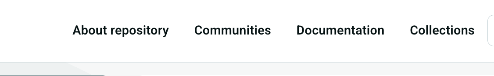

import { Callout, Steps, Cards } from "nextra/components";
import { Card } from "@/components/card";

# Collections

**Collections** are dynamic, query-based groupings of records. Unlike a
community — which *owns* its records and governs their lifecycle — a collection
simply *selects* records that match a search query, and collections can be
organized hierarchically into trees to build meaningful, browsable groupings of
content. A collection cannot enforce access restrictions; that remains the job
of communities.

Collections are built on top of InvenioRDM's collections feature. For the
underlying concepts (collection trees, per-collection search queries, nesting,
and the Python API used to create them), see the upstream
<a href="https://inveniordm.docs.cern.ch/operate/customize/collections/" target="_blank" rel="noopener noreferrer">InvenioRDM collections documentation</a>.
This page describes what NRP adds on top of it and how to enable it.

## Global collections

InvenioRDM scopes each collection tree to a single community, so a collection
only ever searches within that community's records. NRP adds the concept of
**global collections**: a designated *holder* community whose collection trees
search across **every published record in the repository**, not just the records
tagged with that community.

Internally, when a collection belongs to the holder community the usual
`parent.communities.ids` filter is skipped, so the collection's query runs
against the whole repository. This lets you build repository-wide, thematic
browsing (for example "Datasets", "Publications", "Software") that is not tied to
any one community.

## Enabling collections

Set the following variables in your deployment configuration (`invenio.cfg`):

| Variable | Default | Description |
|----------|---------|-------------|
| `COMMUNITIES_COLLECTIONS_ENABLED` | `False` | Master switch. Must be truthy for the **Collections** menu item to appear. |
| `INVENIO_COLLECTIONS_COMMUNITY_SLUG` | `"global"` | Slug of the community that holds the cross-repository ("global") collection trees. Its collections search across all records. Set to `None` to disable global collections. |
| `INVENIO_COLLECTIONS_UI_URL_PREFIX` | `"/collections"` | URL prefix under which the collections UI is mounted. |
| `COMMUNITIES_COLLECTIONS_MENU_ORDER` | `2` | Position of the **Collections** item within the main menu. |

<Callout type="info">
  Menu visibility is controlled solely by `COMMUNITIES_COLLECTIONS_ENABLED` — as
  long as it is truthy, the **Collections** item is shown. For the page to be
  useful, though, you still need to create the holder community (matching
  `INVENIO_COLLECTIONS_COMMUNITY_SLUG`) and at least one collection tree on it;
  otherwise the tab leads to an empty browse page.
</Callout>

Once enabled, a **Collections** tab appears in the repository's main menu,
alongside **Communities**:



## Collection images

Each collection can display an image (used as its logo on the browse grid and as
the header on the collection page). Images are served as static assets, keyed by
the collection's **slug**.

For a collection whose slug is `my-collection`, add the file:

```
static/images/collections/my-collection.jpg
```

<Callout type="warning">
  The filename must exactly match the collection's slug and use the `.jpg`
  extension — the template resolves the image as
  `images/collections/<collection-slug>.jpg` via `url_for('static', …)`. If no
  matching file exists, the collection is shown without an image.
</Callout>

After adding new static assets, rebuild/collect the instance's static files so
the image is served.

## Related

<Cards>
  <Card title="Communities" arrow href="/administration/communities">
    How records are owned and governed by communities.
  </Card>
  <Card title="InvenioRDM collections" arrow href="https://inveniordm.docs.cern.ch/operate/customize/collections/">
    Upstream reference for collection trees and the creation API.
  </Card>
</Cards>
