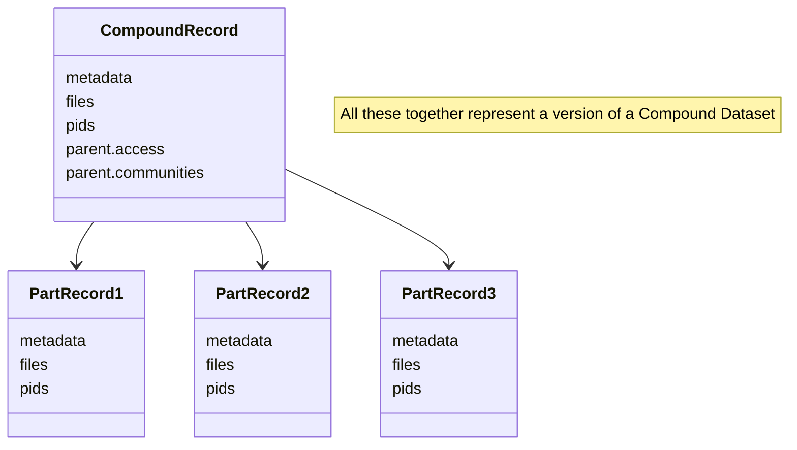
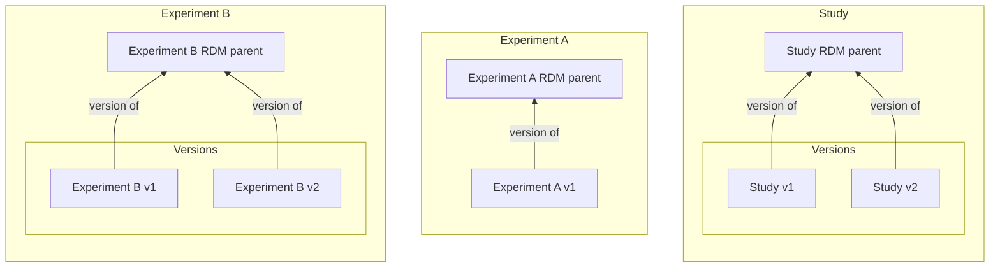
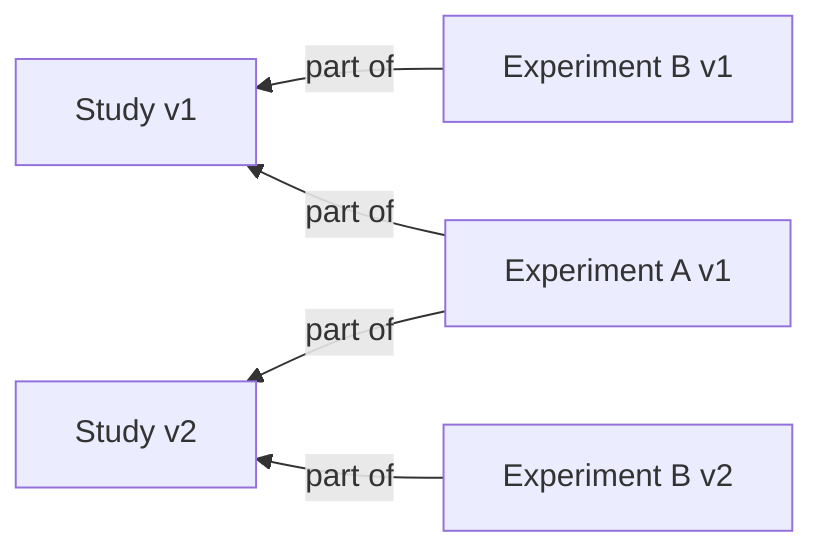
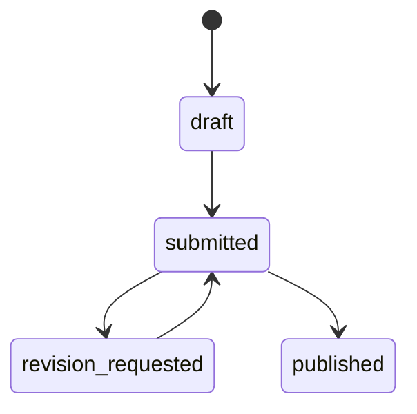
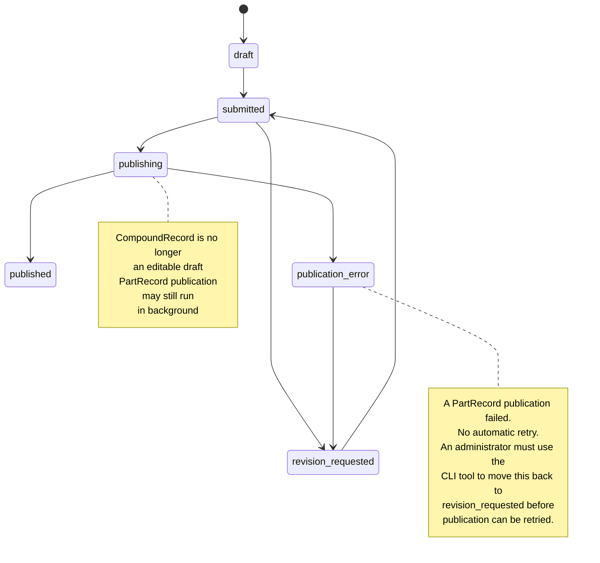
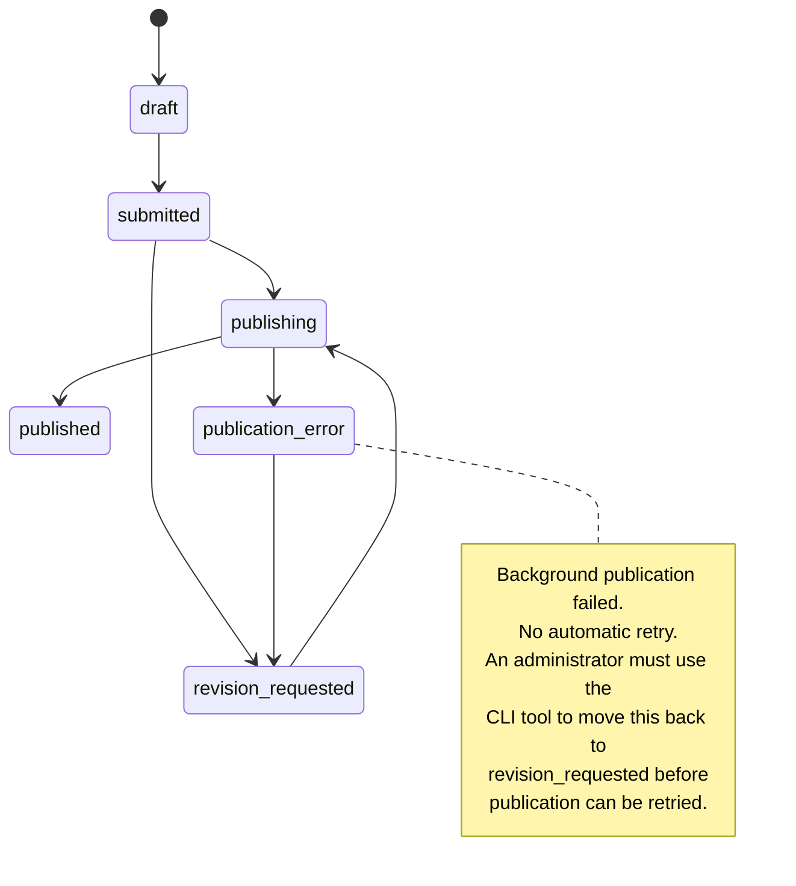

# Compound datasets (proposal)

Please read at first the [General InvenioRDM background on record structure, versioning, communities, and PIDs](./rdm_records.md).

For the terminology used in this document, see the [terminology section](./terminology.md).

## Splitting a large record into multiple records

Sometimes it is useful to represent a larger research object as several linked records instead of one monolithic record. There are several ways to do this.

This document describes one approach: **Compound Datasets**. A compound dataset is a single logical research object that is physically split into multiple separate records. All parts share the same lifecycle: they must be published together and updated together. Individual parts cannot be published or modified independently of the whole. All parts also use the same access policies.

### Compound Datasets

A Compound Dataset is a unit that represents a larger research object as several linked records instead of one monolithic record. To be able to identify it, one of the linked records is designated as the main record (called CompoundRecord in this document) and the others are designated as part records (called PartRecords in this document).



The main record in the compound structure is called a **CompoundRecord**, and the part records are called **PartRecord**.

The main record is the record that governs the composition and publication workflow of the compound structure - that's why it has the `parent.access` and `parent.communities` fields. It contains metadata and may contain files and receives a DOI or any other PID.

The part records are the records that belong to the main record and are linked to it. They may contain metadata and files as well. Their access and communities fields are inherited from the main record and can not be set separately.

CompoundRecord and its PartRecords have interlinked life cycle, interlinked access policies, communities and they also have a relationship between their 
metadata models. No other dependencies are implied besides those four categories.

**Note:** In this version, we will not allow PartRecords to be restricted when the main record is not restricted. This limitation might be lifted in future versions.

The following table shows how real-world datasets can be represented using compound records and part records:

| CompoundRecord (Main) | PartRecord(s) (Parts) |
| --- | --- |
| **Study** | Experiment |
| **Field campaign** | Sampling events |
| **Clinical study** | Visits, assays, or cohorts |
| **Observing programme** | Observation runs |
| **Excavation project** | Trenches, contexts, or find groups |
| **Simulation campaign** | Model runs or parameter sweeps |
| **Research project dataset** | Derived datasets, processing steps, or analysis outputs |

Examples in the rest of this document will use **Study** and **Experiment** types.

### Example

One study may contain multiple experiments. Each experiment can have its own metadata, files, versions, and citations, while the study can also be cited as a larger whole.

In that model, the safest interpretation is:
- the **study RDM parent** represents the study across all its versions,
- each **study version** is a frozen snapshot of that study in the sense that its files, composition, and version-specific links are fixed,
- the **experiment RDM parent** represents one experiment across all its versions,
- each **experiment version** is a frozen snapshot of that experiment in the sense that its files and version-specific links are fixed,

If the repository allows non-versioning metadata corrections, limited metadata updates may still happen in place after publication, but citation-relevant changes should create a new version.

If a Study version depends on experiments, then the links should point to specific experiment versions, not just to experiments in the abstract. Otherwise a citation to an exact version of the study would not reliably tell the reader which exact versions of the experiments were part of it.


A possible version structure is easier to read if it is split into two diagrams.

First, the version families:



Second, the composition of concrete Study versions:



These diagrams show one important principle: even if the Study stays "the same" at the all-versions level, its concrete versions may include different versions of the underlying experiments.

For example:
- **Study version 1** includes **Experiment A version 1** and **Experiment B version 1** (initial deposition).
- **Study version 2** includes **Experiment A version 1** and **Experiment B version 2** (the Experiment B contains changed files and its version was increased. This mandated increasing the Study's version).

That way:
- the DOI on the Study RDM parent identifies the Study as a whole,
- the Study version DOI identifies one exact citable state of the Study, with fixed files, composition, and version-specific links,
- each experiment has the same RDM-parent/version distinction,
- and the version-to-version links preserve reproducibility and citation precision.

## Records in CESNET Invenio

In plain RDM, there is a single record type in the whole repository - RDMRecord.

CESNET Invenio does not have this limitation - repository developers can create multiple types of records, called models. To do so, the repository's `run.sh` script provides a `model create` command.

When a new model is created, a new folder is added under the repository's `models/` directory. It contains:

- `metadata.yaml` with the definition of the model's metadata schema.
- `model.py` with the model's configuration. Example:

```python
datasets_model = model(
    "datasets",
    version="1.1.0",
    presets=[
        ccmm_production_preset_1_1_0,
        workflows_preset,
        requests_preset,
        communities_preset,
    ],
    types=[
        from_yaml("metadata.yaml", __file__)
    ],
    metadata_type="CCMMDataset",
)
```

Note that the location of `metadata.yaml` is not strict - multiple models may share the same metadata schema and differ only in their `model.py` configuration. The presets of the model defines the capabilities and behavior of the model. In the example above, records of the datasets_model
will include all the CCMM metadata fields, will be governed by the globally defined workflows, users will be able to create requests on these records, the records will be able to be associated with communities.


## Publication process

In CESNET Invenio, an ordinary record goes through the following states:
- `draft`
- `submitted`
- `published`
- `revision_requested`

There is no separate `approved` state, publication happens when a curator approves the review/publish request for a submitted record.

The state model for **CompoundRecord** and **PartRecord** is:
- `draft`
- `submitted`
- `publishing`
- `publication_error`
- `revision_requested`
- `published`

When a curator approves the CompoundRecord review/publish request, the CompoundRecord leaves `submitted` and enters `publishing`. In that state, the CompoundRecord is no longer an editable draft, and background publication of the included PartRecords is in progress. When that background process finishes successfully for all required PartRecords, the CompoundRecord leaves `publishing` and becomes `published`.

If background publication of a PartRecord fails, that PartRecord moves to the `publication_error` state and remains there until an administrator resolves the problem.
In this case, the CompoundRecord state will change to `publication_error` as well.
The initial implementation will not automatically retry publication of PartRecords that remain in `publication_error` - administrators will be notified and must manually resolve the problem.
A cli tool will be available to manually return PartRecords and CompoundRecords to `revision_requested` so that the error can be resolved and publication can be retried.

PartRecord-publication status is therefore associated with the CompoundRecord while it is in `publishing`, and it may also remain visible after publication for audit/history purposes.

A normal record workflow can be visualized like this:



For a **CompoundRecord**, the state flow diverges from a normal record after curator approval: instead of going directly from `submitted` to `published`, it enters a real intermediate `publishing` state while included PartRecords are being published in the background:



For a **PartRecord**, CompoundRecord-triggered publication introduces the `publishing`, `publication_error`, and `revision_requested` states:




The publication workflow for compound datasets is intentionally two-stepped and asynchronous.

When the CompoundRecord publish/review request is submitted by the user:
1. The CompoundRecord enters `submitted` state.
2. All PartRecord drafts are marked as `submitted` as well.
3. A new PartRecord draft can not be created anymore
3. Compound and Part records are still editable so that the user can make changes suggested by the curator.

When the CompoundRecord publish/review request is approved by a curator:
1. the CompoundRecord leaves `submitted` and becomes `publishing`,
2. all included PartRecord drafts are marked as `publishing`,
3. a background task processes those PartRecord drafts and publishes them one by one,
4. if publication of a PartRecord fails, that PartRecord moves to `publication_error`, the CompoundRecord moves to `publication_error` as well, and an administrator is notified; there is no automatic retry, and a CLI tool is used to move the affected PartRecord(s) and the CompoundRecord back to `revision_requested` so the issue can be resolved and publication retried,
5. only when all required PartRecord publications have succeeded does the CompoundRecord leave `publishing` and become `published`.

This means that compound publication is not guaranteed to be atomic. While the CompoundRecord is in `publishing`, PartRecord publication may still be running in the background. During that eventual-consistency window, the CompoundRecord may already be visible on its landing page (depends on permissions) and through the API, but both representations must clearly show that some parts of the record are still being published.

During that time window, the relevant CompoundRecord and PartRecords must be treated as temporarily locked for modification. Users must not be able to perform changes that would interfere with the running publication workflow.

### New version of a PartRecord

After the CompoundRecord is published, further changes to its parts (such as adding or removing files to PartRecord) are not allowed, as they would break the record's citability guarantees. Instead, a new version of the PartRecord, which gets a new persistent identifier, must be created.

To create a new version of a PartRecord, the user must first create a new version of the CompoundRecord (so they get a new CompoundRecord PID). Only then will the API allow creating a new version of the PartRecord. The API automatically updates the link from the new PartRecord version to the new CompoundRecord version. The UI might simplify this by providing a single button that creates both, or by navigating the user to the CompoundRecord landing page.

### Removing a PartRecord

In order to remove a PartRecord from a published CompoundRecord, the user has to first create a new version of the CompoundRecord. As the PartRecord can be a member of several versions of the CompoundRecord, we can not simply remove the PartRecord by calling `delete` on it. Instead, we call the `remove_part` endpoint to remove the PartRecord from the CompoundRecord.

The call must be made as HTTP POST request to the `remove_part` endpoint with the following JSON body:

```json
{
    "part_record": "part_record_pid"
}
```

Note that the PID can be the PID or the URL of the PartRecord.


## Requirements and non-requirements

### Representation Requirements

In the requirements below, **CompoundRecord** and **PartRecord** refer to the concrete records/versions participating in a compound structure. Their all-versions layers are the CompoundRecord's RDM parent and the PartRecord's RDM parent.

- **R1. CompoundRecord and PartRecord are both full records.**
  Each CompoundRecord and each PartRecord has its own metadata.

- **R2. CompoundRecord and PartRecord may both have files.**
  Either side may contain files, or either side may be metadata-only.

- **R3. CompoundRecord and PartRecord may use the same or different metadata schemas.**
  There is no implementation restriction that would prevent CompoundRecord and PartRecord from using same or different metadata schemas. For example, a CompoundRecord may use CCMM and PartRecord a scientific field-specific schema.

- **R4. CompoundRecord and PartRecord must use different models.**
  
  A model's behavior - its service logic, permissions, and available UI/API actions - is determined by the preset it is configured with (see `compound_record_preset` and `compound_part_preset` in the Data Structures section below), and a model can only be configured with one such preset. Since the CompoundRecord and PartRecord need different behavior (for example, only the CompoundRecord exposes a publish action), they cannot share a single model. This does not mean that the metadata schemas must be different - the two models can still share the same schema.

- **R5. PID types follow model configuration.**
  Supported persistent identifiers are configured within models. Therefore, the CompoundRecord and PartRecord might have different metadata schemas. For example, a CompoundRecord may have a DOI while a PartRecord has only an internal Invenio PID, or a different external identifier such as ARK or a Handle/ePIC-style identifier.

- **R6. Every PartRecord must be linked to a CompoundRecord.**
  A PartRecord cannot exist in the compound structure without an explicit compound/part relationship. A CompoundRecord must exist before a PartRecord can be created.

- **R7. CompoundRecord/PartRecord associations must be version-specific at publication time.**
  In a published compound structure, each published PartRecord version must be associated with the exact published CompoundRecord version it belongs to, not just with the CompoundRecord across all versions. This is necessary for reproducibility and precise citation.

- **R8. Readers of a specific CompoundRecord version must get the corresponding specific PartRecord versions.**
  When a user opens, cites, or exports a particular published CompoundRecord version, the system must resolve the PartRecords for that CompoundRecord version to the exact PartRecord versions associated with it. If the CompoundRecord is already visible earlier than all its PartRecords, the landing page and API representation must clearly state so.

- **R9. PartRecords cannot be published independently of their CompoundRecord.**
  The publication lifecycle of PartRecords is governed by the CompoundRecord.

- **R10. Publishing a CompoundRecord starts the publication workflow for its PartRecord drafts.**
  When a CompoundRecord draft is published, the PartRecord drafts included in that CompoundRecord version are not published independently by the user; instead, they enter a PartRecord-publication workflow triggered by the CompoundRecord publish action.

- **R11. PartRecord publication is asynchronous and may take time.**
  The system must allow CompoundRecord-triggered PartRecord publication to continue in the background. Immediate atomic publication of the entire compound structure is not required.

- **R12. The CompoundRecord must expose PartRecord-publication status.**
  Because PartRecord publication may still be running after the CompoundRecord publish action has returned, the CompoundRecord must contain enough status information to show whether PartRecord publication is pending, in progress, completed, or failed. A failed PartRecord publication is reflected by that PartRecord entering the `publication_error` state; an administrator is notified, and manual resolution is required. In the eventual-consistency window, both the CompoundRecord landing page and the API representation must clearly show that parts of the record are still being published or have errored.

- **R13. Modification must be blocked while PartRecord publication is unfinished.**
  Once CompoundRecord publication has triggered background PartRecord publication, users must not be allowed to modify the CompoundRecord or the affected PartRecords until the PartRecord-publication process has completed successfully or an administrator has resolved a failure. This prevents interference with the in-flight publication workflow.

- **R14. The composition of a published CompoundRecord version is frozen.**
  After a CompoundRecord version has been published, new PartRecords cannot be added to that already published version, and the existing set of PartRecords should not be changed in place.

- **R15. Any change to the composition requires a new CompoundRecord version.**
  Adding a PartRecord, removing a PartRecord, or replacing one PartRecord version with another must create a new CompoundRecord version.

- **R16. Limited metadata-only edits to already published records are allowed.**
  Editing metadata of a published CompoundRecord or a published PartRecord is allowed if the repository treats that as a non-versioning metadata update. However, this should be limited to corrections that do not alter the version-specific composition, files, or citation-relevant meaning of the published record. If a metadata change is citation-relevant, it should require a new version.

- **R17. File replacement after publication is a versioning event.**
  If a user wants to replace a file after publication, they must not modify the already published compound structure in place.

- **R18. Replacing a PartRecord file requires coordinated CompoundRecord/PartRecord versioning.**
  If a file in a PartRecord must be replaced after publication, the workflow should be:
  1. create a new version of the CompoundRecord,
  2. create a new version of the affected PartRecord,
  3. replace the file (and, if needed, update metadata) in that new PartRecord version,
  4. link that new PartRecord version into the new CompoundRecord version,
  5. publish the new CompoundRecord version, thereby publishing the coordinated new structure.

- **R19. CompoundRecord publication must validate PartRecord-publication prerequisites.**
  Before the PartRecord-publication workflow is started, the system must ensure that all included PartRecord drafts are in a state that allows them to be marked for publication.

### API Requirements

In addition to standard InvenioRDM record and draft endpoints, compound datasets need a small set of addon-specific API capabilities.

- **AR1. CompoundRecord read responses expose compound-record structure.**
  Reading a CompoundRecord draft, `publishing` CompoundRecord, or published CompoundRecord should expose enough information to identify the PartRecords associated with that specific CompoundRecord draft or CompoundRecord version.

- **AR2. CompoundRecord read responses expose PartRecord-publication status.**
  Reading a CompoundRecord should expose enough PartRecord-publication status information for clients to tell whether PartRecord publication is pending, in progress, completed, or failed. If some included PartRecords are still being published, the API representation must make that fact explicit. If publication has failed for a PartRecord, the API should show that the PartRecord is in `publication_error` and requires administrator intervention.

- **AR3. PartRecord read responses expose CompoundRecord context.**
  Reading a PartRecord should expose the identifier of its CompoundRecord and enough CompoundRecord summary information to support navigation and validation.

- **AR4. Publish endpoint on the PartRecord is disabled or not exposed.**
  A PartRecord must not be publishable independently; publication must happen through the CompoundRecord publication workflow.

- **AR5. CompoundRecord publish initiates asynchronous PartRecord publication.**
  Publishing a CompoundRecord must mark the included PartRecord drafts as `publishing` and trigger the background publication workflow.

- **AR6. The API exposes background publication progress.**
  The API should make it possible for clients to poll or read the CompoundRecord and PartRecord states and determine whether PartRecord publication is still pending, in progress, completed, or has failed. In particular, the CompoundRecord representation should clearly show when the compound object is visible but not yet fully published end-to-end because some PartRecords are still in progress or because administrator intervention is required after a failure.

- **AR7. The API supports coordinated versioning of CompoundRecord and PartRecord.**
  Once a new CompoundRecord draft exists, the API should support the workflow of creating a new PartRecord version specifically for inclusion in that new CompoundRecord draft.

- **AR8. Creating a new CompoundRecord version should preserve the previous composition as a starting point.**
  A new CompoundRecord draft must reuse the PartRecord composition of the previously published CompoundRecord version, so users only need to change the parts that actually changed.

- **AR9. The API should support removing a PartRecord from a CompoundRecord draft composition.**
  Removing a PartRecord from the composition must be possible while preparing a CompoundRecord draft or a new CompoundRecord version, subject to the rule that already published CompoundRecord versions remain frozen.

- **AR10. The API must block modification while PartRecord publication is unfinished.**
  If PartRecord publication is still pending, in progress, or failed but awaiting administrator resolution, API operations that would modify the CompoundRecord or the affected PartRecords must be rejected.

- **AR11. Compound-specific validation errors must be explicit.**
  If a client tries to publish a PartRecord independently, add a PartRecord to a published CompoundRecord version, publish a CompoundRecord with incomplete PartRecord drafts, or modify records while PartRecord publication is still running, the API should return clear, domain-specific error messages.

### UI Requirements

- **UR1. Users can browse and search CompoundRecords.**
  CompoundRecords must be listable in the UI, with the same general discovery affordances expected for ordinary records.

- **UR2. Users can browse and search PartRecords.**
  PartRecords must also be listable in the UI. Depending on product decisions, they may appear in a dedicated PartRecord view, in general search results, or both.

- **UR3. The CompoundRecord edit/preview page provides an action to create a PartRecord.**
  When a user is editing or previewing a CompoundRecord draft, the UI should provide a clear action for creating a PartRecord within that CompoundRecord context.

- **UR4. If multiple PartRecord types are supported, PartRecord creation must be type-aware.**
  If there is more than one PartRecord type, the create-PartRecord action should let the user choose which PartRecord type to create, for example via a dropdown or modal selector.

- **UR5. The PartRecord UI must make the publication model explicit.**
  A PartRecord draft must not expose an independent `Publish` action. The UI should make it clear that PartRecords are published through the CompoundRecord publication workflow. Save/discard actions may still be available on the PartRecord draft.

- **UR6. The CompoundRecord landing page shows its PartRecords in a structured list.**
  The landing page of a CompoundRecord should contain a paginated table or equivalent structured component listing its PartRecords.

- **UR7. The PartRecord list on the CompoundRecord page supports navigation and inspection.**
  Each listed PartRecord should be directly navigable, and the list should support useful sorting and filtering where needed.

- **UR8. The PartRecord landing page must expose its CompoundRecord context.**
  The landing page of a PartRecord should contain a visible link to the CompoundRecord together with a small amount of identifying CompoundRecord metadata.

- **UR9. The UI should show version-aware relationships.**
  When viewing a specific CompoundRecord version, the UI should display the specific PartRecord versions associated with that CompoundRecord version, not only PartRecords in general without distinguishing versions.

- **UR10. The UI should expose PartRecord-publication progress on the CompoundRecord.**
  If a CompoundRecord is in `publishing`, the CompoundRecord landing page should clearly show the current PartRecord-publication status and make it explicit whether some parts of the record are still being published or whether administrator intervention is required after a failure.

- **UR11. The UI must prevent modification while PartRecord publication is unfinished.**
  If PartRecord publication is still pending, in progress, or failed but awaiting administrator resolution, the UI should disable or hide editing actions on the relevant CompoundRecord and PartRecords and clearly explain why modification is temporarily blocked.

- **UR12. The UI should prevent actions that violate the publication/versioning model.**
  If adding PartRecords, replacing files, or changing the published composition is not allowed on an already published CompoundRecord version, the UI should disable or hide those actions, or clearly route the user toward creating a new version.

### Non-requirements

The following points may be desirable in some implementations, but they are not necessary to satisfy the compound-dataset model described above.

- **NAR1. A CompoundRecord-scoped PartRecord listing endpoint.**
  A separate endpoint is not necessary if one can use the normal PartRecord listing endpoint and filter by CompoundRecord ID and, where needed, by the relevant CompoundRecord version.

- **NAR2. A CompoundRecord-scoped PartRecord creation endpoint.**
  A separate endpoint is not necessary if one can use the normal PartRecord creation endpoint and include the CompoundRecord identifier and PartRecord type in the request.

- **NAR3. Atomic publication of the entire compound dataset.**
  The model does not require CompoundRecords and PartRecords to become published in one indivisible transaction. An asynchronous workflow with explicit publication status is acceptable.

- **NAR4. A separate bulk-publish endpoint for compound datasets.**
  A new orchestration endpoint is not strictly necessary if the normal CompoundRecord publish action can already mark PartRecords for background publication and expose the resulting status.

- **NAR5. Special compound-dataset PID schemes.**
  The model does not require new PID or DOI schemes beyond the normal record-version and RDM-parent identifiers already described above.

- **NAR6. Multi-level nested compound structures.**
  Multi-level nesting is out of scope in this iteration. As a workaround, use a single compound level and represent deeper relationships using PID relations or related resources.


## API Flow

**Create a new Study**

```http
POST /api/studies

{
  "metadata": {
    "title": "My study"
  }
}

HTTP/1.1 201 Created

Location: /api/studies/aaaaa-aaaab
{
  "id": "aaaaa-aaaab",
  "metadata": {
    "title": "My study"
  },
  "parent": {
    "id": "aaaaa-aaaaa"
  }
}
```

**Create a new experiment as a part of a Study**

```http
POST /api/experiments

{
  "metadata": {
    "title": "First experiment"
  },
  "part_of": "https://repo.com/api/studies/aaaaa-aaaab"
}

HTTP/1.1 201 Created

Location: /api/experiments/bbbbb-bbbbb
{
  "id": "bbbbb-bbbbb",
  "metadata": {
    "title": "First experiment"
  },
  "part_of": [
    "https://repo.com/api/experiments/aaaaa-aaaab"
  ]
}
```

**Note:** The `part_of` field was changed to an array of URLs to support being part of multiple versions of the same Compound Dataset.

**Get experiments as a part of a Study (not published yet, draft)**

```http
GET /api/draft/experiments?part_of=aaaaa-aaaab

HTTP/1.1 200 OK

{
  "hits": ...
}
```

**Directly publish a CompoundRecord**
(for brevity if the user has the necessary permissions; otherwise use the standard publication workflow based on a review/publish request)

```http
POST /api/draft/experiments/aaaaa-aaaab/publish

HTTP/1.1 201 Created

Location: https://repo.com/api/experiments/aaaaa-aaaab
```

**Note:** This might not be published just when the call finishes as the publication process is asynchronous. The url returned in the location header will be working, but the access might be allowed just for the owner of the record.

**Search for experiments of this Study**

```http
GET /api/experiments?part_of=aaaaa-aaaab

HTTP/1.1 200 OK

{
  "hits": [
    {
      "id": "bbbbb-bbbbb",
      "part_of": [
        "https://repo.com/api/experiments/aaaaa-aaaab"
      ],
      ...
    }
  ]
}
```

**Create a new version of the Study to replace a file in the experiment**

```http
POST /api/draft/studies/aaaaa-aaaab/versions

HTTP/1.1 201 Created

Location: https://repo.com/api/draft/studies/aaaaa-aaaac
```

**Create a new version of the experiment where the file is to be replaced**

```http
POST /api/draft/experiments/bbbbb-bbbbb/versions

HTTP/1.1 201 Created

Location: https://repo.com/api/draft/experiments/bbbbb-bbbbc
{
  "part_of": [
    "https://repo.com/api/draft/studies/aaaaa-aaaac"
  ]
}
```

now replace the file in the experiment as usual. Finally

**Publish the new version of the Study**

```http
POST /api/draft/studies/aaaaa-aaaac/publish

HTTP/1.1 201 Created

Location: https://repo.com/api/studies/aaaaa-aaaac
```

**Let's see the updated experiment**

```http
GET /api/experiments/bbbbb-bbbbc

HTTP/1.1 200 OK
{
  "part_of": [
    "https://repo.com/api/experiments/aaaaa-aaaac"
  ]
}
```

## Data structures

### PartRecords

A new preset will be created - `compound_part_preset`, which will create the components necessary for the model to act as a PartRecord of a CompoundRecord.

Example:

```python

from oarepo_compound_records.models import compound_part_preset

activities_model = model(
    "experiments",
    version="1.1.0",
    presets=[
        ccmm_production_preset_1_1_0,
        workflows_preset,
        requests_preset,
        communities_preset,
        compound_part_preset,
    ],
```

Using this model will:

- A new section will be added to the data model to represent PartRecords.
  
  ```json5
  // PartRecord serialization (real example)
  {
    "parent": {}, // RDM parent of this PartRecord
    "metadata": {}, // Metadata of this PartRecord
    "part_of": [
      # array of versions of the CompoundRecord this PartRecord is part of
    ]
  }
  ```

**At a database level:**

- A new table `PartRecordMembership` will be created to store the relationships between PartRecords and CompoundRecords.

| Column | Type | Description |
| --- | --- | --- |
| PartRecordId | UUID | The UUID of the PartRecord |
| CompoundRecordId | UUID | The UUID of the CompoundRecord |
| status | string | The status of the relationship (e.g. "I" for included, "PE" for pending exclusion, "PI" for pending inclusion) |

Foreign key constraints with on delete cascade will be added to the `PartRecordMembership` table to ensure referential integrity.
The table is using sqlalchemy-continuum to track changes and maintain a history of the relationships.

**At record level:**

- A new `PartOfSystemField` will be added to the `PartRecord` model to fetch/store the `part_of` information.
- A new SearchDumperExt will be added to extract and correctly index the part_of information.

**At service level:**
- Add a marshmallow schema to the model so that the `part_of` information can be serialized and deserialized
- Add a service-level component handling "create":
  - when a new PartRecord is created, the `part_of` field must be set

- Add a service-level component handling "draft update":
  - when the draft of a PartRecord is updated, the `part_of` section will be ignored and the previous one kept.

- Add a service-level component handling "new version":
  - it will check if there is a new version available on the CompoundRecord. If not, an error is raised.
  - it will add the a row to the `PartRecordMembership` table to track the relationship between the PartRecord and the CompoundRecord. The status will be set to "PI" (pending inclusion).

- Replace the permissions
  - publication options will be removed from the PartRecord (that is, only the `system_user` can publish it)
  - all other permission checks will be delegated to the CompoundRecord
  - an exception is a `can_new_version` permission, which needs to check if the CompoundRecord has a new version available
    and if the PartRecord is the latest version.
  - this needs more detailed analysis though

- Modify search options
  - add `part_of` filter field to enable `https://repo.com/api/children?part_of=<parent_record_id>`

- Grants
  - grants from the CompoundRecord need to be propagated to all the PartRecords
  - we need to find way / implement an extension to the Invenio's grant service to be able to do that
  - this might be a background task, needs to be analyzed properly

### CompoundRecords

A new preset will be created to mark a CompoundRecord. In this iteration, no limits are placed on which types of PartRecords can be attached to a CompoundRecord.
That is, if there are two types of CompoundRecords and two types of PartRecords, a PartRecord of one type can be attached to a CompoundRecord of the other type.

Example:

```python

from oarepo_compound_records.models import compound_record_preset

experiment_model = model(
    "experiments",
    version="1.1.0",
    presets=[
        ccmm_production_preset_1_1_0,
        workflows_preset,
        requests_preset,
        communities_preset,
        compound_record_preset,
    ],
```

Using this model will add the following components:

- a new service component that handles CompoundRecord publication:
  - when curator approval occurs, the CompoundRecord will move from `submitted` to `publishing`
  - after commit, a background task will be triggered to filter `PartRecordMembership` table and publish the included PartRecords
  - when the background publication work completes, the CompoundRecord will move from `publishing` to `published`


### Background tasks

#### Update pending_inclusion task

The task will look at all PartRecords with `PartRecordMembership` status set to `PI` (pending inclusion) or `PE` (pending exclusion).
For each of these records, it will perform the change (like publish or exclude) and update the `PartRecordMembership` status accordingly.

## UI tools
