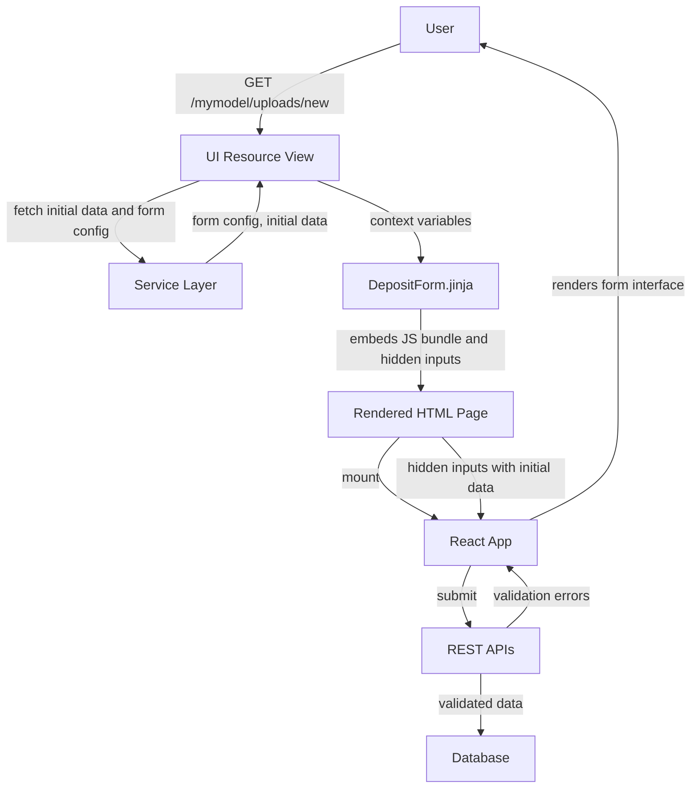
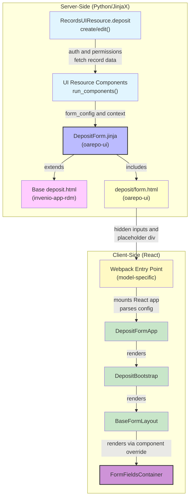

import { Callout, FileTree, Cards } from "nextra/components";
import { Card } from "@/components/card";

# Deposit form

The deposit form enables users to create and edit records. It's a React-based form application that provides field validation, dynamic sections, and integration with your record model.

## Request and Application Flow

### Request Flow

When a user accesses the deposit form URL:



### Application Layers

The deposit form application is organized into server-side and client-side layers:



#### Server-Side Layers

| Layer | Component | Source | Purpose |
|-------|-----------|--------|---------|
| **View** | `RecordsUIResource.deposit_create/edit()` | [oarepo-ui](https://github.com/oarepo/oarepo-ui/blob/main/oarepo_ui/resources/records/resource.py) | Handles HTTP request, authenticates user, fetches record/draft data |
| **Components** | `run_components()` | [oarepo-ui](https://github.com/oarepo/oarepo-ui/blob/main/oarepo_ui/resources/components/base.py) | Executes component hooks to modify `form_config` and add context variables |
| **Page Template** | `DepositForm.jinja` | [oarepo-ui](https://github.com/oarepo/oarepo-ui/blob/main/oarepo_ui/templates/oarepo_ui/pages/DepositForm.jinja) | JinjaX component that extends base template and includes form content |
| **Base Template** | `deposit.html` | [invenio-app-rdm](https://github.com/inveniosoftware/invenio-app-rdm) | Provides page skeleton (CSS, JS, header, footer blocks) |
| **Form Content** | `deposit/form.html` | [oarepo-ui](https://github.com/oarepo/oarepo-ui/blob/main/oarepo_ui/templates/oarepo_ui/deposit/form.html) | Renders hidden inputs with config and placeholder div for React app |

#### Client-Side Layers

| Layer | Component | Source | Purpose |
|-------|-----------|--------|---------|
| **Entry Point** | `{{model_name}}/semantic-ui/js/{{model_name}}/forms/index.js` | Model-specific ([nrp-model-copier](https://github.com/oarepo/nrp-model-copier/tree/master/template/ui/%7B%7Bmodel_name%7D%7D/semantic-ui/js/%7B%7Bmodel_name%7D%7D/forms)) | Webpack entry that mounts React app to `#deposit-form` div |
| **Form App** | `DepositFormApp` | [oarepo-ui](https://github.com/oarepo/oarepo-ui/blob/main/oarepo_ui/theme/assets/semantic-ui/js/oarepo_ui/forms/components/DepositFormApp/DepositFormApp.jsx) | Main React form component with providers, router, and context |
| **Bootstrap** | `DepositBootstrap` | [invenio-rdm-records](https://github.com/inveniosoftware/invenio-rdm-records/blob/master/invenio_rdm_records/assets/semantic-ui/js/invenio_rdm_records/src/deposit/api/DepositBootstrap.js) | Wraps form with notification providers and service setup |
| **Form Layout** | `BaseFormLayout` | [oarepo-ui](https://github.com/oarepo/oarepo-ui/tree/main/oarepo_ui/theme/assets/semantic-ui/js/oarepo_ui/forms/components/BaseFormLayout) | Generic form layout component with overridable fields container |
| **Fields Container** | `{{model_name}}/semantic-ui/js/{{model_name}}/forms/FormFieldsContainer.jsx` | Model-specific ([nrp-model-copier](https://github.com/oarepo/nrp-model-copier/tree/master/template/ui/%7B%7Bmodel_name%7D%7D/semantic-ui/js/%7B%7Bmodel_name%7D%7D/forms)) | Your custom component that defines form fields |

## Configuration

### UI Resource Routes

The deposit routes are defined in your model's UI resource config:

```python filename="ui/mymodel/__init__.py"
from oarepo_ui.resources.records.config import RecordsUIResourceConfig

class MymodelUIResourceConfig(RecordsUIResourceConfig):
    blueprint_name = "mymodel"
    url_prefix = "/mymodel"

    routes = {
        "deposit_create": "/uploads/new",
        "deposit_edit": "/uploads/<pid_value>",
        # ... other routes
    }
```

### Form Configuration

Form field definitions, labels, hints, and validation rules are derived from your record model's YAML schema definition. See [Model schema customization](/customize/model_backend/model) for details on defining field types, labels, hints, and help text.

### Template Context

The `DepositForm.jinja` component receives these context variables from the UI resource view:

| Variable | Description |
|----------|-------------|
| `theme` | Theme configuration |
| `forms_config` | Form configuration |
| `searchbar_config` | Search bar configuration |
| `record` | Current record data (for edit mode) |
| `community` | Community data if applicable |
| `community_ui` | Community UI data |
| `files` | Record files entries |
| `extra_context` | Additional context from resource components |
| `ui_links` | UI links |
| `permissions` | User permissions |
| `webpack_entry` | Webpack entry point for the deposit form JavaScript |

## Customization

### Form Fields

The copier template generates `FormFieldsContainer.jsx` at `ui/mymodel/semantic-ui/js/mymodel/forms/FormFieldsContainer.jsx`. Modify this component to define your form fields using `AccordionField` for sections:

```jsx filename="ui/mymodel/semantic-ui/js/mymodel/forms/FormFieldsContainer.jsx"
import { TextField } from "@js/oarepo_ui/forms";
import { AccordionField } from "react-invenio-forms";

const FormFieldsContainerComponent = ({ record }) => {
  return (
    <>
      <AccordionField
        includesPaths={["metadata.title"]}
        active
        label="Basic information"
      >
        <TextField fieldPath="metadata.title" />
      </AccordionField>

      <AccordionField
        includesPaths={["files.enabled"]}
        active
        label="Files upload"
      >
        {/* File upload component */}
      </AccordionField>
    </>
  );
};

export const FormFieldsContainer = connect(
  (state) => ({
    record: state.deposit.record,
    formConfig: state.deposit.formConfig,
  }),
  null
)(FormFieldsContainerComponent);
```

### React App Entry Point

The copier template configures the webpack entry point automatically. The entry point at `ui/mymodel/semantic-ui/js/mymodel/forms/index.js` renders the deposit app and registers the FormFieldsContainer as a component override:

```jsx filename="ui/mymodel/semantic-ui/js/mymodel/forms/index.js"
import { DepositFormApp, parseFormAppConfig } from "@js/oarepo_ui/forms";
import ReactDOM from "react-dom";
import { OARepoDepositSerializer } from "@js/oarepo_ui/api";
import FormFieldsContainer from "./FormFieldsContainer";

const overridableIdPrefix = "DepositForm";
const rootElem = document.getElementById("deposit-form");

const config = parseFormAppConfig(rootElem);

// Replace the container component
config.overridableComponents = {
  [`${overridableIdPrefix}.FormFields.container`]: FormFieldsContainer,
};

ReactDOM.render(
  <DepositFormApp
    config={config}
    serializer={OARepoDepositSerializer}
  />,
  rootElem
);
```

### Custom Templates

<Callout type="info">
The generic `oarepo_ui.pages.DepositForm` template provides all standard deposit form functionality. For most use cases, you only need to modify the FormFieldsContainer component.
</Callout>

If you need to replace the entire deposit form template with a model-specific implementation:

```jinja filename="ui/mymodel/templates/semantic-ui/mymodel/pages/DepositForm.jinja"
{#def
    theme,
    forms_config,
    searchbar_config,
    record,
    community,
    community_ui,
    community_use_jinja_header,
    files,
    preselectedCommunity=None,
    files_locked,
    extra_context,
    ui_links,
    permissions,
    webpack_entry
#}



  <div class="ui message info">
    {{ extra_context.get('custom_banner_text',
        _('Important: Review the guidelines before submitting')) }}
  </div>
  



    
    {{ webpack[webpack_entry] }}

```

Register in your UI resource config:

```python
class MymodelUIResourceConfig(RecordsUIResourceConfig):
    # ...
    resource_templates = {
        "deposit_create": "mymodel.pages.DepositForm",
        "deposit_edit": "mymodel.pages.DepositForm",
    }
```

### Resource Components

Use resource component hooks to modify form configuration or add template context:

```python filename="ui/mymodel/components.py"
from oarepo_ui.resources.components import UIResourceComponent

class ExtraContextComponent(UIResourceComponent):
    def before_ui_edit(self, resource, request, extra_context, **kwargs):
        """Add custom context to edit page."""
        record = record_from_resource(request)
        extra_context["record_history"] = self._get_history(record)
```

Register in your UI resource config:

```python
class MymodelUIResourceConfig(RecordsUIResourceConfig):
    # ...
    components = [ExtraContextComponent]
```

## Further Reading

<Cards>
  <Card
    title="Deposit form components"
    href="/customize/model_ui/deposit_components"
  >
    Available form field components
  </Card>
  <Card
    title="UI resource architecture"
    href="/customize/model_ui/architecture"
  >
    Entry point configuration
  </Card>
  <Card
    title="Record landing page"
    href="/customize/model_ui/detail"
  >
    Record detail customization
  </Card>
</Cards>
