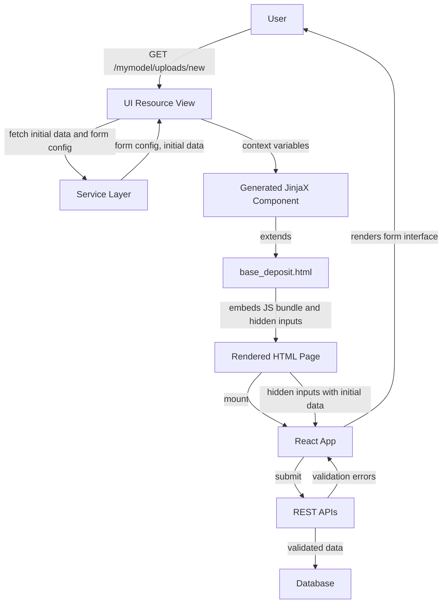

import { Callout, FileTree, Cards, Steps } from "nextra/components";
import { Card } from "@/components/card";

# Deposit form

The deposit form enables users to create and edit records. It's a React-based form application that provides field validation, dynamic sections, and integration with your record model.

## Request and Application Flow

### Request Flow

When a user accesses the deposit form URL:



### Application Layers

The deposit form application is organized into server-side and client-side layers:

```mermaid
graph TD
    subgraph ServerSide["Server-Side (Python/JinjaX)"]
        VR["RecordsUIResource.deposit<br/>create/edit()"]
        RC["UI Resource Components<br/>run_components()"]
        GC["Generated JinjaX Component<br/>(oarepo-ui)"]
        BT["base_deposit.html<br/>(oarepo-ui)"]
        ID["invenio_app_rdm/records/deposit.html"]
        FH["deposit/form.html<br/>(oarepo-ui)"]
    end

    subgraph ClientSide["Client-Side (React)"]
        EP["Webpack Entry Point<br/>(model-specific)"]
        DFA["DepositFormApp"]
        DB["DepositBootstrap"]
        BFL["BaseFormLayout"]
        FFC["FormFieldsContainer"]
    end

    VR -->|auth and permissions<br/>fetch record data| RC
    RC -->|form_config and context| GC
    GC -->|auto-generated {# def #}<br/>extends| BT
    BT -->|extends| ID
    BT -->|includes| FH
    FH -->|hidden inputs and<br/>placeholder div| EP
    EP -->|mounts React app<br/>parses config| DFA
    DFA -->|renders| DB
    DB -->|renders| BFL
    BFL -->|renders via component override| FFC

    style VR fill:#e1f5fe
    style RC fill:#e1f5fe
    style GC fill:#bbf,stroke:#333,stroke-width:2px
    style BT fill:#ffc
    style ID fill:#fcf
    style FH fill:#ffc
    style EP fill:#fff9c4
    style DFA fill:#c8e6c9
    style DB fill:#c8e6c9
    style BFL fill:#c8e6c9
    style FFC fill:#ce93d8,stroke:#333,stroke-width:2px
```

#### Server-Side Layers

| Layer | Component | Source | Purpose |
|-------|-----------|--------|---------|
| **View** | `RecordsUIResource.deposit_create/edit()` | [oarepo-ui](https://github.com/oarepo/oarepo-ui/blob/main/oarepo_ui/resources/records/resource.py) | Handles HTTP request, authenticates user, fetches record/draft data |
| **Components** | `run_components()` | [oarepo-ui](https://github.com/oarepo/oarepo-ui/blob/main/oarepo_ui/resources/components/base.py) | Executes component hooks to modify `form_config` and add context variables |
| **Generated Component** | `{model_name}.deposit_create/edit` | [oarepo-ui](https://github.com/oarepo/oarepo-ui/blob/main/oarepo_ui/templating/page_component_generator.py) | Auto-generated JinjaX component with `{# def #}` block from context variables |
| **Page Template** | `base_deposit.html` | [oarepo-ui](https://github.com/oarepo/oarepo-ui/blob/main/oarepo_ui/templates/oarepo_ui/base_deposit.html) | Base Jinja template that extends invenio deposit template and includes form content |
| **Base Template** | `invenio_app_rdm/records/deposit.html` | [invenio-app-rdm](https://github.com/inveniosoftware/invenio-app-rdm) | Provides page skeleton (CSS, JS, header, footer blocks) |
| **Form Content** | `deposit/form.html` | [oarepo-ui](https://github.com/oarepo/oarepo-ui/blob/main/oarepo_ui/templates/oarepo_ui/deposit/form.html) | Renders hidden inputs with config and placeholder div for React app |

#### Client-Side Layers

| Layer | Component | Source | Purpose |
|-------|-----------|--------|---------|
| **Entry Point** | `{{model_name}}/semantic-ui/js/{{model_name}}/forms/index.js` | Model-specific ([nrp-model-copier](https://github.com/oarepo/nrp-model-copier/tree/master/template/ui/%7B%7Bmodel_name%7D%7D/semantic-ui/js/%7B%7Bmodel_name%7D%7D/forms)) | Webpack entry that mounts React app to `#deposit-form` div |
| **Form App** | `DepositFormApp` | [oarepo-ui](https://github.com/oarepo/oarepo-ui/blob/main/oarepo_ui/theme/assets/semantic-ui/js/oarepo_ui/forms/components/DepositFormApp/DepositFormApp.jsx) | Main React form component with providers, router, and context |
| **Bootstrap** | `DepositBootstrap` | [invenio-rdm-records](https://github.com/inveniosoftware/invenio-rdm-records/blob/master/invenio_rdm_records/assets/semantic-ui/js/invenio_rdm_records/src/deposit/api/DepositBootstrap.js) | Wraps form with notification providers and service setup |
| **Form Layout** | `BaseFormLayout` | [oarepo-ui](https://github.com/oarepo/oarepo-ui/tree/main/oarepo_ui/theme/assets/semantic-ui/js/oarepo_ui/forms/components/BaseFormLayout) | Generic form layout component with overridable fields container |
| **Fields Container** | `{{model_name}}/semantic-ui/js/{{model_name}}/forms/FormFieldsContainer.jsx` | Model-specific ([nrp-model-copier](https://github.com/oarepo/nrp-model-copier/tree/master/template/ui/%7B%7Bmodel_name%7D%7D/semantic-ui/js/%7B%7Bmodel_name%7D%7D/forms)) | Your custom component that defines form fields |

## Configuration

### UI Resource Routes

The deposit routes are defined in your model's UI resource config:

```python filename="ui/mymodel/__init__.py"
from oarepo_ui.resources.records.config import RecordsUIResourceConfig

class MymodelUIResourceConfig(RecordsUIResourceConfig):
    blueprint_name = "mymodel"
    url_prefix = "/mymodel"

    routes = {
        "deposit_create": "/uploads/new",
        "deposit_edit": "/uploads/<pid_value>",
        # ... other routes
    }
```

### Form Configuration

Form field definitions, labels, hints, and validation rules are derived from your record model's YAML schema definition. See [Model schema customization](/customize/model_backend/model) for details on defining field types, labels, hints, and help text.

### Template Context

When no custom page template is configured, oarepo-ui automatically generates a JinjaX component at runtime. The [`generate_page_component()`](https://github.com/oarepo/oarepo-ui/blob/main/oarepo_ui/templating/page_component_generator.py) utility creates a `{# def #}` block from all context variables passed to the template, then extends `base_deposit.html`.

For example, a generated component for `deposit_create` page looks like:

```jinja
{# def
  theme,
  forms_config,
  searchbar_config,
  record,
  community,
  community_ui,
  community_use_jinja_header,
  files,
  preselectedCommunity=None,
  files_locked,
  extra_context,
  ui_links,
  permissions,
  webpack_entry,
#}

```

The generated component extends your model's base template (`mymodel/deposit_create.html` or `mymodel/deposit_edit.html`), which is provided by nrp-model-copier and extends `oarepo_ui/base_deposit.html`.

These context variables are available in your templates:

| Variable | Description |
|----------|-------------|
| `theme` | Theme configuration |
| `forms_config` | Form configuration |
| `searchbar_config` | Search bar configuration |
| `record` | Current record data (for edit mode) |
| `community` | Community data if applicable |
| `community_ui` | Community UI data |
| `files` | Record files entries |
| `extra_context` | Additional context from resource components |
| `ui_links` | UI links |
| `permissions` | User permissions |
| `webpack_entry` | Webpack entry point for the deposit form JavaScript |

## Building Your Deposit Form

The nrp-model-copier template provides a starting point for your deposit form with **only two example fields**:

1. **Title** - A text field in the "Basic information" section
2. **File uploads** - A file uploader in the "Files upload" section

To create a form for your specific model, you typically need to build your own from this starting point.

<Steps>

### Define Your Fields in the Model Schema

Add your fields to `{{model_name}}/metadata.yaml`. Field metadata (labels, hints, required status) is defined here:

```yaml filename="model/{{model_name}}/metadata.yaml"
# Definition of metadata for {{model_name}}

Metadata:
  properties:
    title:
      type: fulltext+keyword
      label:
        en: Title
        cs: Název
      help:
        en: The title of the record
        cs: Název záznamu

    # Add your custom fields here
    description:
      type: fulltext
      label:
        en: Description
        cs: Popis

    creators:
      type: array
      items:
        type: vocabulary
        vocabulary-type: creators
      label:
        en: Creators
        cs: Autoři
```

See [Model schema customization](/customize/model_backend/model) for details on defining field types, labels, hints, and help text.

### Build Your Form in FormFieldsContainer

Edit `ui/{{model_name}}/semantic-ui/js/{{model_name}}/forms/FormFieldsContainer.jsx` to define your form fields organized into accordion sections:

```jsx filename="ui/{{model_name}}/semantic-ui/js/{{model_name}}/forms/FormFieldsContainer.jsx"
import * as React from "react";
import { useFormConfig, TextField, ArrayField } from "@js/oarepo_ui/forms";
import { AccordionField } from "react-invenio-forms";
import { i18next } from "@translations/i18next";
import { UppyUploader } from "@js/invenio_rdm_records";

const FormFieldsContainerComponent = ({ record }) => {
  const formConfig = useFormConfig();
  const { filesLocked } = formConfig;

  return (
    <React.Fragment>
      {/* Basic Information Section */}
      <AccordionField
        includesPaths={["metadata.title", "metadata.description"]}
        active
        label={i18next.t("Basic information")}
      >
        <TextField fieldPath="metadata.title" />
        <TextField
          fieldPath="metadata.description"
          // Field metadata (label, hint) comes from model schema
        />
      </AccordionField>

      {/* Creators Section - Array Field */}
      <AccordionField
        includesPaths={["metadata.creators"]}
        active
        label={i18next.t("Creators")}
      >
        <ArrayField
          fieldPath="metadata.creators"
          addButtonLabel={i18next.t("Add creator")}
        >
          {/* Creator subfields */}
        </ArrayField>
      </AccordionField>

      {/* Files Upload Section */}
      <AccordionField
        includesPaths={["files.enabled"]}
        active
        label={<label htmlFor="files.enabled">{i18next.t("Files upload")}</label>}
        data-testid="filesupload-button"
      >
        <UppyUploader
          isDraftRecord={!record.is_published}
          config={formConfig}
          quota={formConfig.quota}
          filesLocked={filesLocked}
        />
      </AccordionField>
    </React.Fragment>
  );
};
```

**Key concepts:**

- **`AccordionField`** - Groups related fields into collapsible sections
- **`includesPaths`** - Array of field paths that trigger accordion expansion when modified, and ensures field errors display under the correct section
- **`active`** - Whether section is expanded by default
- **`fieldPath`** - Dot-separated path to the field in the record data (e.g., `metadata.title`)

### Choose Field Components

Use the components documented in [Deposit Form Components](/customize/model_ui/deposit_components) to add different field types:

| Component | Use for | Example |
|-----------|---------|---------|
| `TextField` | Single-line/multi-line text input | `metadata.title`, `metadata.name` |
| `RichInputField` | Rich text editor | `metadata.description` |
| `ArrayField` | Arrays of items | `metadata.creators`, `metadata.keywords` |
| `VocabularyField` | Vocabulary-selected items | `metadata.resource_type` |
| `EDTFDateRangePickerField` | Date ranges | `metadata.publication_date` |
| `SelectField` | Dropdown selections | Custom enumerations |

<Callout type="info">
If no suitable field component exists, you can [create custom form components](#create-custom-form-components).
</Callout>

### Verify Entry Point Configuration

The webpack entry point (`index.js`) is automatically configured by the copier template. It registers your `FormFieldsContainer` as an override:

```jsx filename="ui/{{model_name}}/semantic-ui/js/{{model_name}}/forms/index.js"
import { DepositFormApp, parseFormAppConfig } from "@js/oarepo_ui/forms";
import ReactDOM from "react-dom";
import { OARepoDepositSerializer } from "@js/oarepo_ui/api";
import FormFieldsContainer from "./FormFieldsContainer";

const overridableIdPrefix = "DepositForm";
const rootElem = document.getElementById("deposit-form");

const config = parseFormAppConfig(rootElem);

// Register your custom FormFieldsContainer
config.overridableComponents = {
  [`${overridableIdPrefix}.FormFields.container`]: FormFieldsContainer,
};

ReactDOM.render(
  <DepositFormApp
    config={config}
    serializer={OARepoDepositSerializer}
  />,
  rootElem
);
```

You typically **don't need to modify** the entry point - just update `FormFieldsContainer.jsx` with your form fields.

</Steps>

## useFieldData Helper

The `useFieldData` hook from `oarepo_ui/forms` provides access to field metadata (labels, help text, hints, required status, icon) defined in your model's YAML schema. This metadata is extracted during model compilation and made available to React components.

### Usage

```jsx
import { useFieldData } from "@js/oarepo_ui/forms";

const MyField = ({ fieldPath }) => {
  const { getFieldData } = useFieldData();

  const { helpText, label, placeholder, required } = getFieldData({
    fieldPath: fieldPath,
    fieldRepresentation: "text",  // "full", "compact", or "text"
    icon: "pencil",  // optional icon
  });

  return (
    <div>
      {/* label is a React node in "full"/"compact" modes or string in "text" mode */}
      <label>{label}</label>
      <input name={fieldPath} placeholder={placeholder} />
      {helpText && <small>{helpText}</small>}
    </div>
  );
};
```

### getFieldData Options

| Option | Type | Default | Description |
|--------|------|---------|-------------|
| `fieldPath` | string | (required) | The path to the field in the metadata |
| `fieldRepresentation` | string | `"full"` | How to render the label: `"full"`, `"compact"`, or `"text"` |
| `icon` | string | `"pencil"` | Icon to display with the field |
| `fullLabelClassName` | string | - | CSS class for full mode label |
| `compactLabelClassName` | string | - | CSS class for compact mode label |
| `fieldPathPrefix` | string | (auto-set) | Prefix for nested fields, configured by provider |
| `ignorePrefix` | boolean | `false` | Whether to ignore the prefix |

### Return Values by Representation Mode

| Mode | `label` | `helpText` | Other properties |
|------|--------|-----------|------------------|
| **full** | React `<FieldLabel>` component | `helpText` string | `placeholder`, `required`, `detail` |
| **compact** | React `<CompactFieldLabel>` with popup help | (in popup) | `placeholder`, `required`, `detail` |
| **text** | Plain string | `helpText` string | `labelIcon`, `placeholder`, `required`, `detail` |

All modes return an object with `helpText`, `label`, `placeholder`, `required`, `detail` (plus `labelIcon` in text mode).

## Create Custom Form Components

If the available form components don't meet your needs, you can create custom fields using these patterns:

- **Wrapping `react-invenio-forms` components** - Use when extending standard form fields
- **Building from scratch with Formik** - Use for completely custom UI not based on `react-invenio-forms`

### Pattern 1: Wrapping Base Components

Here's an example of creating an `UppercaseField` by wrapping the standard `TextField` from `react-invenio-forms` and adding custom behavior:

```jsx filename="ui/{{model_name}}/semantic-ui/js/{{model_name}}/forms/UppercaseField.jsx"
import React from "react";
import { TextField as InvenioTextField } from "react-invenio-forms";
import { useFieldData } from "@js/oarepo_ui/forms";
import { getIn, useFormikContext } from "formik";

export const UppercaseField = ({
  fieldPath,
  fieldRepresentation = "full",
  icon = "arrow up",
  ...rest
}) => {
  const { setFieldTouched, setFieldValue, values } = useFormikContext();
  const { getFieldData } = useFieldData();

  return (
    <InvenioTextField
      optimized
      fieldPath={fieldPath}
      {...getFieldData({ fieldPath, fieldRepresentation, icon })}
      onBlur={() => {
        const currentValue = getIn(values, fieldPath);
        // Convert to uppercase on field blur
        if (typeof currentValue === "string") {
          setFieldValue(fieldPath, currentValue.toUpperCase());
        }
        setFieldTouched(fieldPath, true);
      }}
      {...rest}
    />
  );
};
```

**Key elements:**

| Element | Purpose |
|---------|---------|
| `InvenioTextField` | Base component from `react-invenio-forms` with Formik integration |
| `optimized` | Uses `FastField` for better performance - only re-renders when this field changes |
| `getFieldData()` | Gets `label`, `helpText`, `placeholder`, `required`, `detail` from model YAML |
| `useFormikContext()` | Access `setFieldValue`, `setFieldTouched`, and form values for custom blur behavior |
| `getIn()` | Safely access nested field values from form state |

### Pattern 2: Building from Scratch with Formik

For custom UI not based on `react-invenio-forms` components, use Formik directly (same pattern as [react-invenio-forms TextField](https://github.com/inveniosoftware/react-invenio-forms/blob/master/src/lib/forms/TextField.js)):

```jsx filename="ui/{{model_name}}/semantic-ui/js/{{model_name}}/forms/CustomField.jsx"
import React from "react";
import { FastField, Field } from "formik";
import PropTypes from "prop-types";
import { Form, Popup } from "semantic-ui-react";
import { useFieldData } from "@js/oarepo_ui/forms";

const CustomField = ({
  fieldPath,
  fieldRepresentation = "text",
  icon = "pencil",
  disabled = false,
  optimized = true,
  // Props from getFieldData can be overridden here
  label,
  helpText,
  required,
  placeholder,
  ...uiProps
}) => {
  const { getFieldData } = useFieldData();

  // Get field metadata from model YAML, with props as overrides
  const fieldData = getFieldData({ fieldPath, fieldRepresentation, icon });
  const computedLabel = label ?? fieldData.label;
  const computedHelpText = helpText ?? fieldData.helpText;
  const computedRequired = required ?? fieldData.required;
  const computedPlaceholder = placeholder ?? fieldData.placeholder;

  const FormikField = optimized ? FastField : Field;

  return (
    <>
      <FormikField name={fieldPath}>
        {({ field, meta }) => {
          // Resolve error to display
          const computedError = meta.error || (!meta.touched && meta.initialError);

          let formInputError = null;
          if (typeof computedError === "string") {
            formInputError = computedError;
          } else if (
            typeof computedError === "object" &&
            computedError.message
          ) {
            // Error object with severity/message - show as popup
            formInputError = (
              <Popup
                trigger={<span>{computedError.message}</span>}
                content={computedError.description}
                position="top center"
              />
            );
          }

          return (
            <Form.Input
              {...field}
              error={formInputError}
              disabled={disabled}
              fluid
              label={computedLabel}
              required={computedRequired}
              placeholder={computedPlaceholder}
              icon={icon}
              id={fieldPath}
              {...uiProps}
            />
          );
        }}
      </FormikField>

      {/* Optional help text below field */}
      {computedHelpText && <label className="helptext">{computedHelpText}</label>}
    </>
  );
};

CustomField.propTypes = {
  fieldPath: PropTypes.string.isRequired,
  fieldRepresentation: PropTypes.string,
  icon: PropTypes.string,
  disabled: PropTypes.bool,
  optimized: PropTypes.bool,
  label: PropTypes.oneOfType([PropTypes.string, PropTypes.node]),
  helpText: PropTypes.oneOfType([PropTypes.string, PropTypes.node]),
  required: PropTypes.bool,
  placeholder: PropTypes.string,
};

export default CustomField;
```

**Key elements explained:**

| Element | Purpose |
|---------|---------|
| `FastField` / `Field` | Formik component for form state. Use `FastField` (optimized mode) for better performance - only re-renders when this specific field changes |
| `optimized` prop | When `true`, uses `FastField`. Set to `false` only if your field depends on other form values |
| `getFieldData()` | Retrieves `label`, `helpText`, `placeholder`, `required`, `detail` from your model's YAML schema definition |
| `field` prop | Spread Formik's field props (`value`, `onChange`, `onBlur`, `name`) onto input |
| `meta` prop | Access `touched`, `error`, `initialError` for validation display |
| `computedError` | Combines Formik error with optional external error prop |
| Error handling | Supports both string errors and structured objects with `severity`/`message`/`description` |
| Props override | `label`, `helpText`, `required`, `placeholder` props override values from `getFieldData()` |

### Using Custom Fields

Import and use your custom fields in `FormFieldsContainer.jsx`:

```jsx
import { CustomField } from "./CustomField";
import { UppercaseField } from "./UppercaseField";

const FormFieldsContainerComponent = ({ record }) => {
  return (
    <React.Fragment>
      <AccordionField includesPaths={["metadata.custom"]} active label="Custom">
        <CustomField
          fieldPath="metadata.custom"
          icon="tag"
          fieldRepresentation="full"
          // Override label from schema if needed
          label="Custom Field Label"
        />
        {/* Field that automatically converts input to uppercase */}
        <UppercaseField fieldPath="metadata.code" fieldRepresentation="compact" />
      </AccordionField>
    </React.Fragment>
  );
};
```

## Optional: Custom Page Templates

For most models, the default `base_deposit.html` template is sufficient. If you need custom UI elements (banners, extra context variables), create model-specific JinjaX components:

```jinja filename="ui/mymodel/templates/semantic-ui/mymodel/deposit_create.html"
{#def
    theme, forms_config, searchbar_config, record, community, community_ui,
    community_use_jinja_header, files, preselectedCommunity=None, files_locked,
    extra_context, ui_links, permissions, webpack_entry
#}



  {# Add custom banner if configured #}
  
    <div class="ui message info">
      {{ extra_context.get('custom_banner_text',
          _('Important: Review the guidelines before submitting')) }}
    </div>
  
  



    
    {{ webpack[webpack_entry] }}

```

Create a similar file for edit mode at `deposit_edit.html` if needed.

Register in your UI resource config:

```python
class MymodelUIResourceConfig(RecordsUIResourceConfig):
    # ...
    resource_templates = {
        "deposit_create": "mymodel.deposit_create",
        "deposit_edit": "mymodel.deposit_edit",
    }
```

<Callout type="info">
When a custom template is configured (via `resource_templates`), oarepo-ui uses it directly instead of generating a JinjaX component at runtime. Your custom template must declare all required context variables in the `{# def #}` block.
</Callout>

## Optional: Resource Components

Use resource component hooks to modify form configuration or add template context:

```python filename="ui/{{model_name}}/components.py"
from oarepo_ui.resources.components import UIResourceComponent

class ExtraContextComponent(UIResourceComponent):
    def before_ui_edit(self, resource, request, extra_context, **kwargs):
        """Add custom context to edit page."""
        record = record_from_resource(request)
        extra_context["record_history"] = self._get_history(record)
```

Register in your UI resource config:

```python
class MymodelUIResourceConfig(RecordsUIResourceConfig):
    # ...
    components = [ExtraContextComponent]
```

## Further Reading

<Cards>
  <Card
    title="Deposit form components"
    href="/customize/model_ui/deposit_components"
  >
    Available form field components
  </Card>
  <Card
    title="Model schema customization"
    href="/customize/model_backend/model"
  >
    Define fields in your model YAML
  </Card>
  <Card
    title="Record landing page"
    href="/customize/model_ui/detail"
  >
    Record detail customization
  </Card>
  <Card
    title="Formik documentation"
    href="https://formik.org/docs/overview"
  >
    Form state management library
  </Card>
  <Card
    title="react-invenio-forms"
    href="https://github.com/inveniosoftware/react-invenio-forms"
  >
    Base form components
  </Card>
  <Card
    title="Semantic UI React Form"
    href="https://react.semantic-ui.com/collections/form"
  >
    Form UI components
  </Card>
</Cards>
