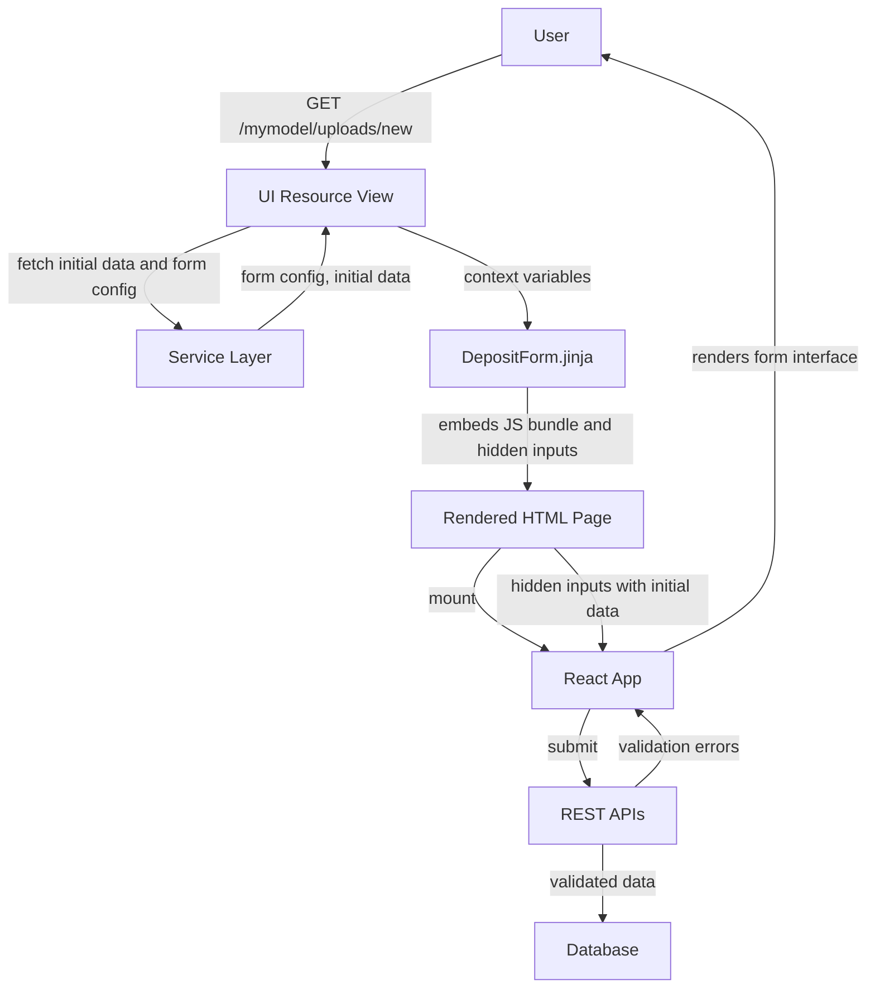

import { Callout, FileTree, Cards } from "nextra/components";
import { Card } from "@/components/card";

# Deposit form

The deposit form enables users to create and edit records. It's a React-based form application that provides field validation, dynamic sections, and integration with your record model.

## Architecture

The deposit form follows this flow:

1. **User accesses** record deposition URL (e.g., `/mymodel/uploads/new` for create, `/mymodel/uploads/<pid_value>` for edit) of a specific model
2. **UI Resource view** prepares initial form data and configuration
3. **DepositForm.jinja** component renders the page, embedding model-specific form app JS bundle, providing initial data through hidden inputs
4. **React app mounts** parses initial data from rendered template hidden inputs and renders the form interface
5. **Form submission** sends data to the API endpoint for validation and storage



## UI Resource Configuration

The deposit routes are defined in your model's UI resource config:

```python filename="ui/mymodel/__init__.py"
from oarepo_ui.resources.records.config import RecordsUIResourceConfig

class MymodelUIResourceConfig(RecordsUIResourceConfig):
    blueprint_name = "mymodel"
    url_prefix = "/mymodel"

    routes = {
        "deposit_create": "/uploads/new",
        "deposit_edit": "/uploads/<pid_value>",
        # ... other routes
    }
```

## Form Configuration

Form field definitions, labels, hints, and validation rules are derived from your record model's YAML schema definition. See [Model schema customization](/customize/model_backend/model) for details on defining field types, labels, hints, and help text.

## Template Structure

The deposit page uses a generic template provided by oarepo-ui (`oarepo_ui.pages.DepositForm`). This template handles the page structure and includes the deposit form container.

<Callout type="info">
The generic `oarepo_ui.pages.DepositForm` template provides all standard deposit form functionality including the form container, data attributes, and React app initialization. Form field customization is done through the FormFieldsContainer component.
</Callout>

### Available Context Variables

| Variable | Description |
|----------|-------------|
| `theme` | Theme configuration |
| `forms_config` | Form configuration |
| `searchbar_config` | Search bar configuration |
| `record` | Current record data (for edit mode) |
| `community` | Community data if applicable |
| `community_ui` | Community UI data |
| `files` | Record files entries |
| `extra_context` | Additional context from resource components |
| `ui_links` | UI links |
| `permissions` | User permissions |
| `webpack_entry` | Webpack entry point for the deposit form JavaScript |

## Form Fields Container

The `FormFieldsContainer.jsx` component located at `ui/mymodel/semantic-ui/js/mymodel/forms/FormFieldsContainer.jsx` is where you define your form fields using AccordionField for sections.

This component is designed to be modified directly when implementing your deposit form. It receives the `record` prop and `formConfig` from the Redux store:

```jsx filename="ui/mymodel/semantic-ui/js/mymodel/forms/FormFieldsContainer.jsx"
import { TextField } from "@js/oarepo_ui/forms";
import { AccordionField } from "react-invenio-forms";
import { connect } from "react-redux";

const FormFieldsContainerComponent = ({ record }) => {
  return (
    <>
      <AccordionField
        includesPaths={["metadata.title"]}
        active
        label="Basic information"
      >
        <TextField fieldPath="metadata.title" />
      </AccordionField>

      <AccordionField
        includesPaths={["files.enabled"]}
        active
        label="Files upload"
      >
        {/* File upload component */}
      </AccordionField>
    </>
  );
};

const mapStateToProps = (state) => ({
  record: state.deposit.record,
});

export default connect(mapStateToProps)(FormFieldsContainerComponent);
```

See [Deposit form components](/customize/model_ui/deposit_components) for available form field components.

## Entry Point

The entry point at `ui/mymodel/semantic-ui/js/mymodel/forms/index.js` renders the deposit app and registers the FormFieldsContainer as a component override:

```jsx filename="ui/mymodel/semantic-ui/js/mymodel/forms/index.js"
import { DepositFormApp, parseFormAppConfig } from "@js/oarepo_ui/forms";
import ReactDOM from "react-dom";
import { OARepoDepositSerializer } from "@js/oarepo_ui/api";
import FormFieldsContainer from "./FormFieldsContainer";

const recordSerializer = new OARepoDepositSerializer(
  ["errors", "expanded"],
  ["__key"]
);

const { rootEl, config, ...rest } = parseFormAppConfig();
const overridableIdPrefix = config.overridableIdPrefix;

export const componentOverrides = {
  [`${overridableIdPrefix}.FormFields.container`]: FormFieldsContainer,
};

ReactDOM.render(
  <DepositFormApp
    config={config}
    {...rest}
    recordSerializer={recordSerializer}
    componentOverrides={componentOverrides}
  />,
  rootEl
);
```

<Callout type="info">
The copier template configures the webpack entry point automatically. Developers only need to modify the FormFieldsContainer component to add their form fields.
</Callout>

See [Component Override](/customize/repository_ui/js_assets/react/overrides) for more details on component overrides.

## Replacing the Default Deposit Template

By default, the deposit form page uses the generic `oarepo_ui.pages.DepositForm` template.

If you need to replace the entire deposit form template with your own model-specific implementation:

### Create a Custom Page Component

```jinja filename="ui/mymodel/templates/semantic-ui/mymodel/pages/DepositForm.jinja"
{#def theme, forms_config, record, community, files, extra_context, ui_links, permissions, webpack_entry #}


{# Add custom content above the form #}

  
  <div class="ui message info">
    <i class="info circle icon"></i>
    {{ extra_context.get('custom_banner_text', _('Important: Review the guidelines before submitting')) }}
  </div>
  
  {{ super() }}



    
    {{ webpack[webpack_entry] }}

```

Register it in your UI resource config:

```python filename="ui/mymodel/__init__.py"
class MymodelUIResourceConfig(RecordsUIResourceConfig):
    templates = {
        "deposit_create": "mymodel.pages.DepositForm",
        "deposit_edit": "mymodel.pages.DepositForm",
    }
```

See [JinjaX Components](/customize/repository_ui/templating/jinjax) for more on creating page components.

## Adding Form Context Data

Add or modify form configuration and context variables through resource components:

```python filename="ui/mymodel/components.py"
from oarepo_ui.resources.components import UIResourceComponent

class MymodelFormComponent(UIResourceComponent):
    def before_ui_create(self, resource, request, extra_context, **kwargs):
        # Add data available in create mode
        extra_context["extra_form_options"] = {
            "customFeature": True,
        }

    def before_ui_edit(self, resource, request, extra_context, **kwargs):
        # Add data available in edit mode
        record = extra_context.get("record")
        if record:
            extra_context["record_history"] = self._get_history(record)
```

Register in your UI resource config:

```python filename="ui/mymodel/__init__.py"
class MymodelUIResourceConfig(RecordsUIResourceConfig):
    components = [
        MymodelFormComponent,
    ]
```

## Related Resources

<Cards>
  <Card
    title="Deposit form components"
    href="/customize/model_ui/deposit_components"
  >
    Available form field components
  </Card>
  <Card
    title="UI Resource Views"
    href="/customize/repository_ui/resources"
  >
    UI resource architecture
  </Card>
  <Card
    title="Webpack Configuration"
    href="/customize/repository_ui/webpack"
  >
    Entry point configuration
  </Card>
  <Card
    title="Record landing page"
    href="/customize/model_ui/detail"
  >
    Record detail customization
  </Card>
</Cards>
