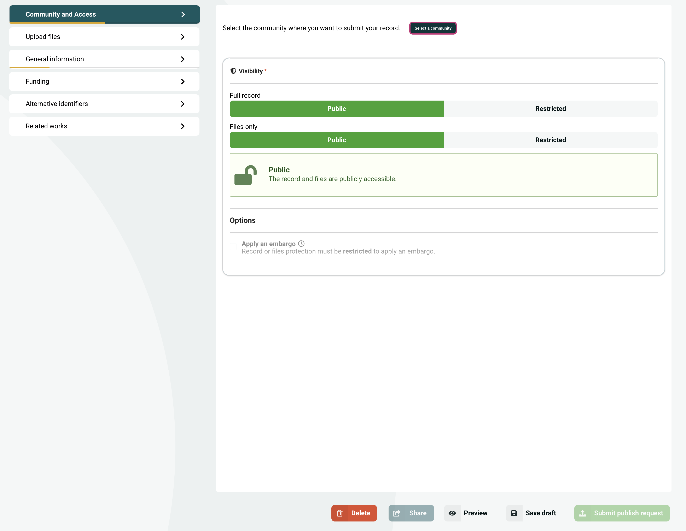
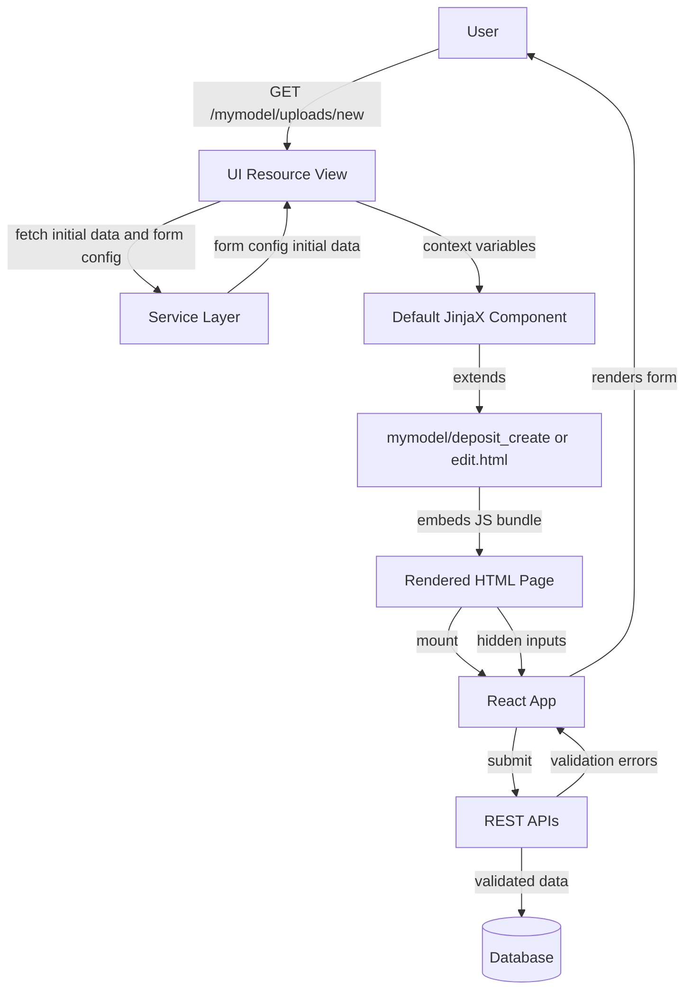
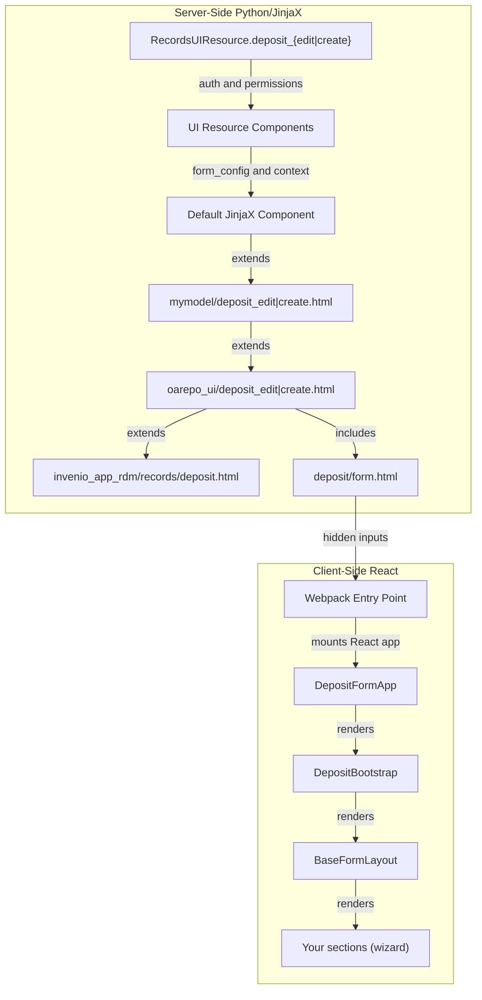

import { Callout, FileTree, Cards, Steps } from "nextra/components";
import { Card } from "@/components/card";

# Deposit form

The deposit form enables users to create and edit records. It's a React-based form application that provides field validation, dynamic sections, and integration with your record model.

## Key Concepts

- **Wizard of sections** — the form renders as a wizard with vertical tabs, built from an **ordered array of section objects** (one tab each). You customize the form by composing and extending this array.
- **Field metadata comes from the model** — labels, hints, help text, and required status are defined in your model's YAML schema and surfaced to React via the `useFieldData` hook. You place field components; you don't re-declare their labels in JSX.
- **Server renders, React mounts** — the server-side view renders a page with hidden inputs (record, form config) plus an empty `<div id="deposit-form">`; a small webpack entry point mounts the React app onto that div.

See [How It Works Under the Hood](#how-it-works-under-the-hood) for the full request and application-layer architecture.

## Building Your Deposit Form

What the nrp-model-copier template generates depends on the `base_model` you chose when creating the model:

| `base_model` | Generated `forms/index.js` starts from |
|---|---|
| `empty` | A single placeholder [`ExampleSection`](https://github.com/oarepo/oarepo-ui/blob/main/oarepo_ui/theme/assets/semantic-ui/js/oarepo_ui/forms/exampleSection.js) — you build your own sections |
| `rdm_minimal` | [`RDMMinimalSections`](https://github.com/oarepo/oarepo-rdm/blob/main/oarepo_rdm/ui/theme/assets/semantic-ui/js/oarepo_rdm_ui/form/RDMMinimalSections.js) + [`RDMMinimalRecordSerializer`](https://github.com/oarepo/oarepo-rdm/blob/main/oarepo_rdm/ui/theme/assets/semantic-ui/js/oarepo_rdm_ui/form/RDMMinimalRecordSerializer.js) from `@js/oarepo_rdm/form` |
| `rdm_basic` | [`RDMBasicSections`](https://github.com/oarepo/oarepo-rdm/blob/main/oarepo_rdm/ui/theme/assets/semantic-ui/js/oarepo_rdm_ui/form/RDMBasicSections.js) from `@js/oarepo_rdm/form` |
| `rdm_complete` | [`RDMCompleteSections`](https://github.com/oarepo/oarepo-rdm/blob/main/oarepo_rdm/ui/theme/assets/semantic-ui/js/oarepo_rdm_ui/form/RDMCompleteSections.js) from `@js/oarepo_rdm/form` |
| `ccmm` | [`CCMMSections`](https://github.com/NRP-CZ/ccmm-invenio/blob/main/src/ccmm_invenio/ui/semantic-ui/js/ccmm_invenio/forms/CCMMSections.js) + [`CCMMDepositRecordSerializer`](https://github.com/NRP-CZ/ccmm-invenio/blob/main/src/ccmm_invenio/ui/semantic-ui/js/ccmm_invenio/forms/CCMMDepositRecordSerializer.js) from `@js/ccmm_invenio/forms` |

All variants render the form with **wizard layout** (`useWizardForm`): the form is an ordered array of **section objects**, one wizard tab each. Customization therefore means composing and extending this section array — for non-empty base models you mostly *reconfigure* (reorder/omit/override preset sections, add your own); for `empty` you *build* the sections yourself. The recommended pattern is one section file per logical group, assembled in a `sections.js`, mirroring how the preset sections are organized in the source packages.

<Steps>

### Define Your Fields in the Model Schema

Add your custom fields to `models/{{model_name}}/metadata.yaml`. This file is for **your** fields only. Standard fields like `title`, `creators`, `resource_type`, `publication_date` are defined by the preset (`rdm_minimal_preset`, `rdm_basic_preset`, `rdm_complete_preset`, `ccmm_production_preset_1_1_0`) configured in `models/{{model_name}}/model.py`, so they are *not* in your YAML — and you must not repeat them here.

```yaml filename="models/{{model_name}}/metadata.yaml"
# Definition of metadata for {{model_name}}
# Standard RDM/CCMM fields (title, creators, resource_type, ...) are pulled in
# from the preset configured in model.py — don't redefine them here.
Metadata:
  properties:
    sample_id:
      type: keyword
      label:
        en: Sample identifier
        cs: Identifikátor vzorku
      help:
        en: Internal identifier of the chemical sample
        cs: Interní identifikátor chemického vzorku

    batch_number:
      type: keyword
      label:
        en: Batch number
        cs: Číslo šarže

    concentration:
      type: object
      properties:
        value:
          type: float
          label:
            en: Concentration
            cs: Koncentrace
        unit:
          type: keyword
          label:
            en: Unit
            cs: Jednotka
```

On **`empty`** models there is no preset, so *every* field (including `title`) has to be declared in this file.

See [Model schema customization](/customize/model_backend/model) for details on defining field types, labels, hints, and help text.

### Build Your Form from Sections

Create a section file per logical group of fields. A section is a plain object — `key` (used in the `?tab=key` URL), `label`, `component` rendering the section (typically its fields), and `includesPaths` (used for error indicators and the per-tab completion bar):

```jsx filename="ui/{{model_name}}/semantic-ui/js/{{model_name}}/forms/SampleInfoSection.js"
import React from "react";
import { i18next } from "@translations/i18next";
import { TextField } from "@js/oarepo_ui/forms";

export const SampleInfoSection = {
  key: "sample-info",
  label: i18next.t("Sample information"),
  component: ({ record, formConfig }) => (
    <React.Fragment>
      <TextField fieldPath="metadata.sample_id" required />
      <TextField fieldPath="metadata.batch_number" />
      <TextField fieldPath="metadata.concentration.value" />
      <TextField fieldPath="metadata.concentration.unit" />
    </React.Fragment>
  ),
  includesPaths: [
    "metadata.sample_id",
    "metadata.batch_number",
    "metadata.concentration",
  ],
};
```

Field labels, hints and help texts come from the model schema automatically (`useFieldData`) — you only place the components. Collect your sections in one file, composing them with the preset sections shipped with your base model. For a **non-empty base model** the preset sections already cover the standard fields (`metadata.title`, `metadata.creators`, files, community, ...) — your own sections carry only your custom fields:

```jsx filename="ui/{{model_name}}/semantic-ui/js/{{model_name}}/forms/sections.js"
import { RDMCommunityAndAccess, RDMFiles, RDMGeneralInformationBasic } from "@js/oarepo_rdm/form";
import { SampleInfoSection } from "./SampleInfoSection";

export const mySections = [
  RDMGeneralInformationBasic, // preset: metadata.title, creators, ...
  RDMFiles, // preset: file upload
  RDMCommunityAndAccess, // preset: community + access
  SampleInfoSection, // custom: metadata.sample_id, batch_number, concentration
];
```

Finally pass the array (and an optional record serializer) to the form in the generated entry point:

```jsx filename="ui/{{model_name}}/semantic-ui/js/{{model_name}}/forms/index.js"
import { mySections } from "./sections";
import { OARepoDepositSerializer } from "@js/oarepo_ui";
ReactDOM.render(
  <DepositFormApp
    config={config}
    {...rest}
    sections={mySections}
    recordSerializer={OARepoDepositSerializer}
    useWizardForm
  />,
  rootEl,
);
```

See [Defining Sections](#defining-sections) below for the full section-object reference (auto-save, completion indicator, locking).

### Choose Field Components

Use the components documented in [Deposit Form Components](/customize/model_ui/deposit_components) to add different field types:

| Component                  | Use for                           | Example                                  |
| -------------------------- | --------------------------------- | ---------------------------------------- |
| `TextField`                | Single-line/multi-line text input | `metadata.title`, `metadata.name`        |
| `StringArrayField`         | Arrays of plain strings           | `metadata.keywords`                      |
| `MultilingualTextInput`    | Localized text (array of `{lang, value}`) | `metadata.description`           |
| `VocabularyField` †        | Vocabulary-selected items         | `metadata.resource_type`                 |
| `EDTFSingleDatePicker`     | EDTF dates                        | `metadata.publication_date`              |
| `EDTFDaterangePicker`      | EDTF date ranges                  | `metadata.date_range`                    |
| `CreatibutorsField`        | Persons/organizations with roles  | `metadata.creators`                      |

† `VocabularyField` comes from `@js/oarepo_vocabularies/form` (package `oarepo-vocabularies`), not `@js/oarepo_ui/forms` — see [VocabularyField](/customize/model_ui/deposit_components#vocabularyfield).

<Callout type="info">
  Generic containers (`ArrayField`, `GroupField`, `AccordionField`), plain
  `SelectField` and `RichInputField` are **not** part of `@js/oarepo_ui/forms`
  — import them from `react-invenio-forms`. If no suitable field component
  exists, you can [create custom form
  fields](#create-custom-form-fields).
</Callout>

</Steps>

To reorder, extend, or remove parts of preset sections (`CCMMSections`, `RDM*Sections`) without rewriting them, use `componentOverrides` on `DepositFormApp` — see [Using CCMM sections](#using-ccmm-sections) for worked examples, including adding content below any section and removing individual fields.

## The Wizard Form

The form is rendered as a wizard with vertical tabs — the entry point passes `useWizardForm` together with the `sections` array and an optional `componentOverrides` map to `DepositFormApp` (as in [Build Your Form from Sections](#build-your-form-from-sections)). This section is the reference for the wizard's behaviour and the section-object format.



*Deposit form wizard: section tabs on the left (each with a completion bar and lock/error indicators), the active section's fields on the right.*

### How the Tab Form Works

- **Free navigation** — users can switch between tabs at any time without being required to complete or validate the current section first. A section can opt out of this and temporarily lock navigation by defining a `lockTabChange` function (see [Locking Tab Navigation](#locking-tab-navigation)).
- **Auto-save on tab switch** — if the form has unsaved changes when switching tabs, it automatically saves the draft. This also triggers a fresh round of validation errors from the backend, so validation feedback is up to date.
- **URL persistence** — the active tab is reflected in the URL via the `?tab=key` query parameter, so users can bookmark or share a link that opens directly on a specific section.

### Defining Sections

A worked example is in [Build Your Form from Sections](#build-your-form-from-sections) above. A section does not have to render fields only — it can render any React content (e.g. the file uploader, a community picker, a custom dashboard).

**Section object properties:**

| Property          | Type     | Description                                                                                       |
| ----------------- | -------- | ------------------------------------------------------------------------------------------------- |
| `key`             | string   | Unique identifier for the section (used in URL as `?tab=key`)                                     |
| `label`           | string   | Display label shown in the tab menu                                                               |
| `component`       | function | Called as `component({ record, formConfig, activeStep, next, back, initialRecord })`, returns JSX |
| `includesPaths`   | string[] | Field paths for error tracking — errors in these fields show indicators on this tab               |
| `saveOnTabChange` | bool \| function   | Forces a save when leaving this tab, even if the form is not dirty. Useful for sections like file upload or community selection that update Redux state rather than Formik state, so the form won't appear dirty despite having unsaved changes. Can be a boolean, or a function `({ formikValues, reduxState, dirty, activeStep }) => boolean` for conditional saving. |
| `sectionCompletion`   | function | Custom function to compute how filled the section is. Receives `({ formikValues, reduxState, includesPaths })` and must return a number between 0 (empty) and 1 (fully filled). When omitted, the built-in generic function checks each path in `includesPaths` via Formik values |
| `sectionCompletionThreshold` | number   | Fraction (0–1) at which the section progress bar turns from orange to green. Defaults to `0.8`    |
| `lockTabChange`   | function | Optional gate that, when present on the **active** section, can temporarily block navigation away from that tab. Receives `(formik, reduxState)` and must return a boolean — return `true` to lock, `false` to allow. While locked, the other tabs render as disabled and `onTabChange` is a no-op. See [Locking Tab Navigation](#locking-tab-navigation) |

**Props available to `component`:**

| Prop            | Type     | Description                                                                                                                                                           |
| --------------- | -------- | --------------------------------------------------------------------------------------------------------------------------------------------------------------------- |
| `record`        | object   | The current record/draft data. Use to read existing field values (e.g. `record.ui.languages`, `record.is_published`)                                                  |
| `formConfig`    | object   | The form configuration object. Contains `formConfig.config.vocabularies`, `formConfig.config.filesLocked`, `formConfig.quota`, `formConfig.overridableIdPrefix`, etc. |
| `activeStep`    | number   | Zero-based index of the currently active section tab                                                                                                                  |
| `next`          | function | Call `next()` to programmatically advance to the next tab                                                                                                             |
| `back`          | function | Call `back()` to programmatically navigate to the previous tab                                                                                                        |
| `initialRecord` | object   | The record data as it was when the form first loaded, before any user edits. Useful for comparing current state to the saved state                                    |

### Using CCMM sections

If during model creation you chose ccmm-invenio, your form will already be provided with prepared [sections](https://github.com/NRP-CZ/ccmm-invenio/blob/main/src/ccmm_invenio/ui/semantic-ui/js/ccmm_invenio/forms/CCMMSections.js) for this model.

#### Adding Custom Sections

```jsx filename="ui/{{model_name}}/semantic-ui/js/{{model_name}}/forms/index.js"
import { CCMMSections } from "@js/ccmm_invenio/forms";
import { TextField } from "@js/oarepo_ui/forms";
import { i18next } from "@translations/i18next";

// Start with the shared sections and add your own at the end
export const mySections = [...CCMMSections, MyNewSection];
```

#### Adding Content to a Section via Override

Below each section's content (and below the "unsaved changes" notice), `TabContent` renders an empty `<Overridable>` slot named `${overridableIdPrefix}.TabForm.TabContent.${section.key}` — see [`TabContent.jsx`](https://github.com/oarepo/oarepo-ui/blob/main/oarepo_ui/theme/assets/semantic-ui/js/oarepo_ui/forms/components/TabContent/TabContent.jsx#L132). Registering content for this ID *appends* it under the section's fields — it does not replace the section's own fields, the error boundary, or any part of the tab. To change a field *inside* the section, override its per-field ID instead (next section).

```jsx filename="ui/{{model_name}}/semantic-ui/js/{{model_name}}/forms/index.js"
import { parseFormAppConfig } from "@js/oarepo_ui/forms";

const { rootEl, config, ...rest } = parseFormAppConfig();
const overridableIdPrefix = config.overridableIdPrefix;

const BasicInfoExtra = ({ section, activeStep }) => (
  <div className="ui segment">
    <p>Additional content for {section.label}</p>
  </div>
);

const componentOverrides = {
  // Add content below the "general-information" section
  [`${overridableIdPrefix}.TabForm.TabContent.general-information`]:
    BasicInfoExtra,
};
```

`config.overridableIdPrefix` is read from the form config embedded in the page by `parseFormAppConfig()` — the same place the other overrides (e.g. `${prefix}.Files`, `${prefix}.TabForm.FormMetadataSummary`) get their prefix.

For the full component-override mechanism (overridable IDs, registration, other slots), see [Component Overrides](/customize/repository_ui/js_assets/react/overrides).

The override component receives these props:

- `section` - The current section object
- `activeStep` - Current step index
- `next` - Function to navigate to next step
- `back` - Function to navigate to previous step

#### Reorganizing CCMM Sections

The `CCMMSections` export is a fixed ordered array. If you need a different order, or want to omit some sections, you cannot simply sort or filter the imported array — you need to import the individual section objects and assemble your own array:

```js filename="ui/{{model_name}}/semantic-ui/js/{{model_name}}/forms/sections.js"
import {
  CCMMFiles,
  CCMMGeneralInformation,
  CCMMFunding,
  CCMMAlternativeIdentifiers,
  CCMMRelatedWorks,
  CCMMCommunityAndAccess,
} from "@js/ccmm_invenio/forms";
import { MyCustomSection } from "./MyCustomSection";

// Re-order, omit, or insert sections as needed
export const mySections = [
  CCMMGeneralInformation, // moved to first
  CCMMFiles,
  MyCustomSection, // inserted between built-in sections
  CCMMFunding,
  CCMMRelatedWorks,
  // CCMMAlternativeIdentifiers omitted entirely
  // CCMMCommunityAndAccess omitted entirely
];
```

#### Overriding Individual Fields Within a Section

Each field inside a CCMM section is wrapped in an `<Overridable>` component, which means you can replace or adjust it via `componentOverrides` in your entry point without touching the section file itself.

The overridable ID for a field follows the pattern `{overridableIdPrefix}.FieldName` — for example, `{overridableIdPrefix}.Files` for the file uploader in `CCMMFiles`. The prefix comes from `config.overridableIdPrefix` returned by `parseFormAppConfig()`.

**Hiding a field** — return `null` from the override to remove it from the UI entirely:

```jsx filename="ui/{{model_name}}/semantic-ui/js/{{model_name}}/forms/index.js"
const { rootEl, config, ...rest } = parseFormAppConfig();
const overridablePrefix = config.overridableIdPrefix;

const componentOverrides = {
  // Remove the file uploader section content completely
  [`${overridablePrefix}.Files`]: () => null,

  // Remove the version field from General Information
  [`${overridablePrefix}.Version`]: () => null,
};
```

**Modifying field props** — render the original component with adjusted props. The override receives the full `tabConfig` spread (i.e. `record`, `formConfig`, `activeStep`, `next`, `back`, `initialRecord`) as props:

```jsx filename="ui/{{model_name}}/semantic-ui/js/{{model_name}}/forms/index.js"
import { UppyUploader } from "@js/invenio_rdm_records";

const { rootEl, config, ...rest } = parseFormAppConfig();
const overridablePrefix = config.overridableIdPrefix;

const componentOverrides = {
  // Replace the file uploader with a version that locks files
  [`${overridablePrefix}.Files`]: ({ record, formConfig }) => (
    <UppyUploader
      isDraftRecord={!record.is_published}
      config={formConfig}
      quota={formConfig.quota}
      decimalSizeDisplay={formConfig.decimal_size_display}
      allowEmptyFiles={formConfig.allow_empty_files}
      fileUploadConcurrency={formConfig.file_upload_concurrency}
      filesLocked={true} // override: always lock files
    />
  ),
};
```

Pass `componentOverrides` to `DepositFormApp`:

```jsx
ReactDOM.render(
  <DepositFormApp
    config={config}
    {...rest}
    sections={mySections}
    recordSerializer={OARepoDepositSerializer}
    componentOverrides={componentOverrides}
    useWizardForm
  />,
  rootEl,
);
```

<Callout type="warning">
  These are front-end only changes. If you are running a ccmm-invenio model, it
  also has a backend part that expects certain data to be submitted from the
  form. Removing a field from the UI that is required by ccmm-invenio means
  there will be no way to fill in that value, and the record cannot be
  published. Similarly, if you add extra sections with new fields, those fields
  must also be declared in the backend model schema (e.g.
  `datasets/metadata.yaml`).
</Callout>

#### Section Completion Indicator

Because the wizard form only validates against the server when saving (i.e. when switching tabs), validation errors are not immediately visible while the user is editing. To compensate, each tab displays a real-time **progress bar** that shows how much of the section has been filled in. This gives users continuous feedback on their progress without waiting for a save round-trip.

By default, the indicator uses a generic function that iterates over the section's `includesPaths` and checks each path in Formik values. For each path that has a non-empty value, it counts it as filled and returns the ratio of filled paths to total paths (a number between 0 and 1).

**Custom `sectionCompletion` functions**

Some data is not stored in Formik state — for example, **file uploads** are managed through Redux, and **community selection** may live outside Formik as well. For sections containing such fields, the generic function cannot detect whether they are filled, so you need to provide a custom `sectionCompletion` function.

The function signature is:

```js
sectionCompletion({ formikValues, reduxState, includesPaths }) => number  // 0 to 1
```

For file upload sections, oarepo-ui provides a ready-made function:

```js
import { computeFilesSectionCompletion } from "@js/oarepo_ui/forms";

export const FilesSection = {
  key: "files",
  label: i18next.t("Upload files"),
  component: ({ record, formConfig }) => { /* ... */ },
  includesPaths: ["files.enabled"],
  sectionCompletion: computeFilesSectionCompletion,
};
```

`computeFilesSectionCompletion` checks the Redux state for file entries and returns `1` if at least one file has been uploaded, `0` otherwise.

**Adjusting the threshold**

Each section can set a custom `sectionCompletionThreshold` (default `0.8`). The bar displays in orange below this threshold and green at or above it:

```js
export const BasicInformationSection = {
  key: "basic-info",
  label: i18next.t("Basic information"),
  component: BasicInfoComponent,
  includesPaths: ["metadata.sample_id", "metadata.batch_number", "metadata.concentration"],
  sectionCompletionThreshold: 0.6, // turn green at 60% instead of 80%
};
```

**Disabling the indicator**

If you want to hide the section completion indicator entirely, add the following to your site overrides:

```less filename="assets/less/site/globals/site.overrides"
.section-completion-bar {
  display: none;
}
```

#### Locking Tab Navigation

By default, users can move between tabs freely at any point — see [How the Tab Form Works](#how-the-tab-form-works). For some sections this is undesirable: a file upload may be in progress, a community selection step may need to be committed before continuing, or a particular operation must finish atomically. The `lockTabChange` property lets a section opt into temporarily blocking navigation while a condition holds.

The function signature is:

```js
lockTabChange(formik, reduxState) => boolean
```

It is only evaluated on the **currently active** section. Returning `true` has two effects simultaneously:

- The other tabs in the menu render with `disabled` so users can see they cannot be clicked.
- `handleSetStep` (the handler behind `onTabChange`) returns early, so programmatic navigation and keyboard navigation are blocked as well.

Returning `false` (the default when the prop is omitted) keeps the standard free-navigation behavior.

Because the function receives both the Formik context and the full Redux state, it can react to either form values or out-of-Formik state like in-flight file uploads:

```jsx filename="ui/{{model_name}}/semantic-ui/js/{{model_name}}/forms/FilesSection.js"
export const FilesSection = {
  key: "files",
  label: i18next.t("Upload files"),
  component: FilesSectionComponent,
  includesPaths: ["files.enabled"],
  // Block leaving this tab while there is an upload still running.
  lockTabChange: (formik, reduxState) => {
    const files = reduxState?.deposit?.files?.entries ?? [];
    return files.some((f) => f.status === "uploading");
  },
};
```

<Callout type="info">
  `lockTabChange` is re-evaluated on every Redux action and on every render of
  the active tab, so changes in either Formik or Redux state lock or unlock
  navigation immediately — no manual refresh needed.
</Callout>

<Callout type="warning">
  Because the lock is total, make sure the condition is guaranteed to clear on
  its own (e.g. the upload finishes or fails). A `lockTabChange` that gets
  stuck on `true` will trap users on the current tab.
</Callout>


## Form Metadata Summary

`TabForm` exposes an overridable slot directly below the vertical step navigation, intended for a sidebar-style summary of the currently filled metadata. It is rendered **only on large (computer) screens** — on mobile and tablet the horizontal `FormSteps` are used instead and the slot is not displayed, so it should not be relied on as the only place to surface information.

A typical use case is keeping the most important context visible at all times while the user is filling other tabs — for example the selected community, the current access setting, the number of uploaded files, or the chosen license — so they don't have to switch tabs to check.

**Override ID:** `` `${overridablePrefix}.TabForm.FormMetadataSummary` ``

The slot is rendered with the following props by default:

| Prop          | Type     | Description                                                                  |
| ------------- | -------- | ---------------------------------------------------------------------------- |
| `record`      | object   | The current record/draft data                                                |
| `activeStep`  | number   | Zero-based index of the currently active section tab                         |
| `sections`    | array    | The full ordered array of section objects passed to `DepositFormApp`         |
| `onTabChange` | function | Call `onTabChange(stepIndex)` to programmatically switch to a different tab  |

If you need anything beyond these props (for example live form values, the persisted record from Redux, or the resolved form configuration), pull it inside the override using the standard hooks:

- `useFormikContext()` — live form values, updated as the user types
- `useSelector(state => state.deposit.record)` — the persisted record from the Redux store (updates on save)
- `useFormConfig()` — the resolved form configuration (locale, vocabularies, permissions, etc.)

By default nothing is rendered in this slot; provide an override to opt in.

```jsx filename="ui/{{model_name}}/semantic-ui/js/{{model_name}}/forms/index.js"
import React from "react";
import { useSelector } from "react-redux";
import { useFormikContext } from "formik";
import { Segment, Header, List } from "semantic-ui-react";
import { parseFormAppConfig, useFormConfig } from "@js/oarepo_ui/forms";

const { rootEl, config, ...rest } = parseFormAppConfig();
const overridablePrefix = config.overridableIdPrefix;

const FormMetadataSummary = () => {
  // Redux: persisted record (only updates on save)
  const record = useSelector((state) => state.deposit.record);
  // Formik: live form values (update as the user types)
  const { values } = useFormikContext();
  // Form config (locale, vocabularies, permissions, …)
  const formConfig = useFormConfig();

  const title = values?.metadata?.title;
  const creators = values?.metadata?.creators ?? [];
  return (
    <Segment className="mt-10">
      <Header as="h4">Metadata summary</Header>
      <List>
        <List.Item>
          <strong>Title:</strong> {title || <em>not set</em>}
        </List.Item>
        <List.Item>
          <strong>Creators:</strong> {creators.length}
        </List.Item>
        <List.Item>
          <strong>Record id:</strong> {record?.id || <em>unsaved</em>}
        </List.Item>
        <List.Item>
          <strong>Locale:</strong> {formConfig?.default_locale}
        </List.Item>
      </List>
    </Segment>
  );
};

const componentOverrides = {
  [`${overridablePrefix}.TabForm.FormMetadataSummary`]: FormMetadataSummary,
};
```

Prefer `useFormikContext` for anything you want to see change while the user is editing other tabs; fall back to the Redux record when you only care about persisted state (for example whether the record has been saved yet, or its server-assigned id).

## Action Buttons

The action row at the bottom of the wizard (Save / Publish / Preview / Delete / Share Draft) is rendered as a stack of `<Overridable>` slots, one per button — see [`TabForm.jsx`](https://github.com/oarepo/oarepo-ui/blob/main/oarepo_ui/theme/assets/semantic-ui/js/oarepo_ui/forms/components/TabForm/TabForm.jsx#L226). Each can be hidden, replaced, or extended independently, and the whole row can be replaced via `${prefix}.TabForm.actions`.

| Override ID | Default |
|---|---|
| `${prefix}.TabForm.DeleteButton` | Invenio RDM `DeleteButton` (draft delete) |
| `${prefix}.TabForm.ShareDraftButton` | Invenio RDM `ShareDraftButton` (grant access to the draft) |
| `${prefix}.TabForm.PreviewButton` | Invenio RDM `PreviewButton` |
| `${prefix}.TabForm.SaveButton` | Invenio RDM `SaveButton` |
| `${prefix}.TabForm.PublishButton` | oarepo-ui `PublishButton` |
| `${prefix}.TabForm.actions` | Wraps the whole row — replace to reorder or restyle all buttons |

The defaults come from [`@js/invenio_rdm_records`](https://github.com/inveniosoftware/invenio-rdm-records/tree/master/invenio_rdm_records/assets/semantic-ui/js/invenio_rdm_records/src/deposit/controls) and [`@js/oarepo_ui/forms`](https://github.com/oarepo/oarepo-ui/blob/main/oarepo_ui/theme/assets/semantic-ui/js/oarepo_ui/forms/components/PublishButton).

**Hide a button** — return `null`:

```jsx
const componentOverrides = {
  // Hide the Preview button entirely
  [`${overridablePrefix}.TabForm.PreviewButton`]: () => null,
  // Hide Delete for users without the delete permission
  [`${overridablePrefix}.TabForm.DeleteButton`]: () => null,
};
```

**Replace a button** — render your own component. It receives the same props the default does (`record`, `permissions`, `groupsEnabled`, …, depending on the slot):

```jsx
const PreviewAsLink = () => {
  const record = useSelector((state) => state.deposit.record);
  return (
    <Button
      as="a"
      href={record?.links?.self_html}
      target="_blank"
      icon="eye"
      content={i18next.t("Preview")}
    />
  );
};

const componentOverrides = {
  [`${overridablePrefix}.TabForm.PreviewButton`]: PreviewAsLink,
};
```

**Restyle the whole row** — override the wrapping `TabForm.actions` slot. Its default is an empty fragment containing the per-button slots; replace it to add a header, change alignment, add leading content, etc.

<Callout type="warning">
Buttons are not "plain labels" — Save, Publish, Preview and Delete each trigger their own backend action (save draft, kick off the publish request, navigate to preview, soft-delete). Replacing one without wiring it to the corresponding Redux action will silently break that flow. Prefer hiding with `() => null` or wrapping the default component rather than rebuilding behaviour. The RDM reference implementation of these buttons is at [`invenio_rdm_records/…/deposit/controls`](https://github.com/inveniosoftware/invenio-rdm-records/tree/master/invenio_rdm_records/assets/semantic-ui/js/invenio_rdm_records/src/deposit/controls).
</Callout>

## useFieldData Helper

The `useFieldData` hook from `oarepo_ui/forms` provides access to field metadata (labels, help text, hints, required status, icon) defined in your model's YAML schema. This metadata is extracted during model compilation and made available to React components.

### Usage

```jsx
import { useFieldData } from "@js/oarepo_ui/forms";

const MyField = ({ fieldPath }) => {
  const { getFieldData } = useFieldData();

  const { helpText, label, placeholder, required } = getFieldData({
    fieldPath: fieldPath,
    fieldRepresentation: "text", // "full", "compact", or "text"
    icon: "pencil", // optional icon
  });

  return (
    <div>
      {/* label is a React node in "full"/"compact" modes or string in "text" mode */}
      <label>{label}</label>
      <input name={fieldPath} placeholder={placeholder} />
      {helpText && <small>{helpText}</small>}
    </div>
  );
};
```

### getFieldData Options

| Option                  | Type    | Default    | Description                                                 |
| ----------------------- | ------- | ---------- | ----------------------------------------------------------- |
| `fieldPath`             | string  | (required) | The path to the field in the metadata                       |
| `fieldRepresentation`   | string  | `"full"`   | How to render the label: `"full"`, `"compact"`, or `"text"` |
| `icon`                  | string  | `"pencil"` | Icon to display with the field                              |
| `fullLabelClassName`    | string  | -          | CSS class for full mode label                               |
| `compactLabelClassName` | string  | -          | CSS class for compact mode label                            |
| `fieldPathPrefix`       | string  | (auto-set) | Prefix for nested fields, configured by provider            |
| `ignorePrefix`          | boolean | `false`    | Whether to ignore the prefix                                |

### Return Values by Representation Mode

| Mode        | `label`                                     | `helpText`        | Other properties                                 |
| ----------- | ------------------------------------------- | ----------------- | ------------------------------------------------ |
| **full**    | React `<FieldLabel>` component              | `helpText` string | `placeholder`, `required`, `detail`              |
| **compact** | React `<CompactFieldLabel>` with popup help | (in popup)        | `placeholder`, `required`, `detail`              |
| **text**    | Plain string                                | `helpText` string | `labelIcon`, `placeholder`, `required`, `detail` |

All modes return an object with `helpText`, `label`, `placeholder`, `required`, `detail` (plus `labelIcon` in text mode).

## Create Custom Form Fields

If the available form components don't meet your needs, you can create custom fields using these patterns:

- **Wrapping `react-invenio-forms` components** - Use when extending standard form fields
- **Building from scratch with Formik** - Use for completely custom UI not based on `react-invenio-forms`

### Pattern 1: Wrapping Base Components

Here's an example of creating an `UppercaseField` by wrapping the standard `TextField` from `react-invenio-forms` and adding custom behavior:

```jsx filename="ui/{{model_name}}/semantic-ui/js/{{model_name}}/forms/UppercaseField.jsx"
import React from "react";
import { TextField as InvenioTextField } from "react-invenio-forms";
import { useFieldData } from "@js/oarepo_ui/forms";
import { getIn, useFormikContext } from "formik";

export const UppercaseField = ({
  fieldPath,
  fieldRepresentation = "full",
  icon = "arrow up",
  ...rest
}) => {
  const { setFieldTouched, setFieldValue, values } = useFormikContext();
  const { getFieldData } = useFieldData();

  return (
    <InvenioTextField
      optimized
      fieldPath={fieldPath}
      {...getFieldData({ fieldPath, fieldRepresentation, icon })}
      onBlur={() => {
        const currentValue = getIn(values, fieldPath);
        // Convert to uppercase on field blur
        if (typeof currentValue === "string") {
          setFieldValue(fieldPath, currentValue.toUpperCase());
        }
        setFieldTouched(fieldPath, true);
      }}
      {...rest}
    />
  );
};
```

**Key elements:**

| Element              | Purpose                                                                             |
| -------------------- | ----------------------------------------------------------------------------------- |
| `InvenioTextField`   | Base component from `react-invenio-forms` with Formik integration                   |
| `optimized`          | Uses `FastField` for better performance - only re-renders when this field changes   |
| `getFieldData()`     | Gets `label`, `helpText`, `placeholder`, `required`, `detail` from model YAML       |
| `useFormikContext()` | Access `setFieldValue`, `setFieldTouched`, and form values for custom blur behavior |
| `getIn()`            | Safely access nested field values from form state                                   |

### Pattern 2: Building from Scratch with Formik

For custom UI not based on `react-invenio-forms` components, use Formik directly (same pattern as [react-invenio-forms TextField](https://github.com/inveniosoftware/react-invenio-forms/blob/master/src/lib/forms/TextField.js)):

```jsx filename="ui/{{model_name}}/semantic-ui/js/{{model_name}}/forms/CustomField.jsx"
import React from "react";
import { FastField, Field } from "formik";
import PropTypes from "prop-types";
import { Form, Popup } from "semantic-ui-react";
import { useFieldData } from "@js/oarepo_ui/forms";

const CustomField = ({
  fieldPath,
  fieldRepresentation = "text",
  icon = "pencil",
  disabled = false,
  optimized = true,
  // Props from getFieldData can be overridden here
  label,
  helpText,
  required,
  placeholder,
  ...uiProps
}) => {
  const { getFieldData } = useFieldData();

  // Get field metadata from model YAML, with props as overrides
  const fieldData = getFieldData({ fieldPath, fieldRepresentation, icon });
  const computedLabel = label ?? fieldData.label;
  const computedHelpText = helpText ?? fieldData.helpText;
  const computedRequired = required ?? fieldData.required;
  const computedPlaceholder = placeholder ?? fieldData.placeholder;

  const FormikField = optimized ? FastField : Field;

  return (
    <>
      <FormikField name={fieldPath}>
        {({ field, meta }) => {
          // Resolve error to display
          const computedError =
            meta.error || (!meta.touched && meta.initialError);

          let formInputError = null;
          if (typeof computedError === "string") {
            formInputError = computedError;
          } else if (
            typeof computedError === "object" &&
            computedError.message
          ) {
            // Error object with severity/message - show as popup
            formInputError = (
              <Popup
                trigger={<span>{computedError.message}</span>}
                content={computedError.description}
                position="top center"
              />
            );
          }

          return (
            <Form.Input
              {...field}
              error={formInputError}
              disabled={disabled}
              fluid
              label={computedLabel}
              required={computedRequired}
              placeholder={computedPlaceholder}
              icon={icon}
              id={fieldPath}
              {...uiProps}
            />
          );
        }}
      </FormikField>

      {/* Optional help text below field */}
      {computedHelpText && (
        <label className="helptext">{computedHelpText}</label>
      )}
    </>
  );
};

CustomField.propTypes = {
  fieldPath: PropTypes.string.isRequired,
  fieldRepresentation: PropTypes.string,
  icon: PropTypes.string,
  disabled: PropTypes.bool,
  optimized: PropTypes.bool,
  label: PropTypes.oneOfType([PropTypes.string, PropTypes.node]),
  helpText: PropTypes.oneOfType([PropTypes.string, PropTypes.node]),
  required: PropTypes.bool,
  placeholder: PropTypes.string,
};

export default CustomField;
```

**Key elements explained:**

| Element               | Purpose                                                                                                                                     |
| --------------------- | ------------------------------------------------------------------------------------------------------------------------------------------- |
| `FastField` / `Field` | Formik component for form state. Use `FastField` (optimized mode) for better performance - only re-renders when this specific field changes |
| `optimized` prop      | When `true`, uses `FastField`. Set to `false` only if your field depends on other form values                                               |
| `getFieldData()`      | Retrieves `label`, `helpText`, `placeholder`, `required`, `detail` from your model's YAML schema definition                                 |
| `field` prop          | Spread Formik's field props (`value`, `onChange`, `onBlur`, `name`) onto input                                                              |
| `meta` prop           | Access `touched`, `error`, `initialError` for validation display                                                                            |
| `computedError`       | Combines Formik error with optional external error prop                                                                                     |
| Error handling        | Supports both string errors and structured objects with `severity`/`message`/`description`                                                  |
| Props override        | `label`, `helpText`, `required`, `placeholder` props override values from `getFieldData()`                                                  |

### Using Custom Fields

Import and use the custom field components you created above inside your section components:

```jsx
import React from "react";
import { i18next } from "@translations/i18next";
import { CustomField } from "./CustomField";
import { UppercaseField } from "./UppercaseField";

export const CustomSection = {
  key: "custom",
  label: i18next.t("Custom"),
  component: ({ record }) => (
    <React.Fragment>
      <CustomField
        fieldPath="metadata.custom"
        icon="tag"
        fieldRepresentation="full"
        // Override label from schema if needed
        label="Custom Field Label"
      />
      {/* Field that automatically converts input to uppercase */}
      <UppercaseField
        fieldPath="metadata.code"
        fieldRepresentation="compact"
      />
    </React.Fragment>
  ),
  includesPaths: ["metadata.custom", "metadata.code"],
};
```

## Optional: Custom Page Templates

Every generated model already ships `ui/mymodel/templates/semantic-ui/mymodel/deposit_{create,edit}.html`. These are *already* in the default inheritance chain — `oarepo_ui.pages.Deposit{Create,Edit}` (JinjaX wrapper) → `mymodel/deposit_{create,edit}.html` → `oarepo_ui/deposit_{create,edit}.html` → `invenio_app_rdm/records/deposit.html` — so your customizations take effect without any JinjaX component or `templates` registration. For the underlying templating model (Jinja vs JinjaX, template lookup, overriding by path), see [Templating in NRP Repositories](/customize/repository_ui/templating).

### Customize via Included Partials (Recommended)

The generated `deposit_create.html` / `deposit_edit.html` comment points you at two hot-swappable partials that the parent `oarepo_ui/...` template auto-includes for you:

| Partial | Path (inside `ui/mymodel/templates/semantic-ui/mymodel/`) | Purpose |
|---|---|---|
| Form container | `deposit_create/form.html` | Wraps/replaces the React mount div and surrounding markup of the page body |
| JavaScript hooks | `deposit_create/javascript.html` | Adds model-specific `<script>` tags without touching the parent's `` (auto-included via the `ignore missing` fallback) |

The JavaScript partial is the easiest safe override — just create the file. Content Security Policy blocks raw inline `<script>` tags, so the partial's role is to pull in a **webpack bundle** you've registered for the model — not to embed code directly. Register a bundle in your model's `webpack.py` (see [Webpack Configuration](/customize/repository_ui/webpack) for how registration works) and refer to it by name:

```jinja filename="ui/mymodel/templates/semantic-ui/mymodel/deposit_create/javascript.html"
{{ webpack["mymodel_deposit_custom.js"] }}
```

With the corresponding webpack entrypoint and registration, e.g.:

```python filename="ui/mymodel/webpack.py"
from invenio_assets.webpack import WebpackThemeBundle

theme = WebpackThemeBundle(
    __name__,
    "assets",
    default="semantic-ui",
    themes={
        "semantic-ui": {
            "entry": {
                # loaded via the deposit_create/javascript.html partial
                "mymodel_deposit_custom": "./js/mymodel/deposit_custom.js",
            },
            # ...
        },
    },
)
```

The base template's `` does ``, so adding the file is enough — no other change needed. (The same applies to a `deposit_edit/javascript.html` for the edit page.) Scripts pulled in this way are loaded from your static bundle, so they are CSP-safe.

<Callout type="warning">
Do **not** put a bare `<script>…</script>` block in the partial — browsers with strict Content Security Policy (default Invenio config) will refuse to execute it. Always go through `{{ webpack["…"] }}` or `{{ webpack_optional("…") }}`, or use `nonce` if you must inline something.
</Callout>

### Override a Block from the Parent Template

For larger changes (e.g. an always-visible banner next to the form rather than in the bundle JS), override a block of the parent:

```jinja filename="ui/mymodel/templates/semantic-ui/mymodel/deposit_create.html"



  
  <div class="ui message warning">
    <i class="icon clock"></i>
    {{ _("Submission deadline:") }} {{ extra_context.deadline }}
  </div>
  
  {{ super() }}

```

`extra_context` is populated by a [Resource Component](#optional-resource-components) — see the `deadline` example there.

<Callout type="info">
The same pattern works in `deposit_edit.html`. The generated template body for an unmodified model is just `` plus a comment block; your overrides plug in before the parent's `page_body` block renders.
</Callout>

## Optional: Resource Components

Use resource component hooks to modify form configuration or add template context. This is what supplies values like `extra_context.deadline` consumed by the [submission deadline banner](#override-a-block-from-the-parent-template) example above:

```python filename="ui/{{model_name}}/components.py"
from oarepo_ui.resources.components import UIResourceComponent

class ExtraContextComponent(UIResourceComponent):
    def before_ui_create(self, *, extra_context, **kwargs):
        """Add submission deadline to the create page (used by a banner in deposit_create.html)."""
        extra_context["deadline"] = "2026-12-31T23:59:59Z"

    def before_ui_edit(self, *, record, extra_context, **kwargs):
        """Add custom context to the edit page."""
        extra_context["deadline"] = "2026-12-31T23:59:59Z"
```

Register in your UI resource config:

```python
class MymodelUIResourceConfig(RecordsUIResourceConfig):
    # ...
    components = [ExtraContextComponent]
```

## How It Works Under the Hood

#### Request Flow

When a user accesses the deposit form URL:


```mermaid
graph TD
    U[User] -->|GET /mymodel/uploads/new| VR[UI Resource View]
    VR -->|fetch initial data and form config| SVC[Service Layer]
    SVC -->|form config initial data| VR
    VR -->|context variables| GC[Default JinjaX Component]
    GC -->|extends| BD[mymodel/deposit_create or edit.html]
    BD -->|embeds JS bundle| PG[Rendered HTML Page]
    PG -->|mount| RA[React App]
    PG -->|hidden inputs| RA
    RA -->|renders form| U
    RA -->|submit| API[REST APIs]
    API -->|validation errors| RA
    API -->|validated data| DB[(Database)]
```

#### Application Layers

The deposit form application is organized into server-side and client-side layers:


```mermaid
graph TD
    subgraph ServerSide["Server-Side Python/JinjaX"]
        VR["RecordsUIResource.deposit_{edit|create}"]
        RC["UI Resource Components"]
        GC["Default JinjaX Component"]
        MT["mymodel/deposit_edit|create.html"]
        BT["oarepo_ui/deposit_edit|create.html"]
        ID["invenio_app_rdm/records/deposit.html"]
        FH["deposit/form.html"]
    end

    subgraph ClientSide["Client-Side React"]
        EP["Webpack Entry Point"]
        DFA["DepositFormApp"]
        DB["DepositBootstrap"]
        BFL["BaseFormLayout"]
        SEC["Your sections (wizard)"]
    end

    VR -->|auth and permissions| RC
    RC -->|form_config and context| GC
    GC -->|extends| MT
    MT -->|extends| BT
    BT -->|extends| ID
    BT -->|includes| FH
    FH -->|hidden inputs| EP
    EP -->|mounts React app| DFA
    DFA -->|renders| DB
    DB -->|renders| BFL
    BFL -->|renders| SEC
```

##### Server-Side Layers

| Layer                 | Component                                                | Source                                                                                                     | Purpose                                                                    |
| --------------------- | -------------------------------------------------------- | ---------------------------------------------------------------------------------------------------------- | -------------------------------------------------------------------------- |
| **View**              | `RecordsUIResource.deposit_create/edit()`                | [oarepo-ui](https://github.com/oarepo/oarepo-ui/blob/main/oarepo_ui/resources/records/resource.py)         | Handles HTTP request, authenticates user, fetches record/draft data        |
| **Components**        | `run_components()`                                       | [oarepo-ui](https://github.com/oarepo/oarepo-ui/blob/main/oarepo_ui/resources/components/base.py)          | Executes component hooks to modify `form_config` and add context variables |
| **Default Component** | `oarepo_ui.pages.DepositCreate/Edit`                     | [oarepo-ui](https://github.com/oarepo/oarepo-ui/tree/main/oarepo_ui/templates/oarepo_ui/pages)             | Pre-defined JinjaX page component with def block                           |
| **Model Template**    | `model_name/deposit_edit\|create.html`                   | [nrp-model-copier](https://github.com/oarepo/nrp-model-copier)                                             | Model-specific template extending `oarepo_ui/deposit_edit\|create.html`     |
| **Base Template**     | `invenio_app_rdm/records/deposit.html`                   | [invenio-app-rdm](https://github.com/inveniosoftware/invenio-app-rdm)                                      | Provides page skeleton (CSS, JS, header, footer blocks)                    |
| **Form Content**      | `deposit/form.html`                                      | [oarepo-ui](https://github.com/oarepo/oarepo-ui/blob/main/oarepo_ui/templates/oarepo_ui/deposit/form.html) | Renders hidden inputs with config and placeholder div for React app        |

##### Client-Side Layers

| Layer                | Component                                                                    | Source                                                                                                                                                                                      | Purpose                                                         |
| -------------------- | ---------------------------------------------------------------------------- | ------------------------------------------------------------------------------------------------------------------------------------------------------------------------------------------- | --------------------------------------------------------------- |
| **Entry Point**      | `{{model_name}}/semantic-ui/js/{{model_name}}/forms/index.js`                | Model-specific ([nrp-model-copier](https://github.com/oarepo/nrp-model-copier/tree/rdm-14/template/ui/%7B%7Bmodel_name%7D%7D/semantic-ui/js/%7B%7Bmodel_name%7D%7D/forms))                  | Webpack entry that mounts React app to `#deposit-form` div      |
| **Form App**         | `DepositFormApp`                                                             | [oarepo-ui](https://github.com/oarepo/oarepo-ui/blob/main/oarepo_ui/theme/assets/semantic-ui/js/oarepo_ui/forms/components/DepositFormApp/DepositFormApp.jsx)                               | Main React form component with providers, router, and context   |
| **Bootstrap**        | `DepositBootstrap`                                                           | [invenio-rdm-records](https://github.com/inveniosoftware/invenio-rdm-records/blob/master/invenio_rdm_records/assets/semantic-ui/js/invenio_rdm_records/src/deposit/api/DepositBootstrap.js) | Wires the form into redux via `DepositFormSubmitContext` and `BaseForm` (save/publish/preview/delete actions) |
| **Form Layout**      | `BaseFormLayout`                                                             | [oarepo-ui](https://github.com/oarepo/oarepo-ui/tree/main/oarepo_ui/theme/assets/semantic-ui/js/oarepo_ui/forms/components/BaseFormLayout)                                                  | Generic form layout component with overridable fields container |
| **Sections** | `{{model_name}}/semantic-ui/js/{{model_name}}/forms/index.js` (+ section files you add) | Model-specific ([nrp-model-copier](https://github.com/oarepo/nrp-model-copier/tree/rdm-14/template/ui/%7B%7Bmodel_name%7D%7D/semantic-ui/js/%7B%7Bmodel_name%7D%7D/forms)) | Your custom sections composing the wizard form |

#### UI Resource Routes

The deposit routes that trigger this flow are defined in your model's UI resource config:

```python filename="ui/mymodel/__init__.py"
from oarepo_ui.resources.records.config import RecordsUIResourceConfig

class MymodelUIResourceConfig(RecordsUIResourceConfig):
    blueprint_name = "mymodel"
    url_prefix = "/mymodel"

    routes = {
        "deposit_create": "/uploads/new",
        "deposit_edit": "/uploads/<pid_value>",
        # ... other routes
    }
```

#### Template Context

When no custom page template is configured, oarepo-ui uses the default page component (`oarepo_ui.pages.DepositCreate` or `oarepo_ui.pages.DepositEdit`). This component declares all context variables in a `{# def #}` block and extends your model's base template.

The `{# def #}` block below is from the `deposit_create` page component (the `deposit_edit` block is identical except it omits `preselectedCommunity` and adds `file_modification = {}`):

```jinja
{# def
  theme,
  forms_config,
  searchbar_config,
  record,
  community,
  community_ui,
  community_use_jinja_header,
  files,
  preselectedCommunity=None,  # create only
  files_locked,
  extra_context,
  ui_links,
  permissions,
  webpack_entry,
#}

```

The default component extends your model's base template (`mymodel/deposit_create.html` or `mymodel/deposit_edit.html`), which is provided by nrp-model-copier and extends `oarepo_ui/deposit_create.html` / `oarepo_ui/deposit_edit.html`.

These context variables are available in your templates:

| Variable           | Description                                         |
| ------------------ | --------------------------------------------------- |
| `theme`            | Theme configuration                                 |
| `forms_config`     | Form configuration                                  |
| `searchbar_config` | Search bar configuration                            |
| `record`           | Current record data (for edit mode)                 |
| `community`        | Community data if applicable                        |
| `community_ui`     | Community UI data                                   |
| `files`            | Record files entries                                |
| `extra_context`    | Additional context from resource components         |
| `ui_links`         | UI links                                            |
| `permissions`      | User permissions                                    |
| `webpack_entry`    | Webpack entry point for the deposit form JavaScript |


## Further Reading

<Cards>
  <Card
    title="Deposit form components"
    href="/customize/model_ui/deposit_components"
  >
    Available form field components
  </Card>
  <Card
    title="Model schema customization"
    href="/customize/model_backend/model"
  >
    Define fields in your model YAML
  </Card>
  <Card title="Record landing page" href="/customize/model_ui/detail">
    Record detail customization
  </Card>
  <Card title="Formik documentation" href="https://formik.org/docs/overview">
    Form state management library
  </Card>
  <Card
    title="react-invenio-forms"
    href="https://github.com/inveniosoftware/react-invenio-forms"
  >
    Base form components
  </Card>
  <Card
    title="Semantic UI React Form"
    href="https://react.semantic-ui.com/collections/form"
  >
    Form UI components
  </Card>
</Cards>
