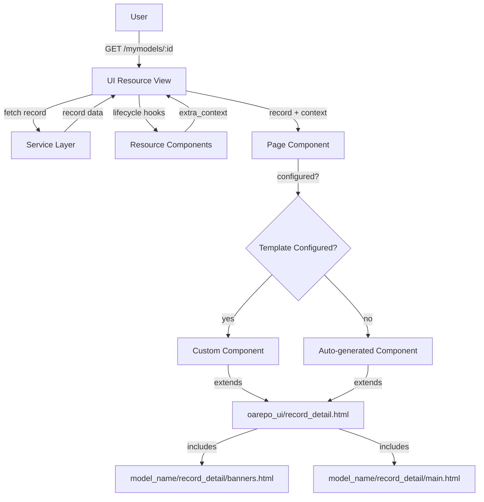

import { Callout, FileTree, Cards } from "nextra/components";
import { Card } from "@/components/card";

# Record landing page

The record landing page displays detailed information about a single record. This page is rendered through a generic JinjaX component provided by `oarepo-ui` that can be customized via model-specific partial templates.

## Architecture

The record detail page follows this flow:

1. **User accesses** a record URL (e.g., `/mymodels/<pid_value>`)
2. **UI Resource view** (`record_detail`) fetches the record from the service layer
3. **Resource components** prepare additional context data
4. **Page component** renders the page using base template and model partials

<Callout type="info">
If no custom template is explicitly configured, the system automatically generates a JinjaX page component at runtime that extends the base template and includes your model-specific partials.
</Callout>



## Runtime Component Generation

By default, `oarepo-ui` automatically generates a JinjaX page component at runtime when no custom template is explicitly configured. This generated component extends a base template and is cached for subsequent requests.

### Base Template

The base template used for runtime generation ([source](https://github.com/oarepo/oarepo-ui/blob/main/oarepo_ui/templates/oarepo_ui/record_detail.html)):

```jinja filename="oarepo_ui/templates/oarepo_ui/record_detail.html"



  {{ super() }}
  
    {{ webpack["record_sharing.js"] }}
  

```

<Callout type="info">
The `embedded` flag toggles certain UI features when the detail page is rendered within another context (e.g., inside a modal or iframe).
</Callout>

### Template Map

The system uses an internal `_TEMPLATE_MAP` to resolve base templates for different page types:

| Page Type | Template Path Pattern |
|-----------|----------------------|
| `record_detail` | `{model_name}/record_detail.html` |
| `search` | `{model_name}/record_search.html` |
| `deposit_edit` | `{model_name}/deposit_edit.html` |
| `deposit_create` | `{model_name}/deposit_create.html` |

For a model named `mymodel`, the system looks for `{model_name}/record_detail.html` which resolves to `mymodel/record_detail.html`.

### Generated Component Props

When the component is auto-generated, all keys from the `render_kwargs` are declared as props in a `{# def #}` block. These typically include:

| Prop | Description |
|------|-------------|
| `record` | API record object with id, pid, links, metadata, access, files |
| `record_ui` | Record metadata serialized for UI representation |
| `files` | Record files entries |
| `media_files` | System/media files entries |
| `permissions` | User permissions to record (`can_edit`, `can_update`, `can_manage`) |
| `is_preview` | Whether viewing in preview mode |
| `include_deleted` | Whether to include deleted records |
| `is_draft` | Whether record is a draft |
| `model` | Record model configuration |
| `model_name` | Name of the record model (e.g.: `mymodel`) |
| `community` | Community metadata if record belongs to one |
| `community_ui` | Community data serialized for UI representation |
| `user_avatar` | URL of the current user's avatar image |
| `record_owner_id` | ID of the record owner user |
| `ui_links` | UI navigation links |
| `extra_context` | Additional context from resource components |
| `d` | Shorthand for record.metadata |

### Template Structure

When using the auto-generated component, the runtime generator extends your model's base template (`{model_name}/record_detail.html`), which is provided by nrp-model-copier. This template includes your model-specific partials and extends `oarepo_ui/record_detail.html`.

For a model named `mymodel`, the structure is:

<FileTree>
  <FileTree.Folder name="ui/mymodel/templates" defaultOpen>
    <FileTree.Folder name="semantic-ui" defaultOpen>
      <FileTree.Folder name="mymodel" defaultOpen>
        <FileTree.File name="record_detail.html" />
        <FileTree.Folder name="record_detail" defaultOpen>
          <FileTree.File name="banners.html" />
          <FileTree.File name="main.html" />
        </FileTree.Folder>
      </FileTree.Folder>
    </FileTree.Folder>
  </FileTree.Folder>
</FileTree>

The `record_detail.html` template ([source](https://github.com/oarepo/nrp-model-copier/blob/main/template/ui/%7B%7Bmodel_name%7D%7D/templates/semantic-ui/%7B%7Bmodel_name%7D%7D/record_detail.html)):

```jinja filename="ui/mymodel/templates/semantic-ui/mymodel/record_detail.html"



  



  



  

```

### Available Blocks

| Block | Purpose |
|-------|---------|
| `page_body` | Main page wrapper - controls overall page structure |
| `page_banners` | Banner region for notices, warnings, status messages |
| `page_main` | Main content area - includes the model's main.html partial |
| `javascript` | JavaScript bundles |

## UI Resource Configuration

The record detail route is defined in your model's UI resource config:

```python filename="ui/mymodel/__init__.py"
from oarepo_ui.resources.records.config import RecordsUIResourceConfig

class MymodelUIResourceConfig(RecordsUIResourceConfig):
    blueprint_name = "mymodel"
    url_prefix = "/mymodel"

    routes = {
        "record_detail": "/records/<pid_value>",
        # ... other routes
    }
```

See [UI Resource Views](/customize/repository_ui/resources) for full details on UI resources.

## record_detail/banners.html

The `banners.html` template ([source](https://github.com/oarepo/oarepo-ui/blob/main/oarepo_ui/templates/oarepo_ui/record_detail/banners.html)) is included via the `page_banners` block and displays contextual banners at the top of the detail page.

<Callout type="info">
If you choose to extend from `oarepo_ui/record_detail/banners.html`, you get access to three overridable blocks: `banner_community_header`, `banner_preview_header`, and `banner_version_header`. Otherwise, you can put any content directly in your model-specific template.
</Callout>

### Option 1: Extend Default Banners

Extend from the default banners template to override specific blocks:

```jinja filename="ui/mymodel/templates/semantic-ui/mymodel/record_detail/banners.html"



  {{ super() }}
  
  <div class="ui message warning">
    <i class="exclamation triangle icon"></i>
    {{ extra_context.custom_warning }}
  </div>
  



  {# Hide version warning #}



  {# Hide community header #}

```

### Option 2: Custom Content

If you don't extend the default banners, put any content directly in your template:

```jinja filename="ui/mymodel/templates/semantic-ui/mymodel/record_detail/banners.html"
{# Custom banners without extending the default template #}


<div class="ui message info">
  <i class="eye icon"></i>
  You are viewing a preview. This record is not published yet.
</div>



<div class="ui message warning">
  <i class="warning icon"></i>
  {{ d.custom_field }}
</div>

```

## record_detail/main.html

The `main.html` template ([source](https://github.com/oarepo/oarepo-ui/blob/main/oarepo_ui/templates/oarepo_ui/record_detail/main.html)) is included via the `page_main` block and renders the main content of the record detail page. It provides the following overridable blocks:

| Block | Purpose |
|-------|---------|
| `record_body` | Main content wrapper (contains all other blocks) |
| `record_header` | Header section |
| `record_header_button` | Navigation header buttons (back to edit) |
| `record_header_info` | Publication date, version, type, access status |
| `record_title` | Record title and creators/contributors |
| `record_content` | Main description section |
| `record_files` | Files section with preview and list |
| `record_files_access_request` | Access request form for restricted files |
| `record_media_files` | System/media files section |
| `additional_record_details` | Additional metadata from `details.html` |
| `record_footer` | Footer section |
| `record_sidebar` | Right sidebar from `side_bar.html` |
| `jump` | "Jump to top" button |

<Callout type="info">
Use `{{ super() }}` within override blocks to preserve the parent template content. Omit `{{ super() }}` to completely replace the section. See [Templating: Jinja](/customize/repository_ui/templating/jinja) for more on template inheritance.
</Callout>

### Override Title and Add Content

```jinja filename="ui/mymodel/templates/semantic-ui/mymodel/record_detail/main.html"

  {{ super() }}
  {# Add custom badge after title #}
  <span class="ui label">MyModel</span>



  {{ super() }}
  <div class="ui segment">
    <h3>MyModel Metadata</h3>
    <p>{{ d.custom_field }}</p>
  </div>

```

### Hide Default Elements

```jinja filename="ui/mymodel/templates/semantic-ui/mymodel/record_detail/main.html"

  {# Hide publication date and version info #}

```

## record_detail/side_bar.html

The sidebar template ([source](https://github.com/inveniosoftware/invenio-app-rdm/blob/master/invenio_app_rdm/records_ui/templates/semantic-ui/invenio_app_rdm/records/details/side_bar.html)) is included from `invenio_app_rdm/records/details/side_bar.html`. It composes the sidebar from multiple templates listed in the `APP_RDM_DETAIL_SIDE_BAR_TEMPLATES` configuration:

```jinja filename="side_bar.html"

  

```

### Adding Sidebar Widgets

To add custom sidebar widgets, add your template path to the configuration in your `invenio.cfg`:

```python filename="invenio.cfg"
APP_RDM_DETAIL_SIDE_BAR_TEMPLATES = [
    "invenio_app_rdm/records/details/side_bar/versioning.html",
    "invenio_app_rdm/records/details/side_bar/export_formats.html",
    "invenio_app_rdm/records/details/side_bar/keywords.html",
    "mymodel/records/detail/side_bar/custom_widget.html",
]
```

Create your sidebar widget template:

```jinja filename="ui/mymodel/templates/semantic-ui/mymodel/records/detail/side_bar/custom_widget.html"
<div class="ui segment">
  <h3>Custom Widget</h3>
  <p>Your custom sidebar content here.</p>
</div>
```

### Overriding the Entire Sidebar

If you need to completely replace the sidebar, override the `record_sidebar` block:

```jinja filename="ui/mymodel/templates/semantic-ui/mymodel/record_detail/main.html"

  {# Custom sidebar content - replaces default sidebar #}
  <div class="ui segment">
    <h3>Custom Sidebar</h3>
    <p>Your custom content here.</p>
  </div>

```

## Using Resource Components

Add custom context data through resource components:

```python filename="ui/mymodel/components.py"
from oarepo_ui.resources.components import UIResourceComponent

class MymodelDetailComponent(UIResourceComponent):
    def before_detail(self, resource, request, extra_context, **kwargs):
        # Add custom data to template context
        record = extra_context.get("record")
        if record:
            extra_context["related_records"] = self._get_related(record)

    def _get_related(self, record):
        # Fetch related records from service layer
        return []
```

Register in your UI resource config:

```python filename="ui/mymodel/__init__.py"
from .components import MymodelDetailComponent

class MymodelUIResourceConfig(RecordsUIResourceConfig):
    components = [
        MymodelDetailComponent,
    ]
```

Access custom context in any override block:

```jinja filename="ui/mymodel/templates/semantic-ui/mymodel/record_detail/main.html"

  {{ super() }}
  
  <div class="related-records">
    <h3>Related Records</h3>
    
    <div class="related-item">
      <a href="{{ rec.links.self_html }}">{{ rec.metadata.title }}</a>
    </div>
    
  </div>
  

```

## Replacing the Default Landing Page Template

There are three ways to customize the record detail page, listed in order of increasing customization:

### Option 1: Auto-generated (Default)

By default, the system automatically generates a JinjaX page component at runtime. No configuration is required. The generated component:

- Extends `oarepo_ui/record_detail.html`
- Declares all `render_kwargs` as props in a `{# def #}` block
- Includes your model's `record_detail/banners.html` and `record_detail/main.html` partials
- Is cached in `catalog._generated_components` for performance

This is the recommended approach unless you need custom page-level logic.

### Option 2: Custom Page Component

If you need full control over the page structure, create a custom JinjaX component:

```jinja filename="ui/mymodel/templates/semantic-ui/mymodel/record_detail.html"
{#def
    record,
    record_ui,
    files,
    media_files,
    permissions,
    is_preview,
    include_deleted,
    is_draft,
    model,
    model_name,
    community,
    community_ui,
    user_avatar,
    record_owner_id,
    ui_links,
    extra_context,
    d,
    oai_record,
#}



{# Your custom page structure here #}


  <div class="my-custom-landing-page">
    {# Your custom content #}
    <h1>{{ d.title }}</h1>
  </div>

```

Register it in your UI resource config:

```python filename="ui/mymodel/__init__.py"
class MymodelUIResourceConfig(RecordsUIResourceConfig):
    templates = {
        "record_detail": "mymodel.RecordDetail",
    }
```

<Callout type="info">
Note the format difference: the configured template name uses dot notation (e.g., `mymodel.RecordDetail`) rather than path notation.
</Callout>

### Option 3: Model-specific Partials (Recommended for Most Cases)

For most customization needs, you don't need to create a full page component. Instead, override specific blocks in your model's partial templates. The auto-generated component includes these partials, and you only customize what you need.

<FileTree>
  <FileTree.Folder name="ui/mymodel/templates" defaultOpen>
    <FileTree.Folder name="semantic-ui" defaultOpen>
      <FileTree.Folder name="mymodel" defaultOpen>
        <FileTree.Folder name="record_detail" defaultOpen>
          <FileTree.File name="banners.html" />
          <FileTree.File name="main.html" />
        </FileTree.Folder>
      </FileTree.Folder>
    </FileTree.Folder>
  </FileTree.Folder>
</FileTree>

This is the most maintainable approach as you only need to customize the specific parts of the UI you want to change, and automatically get updates to the base template.

## How Runtime Component Generation Works

When you don't configure a custom template in `templates["record_detail"]`, the system generates a JinjaX component at runtime using the `generate_page_component()` function.

### The Generation Process

1. **Template resolution**: The system looks up `config.templates["record_detail"]`
2. **If not configured** and `model_name` + `render_kwargs` are available:
   - Generates a component named `{model_name}.record_detail`
   - Creates a `{# def #}` block declaring all `render_kwargs` keys as props
   - Generates ``
3. **Caching**: The generated component source is stored in `catalog._generated_components`
4. **Rendering**: Subsequent requests use the cached component

### Generated Component Example

For a model named `mymodel` with standard render kwargs, the runtime generator creates:

```jinja
{# def
  record,
  record_ui,
  files,
  media_files,
  permissions,
  is_preview,
  include_deleted,
  is_draft,
  model,
  model_name,
  community,
  community_ui,
  user_avatar,
  record_owner_id,
  ui_links,
  extra_context,
  d,
#}

```

This generated component extends your model's base template (`mymodel/record_detail.html`), which in turn extends `oarepo_ui/record_detail.html` and includes your partials (`banners.html`, `main.html`, `side_bar.html`).

This generated component then looks for and includes:
- `mymodel/record_detail/banners.html` (via the base template)
- `mymodel/record_detail/main.html` (via the base template)

### When Generation Fails

If the system cannot generate a component (missing `model_name` or `render_kwargs`), a `KeyError` will be raised.

## Related Resources

<Cards>
  <Card
    title="UI Resource Views"
    href="/customize/repository_ui/resources"
  >
    UI resource architecture
  </Card>
  <Card
    title="JinjaX Components"
    href="/customize/repository_ui/templating/jinjax"
  >
    JinjaX component system
  </Card>
  <Card
    title="Templating"
    href="/customize/repository_ui/branding/templating"
  >
    Jinja template customization
  </Card>
  <Card
    title="Deposit form"
    href="/customize/model_ui/deposit"
  >
    Record deposit form customization
  </Card>
  <Card
    title="Search result"
    href="/customize/model_ui/search"
  >
    Search page customization
  </Card>
</Cards>
