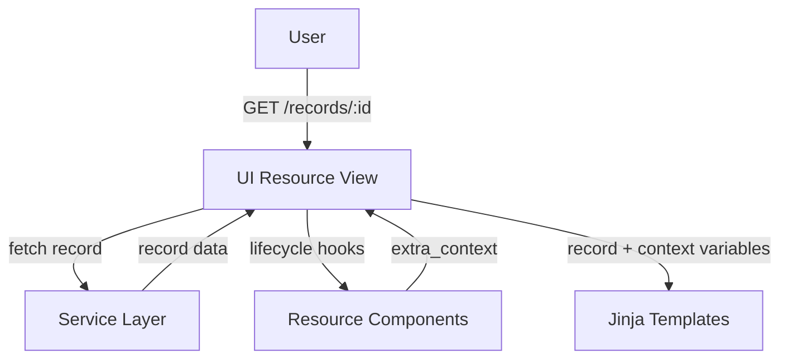

import { Callout, FileTree, Cards } from "nextra/components";
import { Card } from "@/components/card";

# Record landing page

The record landing page displays detailed information about a single record. This page is rendered through the model's UI resource, which prepares the record data and renders Jinja templates.

## Architecture

The record detail page follows this flow:

1. **User accesses** a record URL (e.g., `/records/<pid_value>`)
2. **UI Resource view** (`record_detail`) fetches the record from the service layer
3. **Resource components** prepare additional context data
4. **Jinja templates** render the final HTML



## UI Resource Configuration

The record detail route is defined in your model's UI resource config:

```python filename="ui/mymodel/__init__.py"
from oarepo_ui.resources.records.config import RecordsUIResourceConfig

class MymodelUIResourceConfig(RecordsUIResourceConfig):
    blueprint_name = "mymodel"
    url_prefix = "/mymodel"

    routes = {
        "record_detail": "/records/<pid_value>",
        # ... other routes
    }
```

See [UI Resource Views](/customize/repository_ui/resources) for full details on UI resources.

## Template Structure

The record detail page uses a generic template provided by oarepo-ui (`oarepo_ui.pages.RecordDetail`). This template includes model-specific partial templates for customization:

<FileTree>
  <FileTree.Folder name="ui/mymodel/templates" defaultOpen>
    <FileTree.Folder name="semantic-ui" defaultOpen>
      <FileTree.Folder name="mymodel" defaultOpen>
        <FileTree.Folder name="record_detail" defaultOpen>
          <FileTree.File name="banners.html" />
          <FileTree.File name="main.html" />
        </FileTree.Folder>
      </FileTree.Folder>
    </FileTree.Folder>
  </FileTree.Folder>
</FileTree>

<Callout type="info">
The generic `oarepo_ui.pages.RecordDetail` template handles the page structure. Customizations happen in `banners.html` and `main.html` by overriding exposed Jinja blocks.
</Callout>

## Available Context Variables

The detail page template receives these variables from the resource:

| Variable | Description |
|----------|-------------|
| `record` | Record object with id, pid, links, metadata, access, files |
| `record_ui` | UI-specific metadata: versions, links, publication status |
| `files` | Record files entries |
| `media_files` | System/media files entries |
| `permissions` | User permissions (can_edit, can_update, can_manage) |
| `is_preview` | Whether viewing in preview mode |
| `include_deleted` | Whether to include deleted records |
| `is_draft` | Whether record is a draft |
| `d` | Shorthand for record.metadata |
| `model` | Record model configuration |
| `model_name` | Name of the model (e.g., "mymodel") |
| `community` | Community metadata if record belongs to one |
| `community_ui` | Community UI data |
| `user_avatar` | URL of the current user's avatar image |
| `record_owner_id` | ID of the record owner user |
| `ui_links` | UI navigation links |
| `extra_context` | Additional context from resource components |

## record_detail/banners.html

This template extends `oarepo_ui/record_detail/banners.html` and provides overrideable blocks for banners:

| Block | Purpose |
|-------|---------|
| `banner_community_header` | Community header banner |
| `banner_preview_header` | Preview mode banner |
| `banner_version_header` | Version status banner |

## record_detail/main.html

This template extends `oarepo_ui/record_detail/main.html` and provides numerous overrideable blocks:

| Block | Purpose |
|-------|---------|
| `record_body` | Main content wrapper |
| `record_header` | Header section |
| `record_header_button` | Navigation header buttons |
| `record_header_info` | Publication date, version, type, access |
| `record_title` | Record title and creators |
| `record_content` | Main description |
| `record_files` | Files section |
| `record_files_access_request` | Access request form for restricted files |
| `record_media_files` | Media files section |
| `additional_record_details` | Additional metadata |
| `record_footer` | Footer section |
| `record_sidebar` | Right sidebar |
| `jump` | "Jump to top" button |

<Callout type="info">
Use `{{ super() }}` within override blocks to preserve the parent template content. Omit `{{ super() }}` to completely replace the section.
</Callout>

## Customization Approaches

### Approach 1: Override in main.html

Modify `record_detail/main.html` to override specific blocks:

```jinja filename="ui/mymodel/templates/semantic-ui/mymodel/record_detail/main.html"




{# Hide default header info -%}



{# Wrap title with custom container -%}

  <div class="ui secondary basic segment">
    {{ super() }}
  </div>


{# Add custom footer content -%}

  {{ super() }}
  
  <div class="ui message info">
    {{ m.custom_field }}
  </div>
  

```

### Approach 2: Hide Default Elements

To completely hide a section, override it with empty content:

```jinja


```

### Approach 3: Enhance Banners

Modify `record_detail/banners.html` to add custom banner elements:

```jinja filename="ui/mymodel/templates/semantic-ui/mymodel/record_detail/banners.html"



  {{ super() }}
  
  <div class="ui message warning">
    {{ custom_context_warning }}
  </div>
  

```

## Using Resource Components

Add custom context data through resource components:

```python filename="ui/mymodel/components.py"
from oarepo_ui.resources.components import UIResourceComponent

class MymodelDetailComponent(UIResourceComponent):
    def before_detail(self, resource, request, extra_context, **kwargs):
        # Add custom data to template context
        record = extra_context.get("record")
        if record:
            extra_context["related_records"] = self._get_related(record)

    def _get_related(self, record):
        # Fetch related records from service layer
        return []
```

Register in your UI resource config:

```python filename="ui/mymodel/__init__.py"
from .components import MymodelDetailComponent

class MymodelUIResourceConfig(RecordsUIResourceConfig):
    components = [
        MymodelDetailComponent,
    ]
```

Access custom context in any override block:

```jinja

  {{ super() }}
  
  <div class="related-records">
    <h3>Related Records</h3>
    
    <div class="related-item">
      <a href="{{ rec.links.self_html }}">{{ rec.metadata.title }}</a>
    </div>
    
  </div>
  

```

## Replacing the Default Landing Page Template

By default, the record detail page uses the generic `oarepo_ui.pages.RecordDetail` template that includes your model-specific `record_detail/banners.html` and `record_detail/main.html` partials.

If you need to replace the entire landing page template with your own model-specific implementation:

### Create a Custom Page Component

```jinja filename="ui/mymodel/templates/semantic-ui/mymodel/pages/RecordDetail.jinja"
{#def record, record_ui, files, media_files, permissions, is_preview, include_deleted, is_draft, model_name, community, community_ui, user_avatar, record_owner_id, d, oai_record #}


{# Your custom page structure here #}

  <div class="my-custom-landing-page">
    {# Your custom content #}
  </div>

```

Register it in your UI resource config:

```python filename="ui/mymodel/__init__.py"
class MymodelUIResourceConfig(RecordsUIResourceConfig):
    templates = {
        "record_detail": "mymodel.pages.RecordDetail",
    }
```

See [JinjaX Components](/customize/repository_ui/templating/jinjax) for more on creating page components.

## Related Resources

<Cards>
  <Card
    title="UI Resource Views"
    href="/customize/repository_ui/resources"
  >
    UI resource architecture
  </Card>
  <Card
    title="JinjaX Components"
    href="/customize/repository_ui/templating/jinjax"
  >
    JinjaX component system
  </Card>
  <Card
    title="Templating"
    href="/customize/repository_ui/branding/templating"
  >
    Jinja template customization
  </Card>
  <Card
    title="Deposit form"
    href="/customize/model_ui/deposit"
  >
    Record deposit form customization
  </Card>
  <Card
    title="Search result"
    href="/customize/model_ui/search"
  >
    Search page customization
  </Card>
</Cards>
