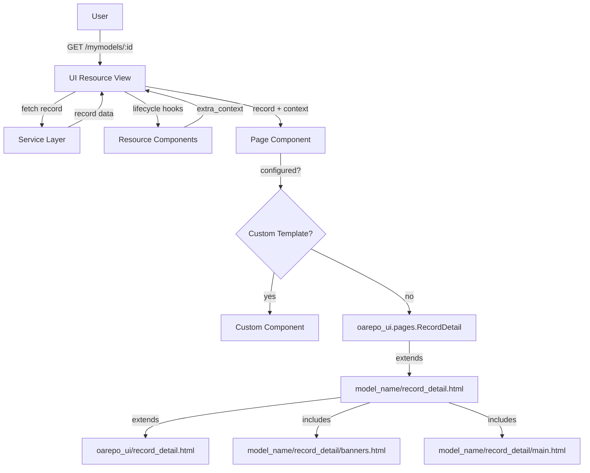

import { Callout, FileTree, Cards } from "nextra/components";
import { Card } from "@/components/card";

# Record landing page

The record landing page displays detailed information about a single record. This page is rendered through a generic JinjaX component provided by `oarepo-ui` that can be customized via model-specific partial templates.

## Architecture

The record detail page follows this flow:

1. **User accesses** a record URL (e.g., `/mymodels/<pid_value>`)
2. **UI Resource view** (`record_detail`) fetches the record from the service layer
3. **Resource components** prepare additional context data
4. **Page component** renders the page using base template and model partials

<Callout type="info">
The default page component (`oarepo_ui.pages.RecordDetail`) renders the record using your model's base template. You can customize specific parts by overriding partial templates, or replace the entire page component.
</Callout>



## Default Page Component

By default, `oarepo-ui` uses a pre-defined JinjaX page component (`oarepo_ui.pages.RecordDetail`) that renders your record. This component extends your model's base template and includes your model-specific partials.

### Base Template

The base template used by the default page component ([source](https://github.com/oarepo/oarepo-ui/blob/main/oarepo_ui/templates/oarepo_ui/record_detail.html)):

```jinja filename="oarepo_ui/templates/oarepo_ui/record_detail.html"



  {{ super() }}
  
    {{ webpack["record_sharing.js"] }}
  

```

<Callout type="info">
The `embedded` flag controls certain UI features when the detail page is rendered within another context (e.g., inside a modal or iframe).
</Callout>

### Page Component Props

The default page component (`oarepo_ui.pages.RecordDetail`) receives the following props, which are passed as context variables to your model's templates:

| Prop | Description |
|------|-------------|
| `record` | API record object with id, pid, links, metadata, access, files |
| `record_ui` | Record metadata serialized for UI representation |
| `files` | Record files entries |
| `media_files` | System/media files entries |
| `permissions` | User permissions to record (`can_edit`, `can_update`, `can_manage`) |
| `is_preview` | Whether viewing in preview mode |
| `include_deleted` | Whether to include deleted records |
| `is_draft` | Whether record is a draft |
| `model` | Record model configuration |
| `model_name` | Name of the record model (e.g.: `mymodel`) |
| `community` | Community metadata if record belongs to one |
| `community_ui` | Community data serialized for UI representation |
| `user_avatar` | URL of the current user's avatar image |
| `record_owner_id` | ID of the record owner user |
| `ui_links` | UI navigation links |
| `extra_context` | Additional context from resource components |
| `d` | Shorthand for record.metadata |

### Template Structure

The default page component extends your model's base template (`{model_name}/record_detail.html`), which is provided by nrp-model-copier. This template includes your model-specific partials and extends `oarepo_ui/record_detail.html`.

For a model named `mymodel`, the structure is:

<FileTree>
  <FileTree.Folder name="ui/mymodel/templates" defaultOpen>
    <FileTree.Folder name="semantic-ui" defaultOpen>
      <FileTree.Folder name="mymodel" defaultOpen>
        <FileTree.File name="record_detail.html" />
        <FileTree.Folder name="record_detail" defaultOpen>
          <FileTree.File name="banners.html" />
          <FileTree.File name="main.html" />
        </FileTree.Folder>
      </FileTree.Folder>
    </FileTree.Folder>
  </FileTree.Folder>
</FileTree>

The `record_detail.html` template ([source](https://github.com/oarepo/nrp-model-copier/blob/main/template/ui/%7B%7Bmodel_name%7D%7D/templates/semantic-ui/%7B%7Bmodel_name%7D%7D/record_detail.html)):

```jinja filename="ui/mymodel/templates/semantic-ui/mymodel/record_detail.html"



  



  



  

```

### Available Blocks in record_detail.html

| Block | Purpose |
|-------|---------|
| `banners` | Banner region for community, preview, version notices |
| `record_body` | Main content wrapper |
| `record_sidebar` | Right sidebar content |
| `css` | Page-specific CSS includes |
| `head_meta` | HTML meta tags |
| `javascript` | JavaScript includes |

## UI Resource Configuration

The record detail route is defined in your model's UI resource config:

```python filename="ui/mymodel/__init__.py"
from oarepo_ui.resources.records.config import RecordsUIResourceConfig

class MymodelUIResourceConfig(RecordsUIResourceConfig):
    blueprint_name = "mymodel"
    url_prefix = "/mymodel"

    routes = {
        "record_detail": "/records/<pid_value>",
        # ... other routes
    }
```

See [UI Resource Views](/customize/repository_ui/resources) for full details on UI resources.

## record_detail/banners.html

Add model-specific banners at the top of the detail page. By default, no `banners.html` is shipped with nrp-model-copier—you can create one to customize.

Create `ui/mymodel/templates/semantic-ui/mymodel/record_detail/banners.html`:

```jinja filename="ui/mymodel/templates/semantic-ui/mymodel/record_detail/banners.html"
{# Custom banners for your model #}


<div class="ui message info">
  <i class="info icon"></i>
  {{ extra_context.custom_banner }}
</div>



<div class="ui message warning">
  <i class="eye icon"></i>
  {{ _("Preview mode - this record is not published") }}
</div>

```

<Callout type="info">
If you don't create `banners.html`, the base template uses default banners from `oarepo_ui/record_detail/banners.html`.
</Callout>

### Extending Default Banners

To add to the default banners rather than replace them:

```jinja filename="ui/mymodel/templates/semantic-ui/mymodel/record_detail/banners.html"



  {{ super() }}
  
  <div class="ui message warning">
    <i class="exclamation triangle icon"></i>
    {{ extra_context.custom_warning }}
  </div>
  

```

## record_detail/main.html

The only partial template shipped by nrp-model-copier by default. Edit this file to customize the main content area:

```
ui/mymodel/templates/semantic-ui/mymodel/record_detail/main.html
```

This template extends `oarepo_ui/record_detail/main.html` and provides these overridable blocks:

| Block | Purpose |
|-------|---------|
| `record_body` | Main content wrapper |
| `record_header` | Header section |
| `record_header_button` | "Back to edit" button (preview mode) |
| `record_header_info` | Publication date, version, access status |
| `record_title` | Record title and creators/contributors |
| `record_content` | Description/abstract section |
| `record_files` | Files list and preview |
| `record_files_access_request` | Access request form for restricted files |
| `record_media_files` | System/media files |
| `additional_record_details` | Additional metadata (details.html) |
| `record_footer` | Footer section |
| `jump` | "Jump to top" button |

<Callout type="info">
Use `{{ super() }}` within override blocks to preserve the parent template content. Omit `{{ super() }}` to completely replace the section. See [Templating: Jinja](/customize/repository_ui/templating/jinja) for more on template inheritance.
</Callout>

### Customizing Main Content

Create/edit `ui/mymodel/templates/semantic-ui/mymodel/record_detail/main.html` to customize the main content area:

```jinja filename="ui/mymodel/templates/semantic-ui/mymodel/record_detail/main.html"


{# Add badge after title #}

  {{ super() }}
  <span class="ui label">MyModel</span>


{# Add custom metadata section #}

  {{ super() }}
  <div class="ui segment">
    <h3>MyModel Metadata</h3>
    <p>{{ d.custom_field }}</p>
  </div>

```

### Hide Default Elements

Override a block to hide it (omit `{{ super() }}`):

```jinja filename="ui/mymodel/templates/semantic-ui/mymodel/record_detail/main.html"

  {# Hide publication date and version by not calling super() #}

```

## record_detail/record_sidebar.html

The sidebar is rendered via the `record_sidebar` block in `record_detail.html`, which by default includes the standard Invenio sidebar. You can customize it in two ways:

### Option 1: Add Sidebar Widgets (Recommended)

Add your widget to `APP_RDM_DETAIL_SIDE_BAR_TEMPLATES` in `invenio.cfg`:

```python filename="invenio.cfg"
APP_RDM_DETAIL_SIDE_BAR_TEMPLATES = [
    "invenio_app_rdm/records/details/side_bar/versioning.html",
    "mymodel/record_detail/record_sidebar.html",  # Your custom widget
]
```

Create your widget at `ui/mymodel/templates/semantic-ui/mymodel/record_detail/record_sidebar.html`:

```jinja filename="ui/mymodel/templates/semantic-ui/mymodel/record_detail/custom_widget.html"
<div class="ui segment">
  <h3>Custom Widget</h3>
  <p>Your custom content here.</p>
</div>
```

### Option 2: Override via Partial Template

Create a `record_sidebar.html` partial to replace the default sidebar content:

```jinja filename="ui/mymodel/templates/semantic-ui/mymodel/record_detail/record_sidebar.html"
<div class="ui segments">
  <div class="ui segment">
    <h3>Custom Sidebar</h3>
    <p>Your custom content here.</p>
  </div>
</div>
```

<Callout type="info">
The base template includes your partial with ``. Create the file to override; omit it to use the default.
</Callout>

## Custom CSS, JavaScript, and Meta Tags

Add model-specific assets without overriding the entire template:

### Custom CSS

Create `ui/mymodel/templates/semantic-ui/mymodel/record_detail/css.html`:

```jinja filename="ui/mymodel/templates/semantic-ui/mymodel/record_detail/css.html"
<style>
  .my-model-detail .record-title {
    color: #2185d0;
  }
</style>
```

### Custom JavaScript

Create `ui/mymodel/templates/semantic-ui/mymodel/record_detail/javascript.html`:

```jinja filename="ui/mymodel/templates/semantic-ui/mymodel/record_detail/javascript.html"
<script>
  // Add interactivity to your detail page
  document.addEventListener('DOMContentLoaded', function() {
    console.log('MyModel detail page loaded');
  });
</script>
```

### Custom Meta Tags

Create `ui/mymodel/templates/semantic-ui/mymodel/record_detail/head_meta.html`:

```jinja filename="ui/mymodel/templates/semantic-ui/mymodel/record_detail/head_meta.html"
<meta name="my-model-specific" content="custom value">
<meta property="og:type" content="article">
```

<Callout type="info">
These partials are automatically included by the base template if they exist. No registration needed—just create the files.
</Callout>

## Using Resource Components

Add custom context data through resource components:

```python filename="ui/mymodel/components.py"
from oarepo_ui.resources.components import UIResourceComponent

class MymodelDetailComponent(UIResourceComponent):
    def before_detail(self, resource, request, extra_context, **kwargs):
        # Add custom data to template context
        record = extra_context.get("record")
        if record:
            extra_context["related_records"] = self._get_related(record)

    def _get_related(self, record):
        # Fetch related records from service layer
        return []
```

Register in your UI resource config:

```python filename="ui/mymodel/__init__.py"
from .components import MymodelDetailComponent

class MymodelUIResourceConfig(RecordsUIResourceConfig):
    components = [
        MymodelDetailComponent,
    ]
```

Access custom context in any override block:

```jinja filename="ui/mymodel/templates/semantic-ui/mymodel/record_detail/main.html"

  {{ super() }}
  
  <div class="related-records">
    <h3>Related Records</h3>
    
    <div class="related-item">
      <a href="{{ rec.links.self_html }}">{{ rec.metadata.title }}</a>
    </div>
    
  </div>
  

```

## Replacing the Default Landing Page Template

There are three ways to customize the record detail page, listed in order of increasing customization:

### Option 1: Default Page Component (Recommended)

By default, `oarepo-ui` uses the pre-defined page component (`oarepo_ui.pages.RecordDetail`). No configuration is required. The default component:

- Extends your model's `record_detail.html` template
- Includes your model's `record_detail/banners.html` and `record_detail/main.html` partials
- Provides all context variables to your templates

This is the recommended approach unless you need custom page-level logic.

### Option 2: Custom Page Component

If you need full control, create a JinjaX component that extends your model's template:

**Step 1: Create the JinjaX component** (`RecordDetail.jinja`):

```jinja filename="ui/mymodel/templates/semantic-ui/mymodel/RecordDetail.jinja"
{# def record, record_ui, files, model_name, ... #}

```

**Step 2: Create your model's template** (`record_detail.html`):

```jinja filename="ui/mymodel/templates/semantic-ui/mymodel/record_detail.html"



  <div class="my-custom-layout">
    <h1>{{ d.title }}</h1>
    {{ super() }}
  </div>

```

**Step 3: Register** using dot notation:

```python filename="ui/mymodel/__init__.py"
class MymodelUIResourceConfig(RecordsUIResourceConfig):
    templates = {
        "record_detail": "mymodel.RecordDetail",
    }
```

<Callout type="warning">
**Two files required:** The JinjaX component (`RecordDetail.jinja`) declares variables and extends your model template. Your model template (`record_detail.html`) extends the base template and overrides blocks.
</Callout>

### Option 3: Model-specific Partials (Recommended for Most Cases)

For most customization needs, you don't need to create a full page component. Instead, override specific blocks in your model's partial templates. The default page component includes these partials, and you only customize what you need.

<FileTree>
  <FileTree.Folder name="ui/mymodel/templates" defaultOpen>
    <FileTree.Folder name="semantic-ui" defaultOpen>
      <FileTree.Folder name="mymodel" defaultOpen>
        <FileTree.Folder name="record_detail" defaultOpen>
          <FileTree.File name="banners.html" />
          <FileTree.File name="main.html" />
        </FileTree.Folder>
      </FileTree.Folder>
    </FileTree.Folder>
  </FileTree.Folder>
</FileTree>

This is the most maintainable approach as you only need to customize the specific parts of the UI you want to change, and automatically get updates to the base template.

## How the Default Page Component Works

When you don't configure a custom template in `templates["record_detail"]`, the system uses the default page component (`oarepo_ui.pages.RecordDetail`).

### Component Resolution Process

1. **Template resolution**: The system looks up `config.templates["record_detail"]`
2. **If not configured**: The default component `oarepo_ui.pages.RecordDetail` is used
3. **Rendering**: The component extends your model's `{model_name}/record_detail.html` template

### Default Component Structure

The default page component (`oarepo_ui/pages/RecordDetail.jinja`) looks like:

```jinja
{# def
  record,
  record_ui,
  files,
  media_files,
  permissions,
  is_preview,
  include_deleted,
  is_draft,
  model,
  model_name,
  community,
  community_ui,
  user_avatar,
  record_owner_id,
  ui_links,
  extra_context,
  d,
#}

```

This component extends your model's base template (`mymodel/record_detail.html`), which in turn extends `oarepo_ui/record_detail.html` and includes your partials (`banners.html`, `main.html`, `side_bar.html`).

## Error Pages

When users encounter errors accessing records, oarepo-ui renders appropriate error pages. These can be customized via the `templates` configuration.

### Not Found Page (404)

The not found page is displayed when a record does not exist or the PID is invalid.

#### Default Template

The default not found template ([source](https://github.com/oarepo/oarepo-ui/blob/main/oarepo_ui/templates/oarepo_ui/not_found.html)):

```jinja filename="oarepo_ui/templates/oarepo_ui/not_found.html"


<div class="ui container centered rel-pt-2">
  <h1 class="ui header inline-block">
    <i class="icon search" aria-hidden="true"></i>
    <div class="content pl-0 rel-pr-1">
      {{ _("Not found") }}
    </div>
  </h1>

  <p>
    
      The record you are trying to access does not exist in the repository.
    
  </p>

  
  
    <p>
      {{ _("PID") }}: <code>{{ pid }}</code>
    </p>
  
  
</div>

```

#### Customizing the Not Found Page

Add a **"Did you mean?"** feature that suggests corrected record IDs:

```jinja filename="ui/mymodel/templates/semantic-ui/mymodel/NotFound.jinja"
{# def pid, model_name #}

```

```jinja filename="ui/mymodel/templates/semantic-ui/mymodel/not_found.html"



<h1>{{ _("Record Not Found") }}</h1>


  {# Fix common typos: O→0, l→1 #}
  

  
  <div class="ui message">
    <p>{{ _("Did you mean:") }} <a href="/records/{{ fixed }}">{{ fixed }}</a>?</p>
  </div>
  


```

### Tombstone Page (410 Gone)

The tombstone page is displayed when a user tries to access a **deleted record**. The metadata is kept for archival purposes, but the record is no longer accessible.

#### Error Handlers

By default, the following exceptions trigger the tombstone page:

| Exception | Description |
|-----------|-------------|
| `PIDDeletedError` | The PID has been marked as deleted |
| `RecordDeletedException` | The record has been deleted |

These are configured in `error_handlers` in `RecordsUIResourceConfig`.

#### Default Template

The default tombstone template ([source](https://github.com/oarepo/oarepo-ui/blob/main/oarepo_ui/templates/oarepo_ui/tombstone.html)):

```jinja filename="oarepo_ui/templates/oarepo_ui/tombstone.html"


<div class="ui container centered rel-pt-2">
  <h1 class="ui header inline-block">
    <i class="icon lightning" aria-hidden="true"></i>
    <div class="content pl-0 rel-pr-1">
      {{ _("Gone") }}
    </div>
  </h1>

  <p>
    
      The record you are trying to access was removed. The
      metadata of the record is kept for archival purposes.
    
  </p>

  
  
    <table class="ui table">
      <tbody>
        
          
            <tr>
              <th class="left aligned pl-5">{{ _(key) }}:</th>
              <td>
                
                  <a href="{{ value }}" target="_blank">{{ value }}</a>
                
                  {{ value }}
                
              </td>
            </tr>
          
        
      </tbody>
    </table>
  
    <p>No tombstone (e.g. removal reason, note) available.</p>
  
  
</div>

```

#### Available Variables

The tombstone template receives the following context variables:

| Variable | Description |
|----------|-------------|
| `tombstone` | Dictionary with tombstone information (removal reason, removal date, removed by, etc.) |
| `pid` | The PID of the deleted record |
| `config.THEME_SITENAME` | Site name for translations |

#### Customizing the Tombstone Page

Add a **citation update notice** for researchers who may have cited this record:

```jinja filename="ui/mymodel/templates/semantic-ui/mymodel/Tombstone.jinja"
{# def tombstone, pid, model_name #}

```

```jinja filename="ui/mymodel/templates/semantic-ui/mymodel/tombstone.html"



<h1><i class="icon archive"></i> {{ _("Record Removed") }}</h1>

<div class="ui message warning">
  {{ _("If you cited this record, please update your references.") }}
</div>


<table class="ui table">
  <tr><td>ID</td><td><code>{{ pid }}</code></td></tr>
  
  <tr><td>{{ _("Removed") }}</td><td>{{ tombstone.removal_date }}</td></tr>
  
</table>


```

Register in your UI resource config using dot notation:

```python filename="ui/mymodel/__init__.py"
class MymodelUIResourceConfig(RecordsUIResourceConfig):
    # ...
    templates = {
        "tombstone": "mymodel.Tombstone",
    }
```

<Callout type="warning">
**JinjaX Component Required:** When using `templates` configuration for error pages, you must create a valid **JinjaX page component** (e.g., `mymodel/Tombstone.jinja`) with a `{# def #}` block declaring all required context variables (`pid`, `tombstone`, etc.). The component should extend your model's template. Without the `{# def #}` block, the template will fail to render.
</Callout>

## Related Resources

<Cards>
  <Card
    title="UI Resource Views"
    href="/customize/repository_ui/resources"
  >
    UI resource architecture
  </Card>
  <Card
    title="JinjaX Components"
    href="/customize/repository_ui/templating/jinjax"
  >
    JinjaX component system
  </Card>
  <Card
    title="Templating"
    href="/customize/repository_ui/branding/templating"
  >
    Jinja template customization
  </Card>
  <Card
    title="Deposit form"
    href="/customize/model_ui/deposit"
  >
    Record deposit form customization
  </Card>
  <Card
    title="Search result"
    href="/customize/model_ui/search"
  >
    Search page customization
  </Card>
</Cards>
