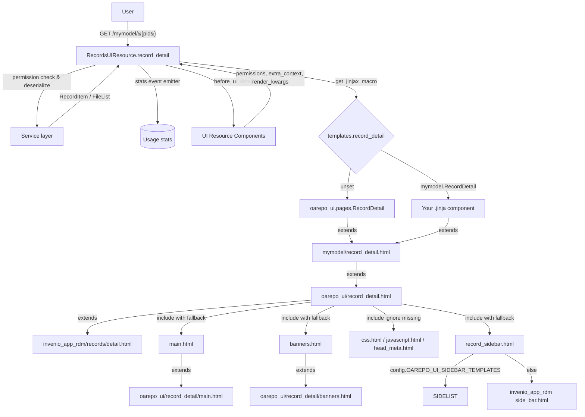

import { Callout, FileTree, Cards, Steps } from "nextra/components";
import { Card } from "@/components/card";

# Record landing page

The record landing page (detail page) displays everything about one record: its title, creators, files, and metadata. Unlike the deposit form, it is **not** a React application — it is server-rendered Jinja templates. You customize it by writing HTML/Jinja in your model's template partials.

## Key Concepts

- **Six auto-included partials** — the base template auto-includes up to six model-specific files if they exist (or fall back to defaults): `record_detail/main.html`, `record_detail/banners.html`, `record_detail/css.html`, `record_detail/head_meta.html`, `record_detail/javascript.html`, `record_detail/record_sidebar.html`. Creating the file is enough — no registration, no `templates = {}`, no webpack for plain HTML/CSS.
- **`metadata` is the friendly copy** — inside `main.html` use `metadata.title`, `metadata.description`, or field paths like `metadata.sample_id`. It's shorthand for the serialized, localized record (`record_ui["metadata"]`), so dates and vocabulary titles are already formatted. Use `record.metadata` only for raw access.
- **Blocks hide or replace** — `main.html` extends the oarepo-ui base, which is one long chain of blocks (`record_header_info`, `record_title`, `record_files`, …). Override a block with `{{ super() }}` inside to augment it; override it without `super()` to hide or replace that section entirely.

## Partials Cheat Sheet

Start here. For a model named `mymodel`, these files live at `ui/mymodel/templates/semantic-ui/mymodel/record_detail/`.

| Partial | What it renders / how to use it | Common task |
|---|---|---|
| `main.html` | The whole record body. Extends `oarepo_ui/record_detail/main.html`. The only file generated by default — edit it directly. | **Hide** a default block, **add** a metadata section, change the title |
| `banners.html` | Top-of-page banners. Extends the oarepo-ui default (community / preview / "newer version" banners). Wrap it with `` and `{{ super() }}` to keep the defaults. | Add a model banner below the preview banner |
| `css.html` | Inline `<style>` inside the page `<head>`. Auto-included. | Tweak colors, font sizes |
| `javascript.html` | Inline/content JS at the end of `<body>`. Register a **webpack entry** instead of inline `<script>` (CSP). | Interactive widgets |
| `head_meta.html` | OpenGraph / citation meta tags. Auto-included. | Embed Dublin Core / JSON-LD |
| `record_sidebar.html` | Right-hand sidebar content (replaces the **whole** default). | Custom sidebar; rarely needed |
| — none (config) | `OAREPO_UI_SIDEBAR_TEMPLATES` in `invenio.cfg` | **Add a sidebar widget** (recommended for the sidebar) |

<Callout type="info">
The generated `main.html` already extends the oarepo-ui base and carries a commented map of every overridable block — read its comment header first. It is the single most important file on this page.
</Callout>

## The Four Most Common Customizations

These four cover the bulk of real-world landing-page work. Each is a small edit, no source-code forking needed.

### 1. Hide a default section

Drop a block body but leave the `main.html` `` untouched. To remove the "Published 2026-09-23 | Version 3" info line:

```jinja filename="ui/mymodel/templates/semantic-ui/mymodel/record_detail/main.html"



  {# publication date / version / resource type / access status hidden #}

```

To hide a different part, use its block name from the [block reference](#block-reference-mainhtml) below.

### 2. Add a custom metadata field

Your custom fields live under `metadata`. This block puts a new section *after* the standard "Additional details" — using `{{ super() }}` keeps the built-in section in place:

```jinja filename="ui/mymodel/templates/semantic-ui/mymodel/record_detail/main.html"



  {{ super() }}
  
  <section id="sample-metadata" class="rel-mt-2">
    <h2>{{ _("Sample metadata") }}</h2>
    <dl class="ui list">
      <dt>{{ _("Sample ID") }}</dt><dd>{{ metadata.sample_id }}</dd>
      
      <dt>{{ _("Concentration") }}</dt>
      <dd>{{ metadata.concentration.value }} {{ metadata.concentration.unit }}</dd>
      
    </dl>
  </section>
  

```

The `metadata` variable is the UI-serialized record (already localized, `ui_value()` applied). It is the same object available on the [deposit form's section `component` prop](#using-resource-components) — your schema labels/help texts are **not** automatically rendered here; the landing page only shows values.

### 3. Add a banner

Create (or edit) `banners.html`. To add a model-specific banner *and* keep the built-in community / preview / new-version banners, extend the default rather than literally re-including it:

```jinja filename="ui/mymodel/templates/semantic-ui/mymodel/record_detail/banners.html"



  {{ super() }}
  
  <div class="ui warning message">
    <i class="exclamation triangle icon"></i>
    {{ extra_context.retrieval_warning }}
  </div>
  

```

Here `extra_context.retrieval_warning` is something you set in a [Resource component](#using-resource-components). Omission: to **remove** the community banner entirely, define `` without a `super()` call.

### 4. Add a sidebar widget

The modern way to extend the right sidebar is per-model configuration in `invenio.cfg` — you write a template that renders **one widget**, and oarepo-ui slots it into the sidebar list. This appends your widget *after* the built-in list (versions, keywords, licenses, citations, export, …) while leaving the rest alone:

```python filename="invenio.cfg"
OAREPO_UI_SIDEBAR_TEMPLATES = {
    "mymodel": [
        # start from the full default list (invenio-app-rdm), then append your own
        "invenio_app_rdm/records/details/side_bar/manage_menu.html",
        "invenio_app_rdm/records/details/side_bar/metrics.html",
        "invenio_app_rdm/records/details/side_bar/versions.html",
        "invenio_app_rdm/records/details/side_bar/external_resources.html",
        "invenio_app_rdm/records/details/side_bar/communities.html",
        "invenio_app_rdm/records/details/side_bar/keywords_subjects.html",
        "invenio_app_rdm/records/details/side_bar/details.html",
        "invenio_app_rdm/records/details/side_bar/locations.html",
        "invenio_app_rdm/records/details/side_bar/licenses.html",
        "invenio_app_rdm/records/details/side_bar/citations.html",
        "invenio_app_rdm/records/details/side_bar/export.html",
        "invenio_app_rdm/records/details/side_bar/technical_metadata.html",
        # -- your widget, rendered after the above --
        "mymodel/record_detail/side_bar/sample_history.html",
    ]
}
```

```jinja filename="ui/mymodel/templates/semantic-ui/mymodel/record_detail/side_bar/sample_history.html"
<section id="sample-history" class="ui segment">
  <h2 class="ui small header">{{ _("Sample history") }}</h2>
  <p>Replaced by your resource component: {{ extra_context.sample_history | length }} events.</p>
</section>
```

<Callout type="warning">
`OAREPO_UI_SIDEBAR_TEMPLATES` is read by the oarepo-ui fallback sidebar template (`oarepo_ui/record_detail/side_bar/record_sidebar.html`). When the config key exists for your `model_name`, the **whole** built-in Invenio sidebar list is replaced by the list you supply — so include the defaults you still want.
</Callout>

#### The older global config (still works)

`APP_RDM_DETAIL_SIDE_BAR_TEMPLATES` still exists in `invenio.cfg` and is honored when `OAREPO_UI_SIDEBAR_TEMPLATES` has no entry for your model. The default value, from invenio-app-rdm, is the same 12-item list shown above. Modify it if you want a global (all-models) change; prefer the per-model config for a single model.

<Callout type="info">
Don't confuse the per-widget template list with the `record_sidebar.html` **partial block** — creating a `record_sidebar.html` partial (cheat sheet) replaces the *entire* sidebar HTML, which is rarely what you want. Use the config approach first.
</Callout>

## File Reference: Default Template Locations

Everything below lives under `ui/mymodel/templates/semantic-ui/mymodel/`. The `record_detail` folder holds the partials; the top-level `record_detail.html` is generated by `nrp-model-copier` for models based on the RDM/CCMM presets.

<FileTree>
  <FileTree.Folder name="ui/mymodel/templates/semantic-ui/mymodel" defaultOpen>
    <FileTree.File name="record_detail.html" />
    <FileTree.Folder name="record_detail" defaultOpen>
      <FileTree.File name="main.html" />
      <FileTree.File name="banners.html" />
      <FileTree.File name="css.html" />
      <FileTree.File name="javascript.html" />
      <FileTree.File name="head_meta.html" />
      <FileTree.File name="record_sidebar.html" />
      <FileTree.Folder name="side_bar">
        <FileTree.File name="sample_history.html" />
      </FileTree.Folder>
    </FileTree.Folder>
    <FileTree.File name="not_found.html" />
    <FileTree.File name="tombstone.html" />
  </FileTree.Folder>
</FileTree>

Only `main.html` is created by default for non-`empty` base models; the rest are opt-in.

## Block Reference: `main.html`

These blocks exist in `oarepo_ui/record_detail/main.html` and can be overridden in your model's `main.html`. They are the same blocks the generated `main.html` comment pre-lists for you.

| Block | What it contains by default |
|---|---|
| `record_body` | Entire `<article>` wrapper (header → title → content → files → media files → details → footer) |
| `record_header` | Wraps `record_header_button` + `record_mobile_management` + `record_header_info` |
| `record_header_button` | "Back to edit" nav shown in preview mode for users who can curate the draft |
| `record_mobile_management` | Mobile-only "Manage record" popup |
| `record_header_info` | Publication date, version, resource-type label, access-status label |
| `record_title` | `<h1>` title + creators/contributors list |
| `record_content` | The description / abstract section (includes RDM `description.html`) |
| `record_files` | File preview box, file list, or the "Request access" accordion when files are restricted |
| `record_files_access_request` | Access-request form rendered inside `record_files` for restricted files |
| `record_media_files` | System/media files listing |
| `additional_record_details` | RDM "Additional details" inclusion (`details.html`) |
| `record_footer` | Empty by default — a hook for anything below the details section |

Blocks available in `banners.html`: `banner_community_header`, `banner_preview_header`, `banner_version_header`.

Blocks at the outer `page_body` level (only available if your model's top template extends the RDM detail page — i.e. most models): `record_sidebar`, `jump`, `page_body` itself.

<Callout type="info">
Use `{{ super() }}` inside an override to keep the parent block's output, then add your markup before/after it. Omit `super()` to hide the block. More on template inheritance: [Templating: Jinja](/customize/repository_ui/templating/jinja).
</Callout>

## Using Resource Components

A resource component's `before_ui_detail` hook lets you inject arbitrary data into the template context — for the `extra_context.retrieval_warning` and `extra_context.sample_history` examples above, and for anything you'd otherwise have to fetch in the template. The correct hook signature takes the record as both the raw `api_record: RecordItem` and its serialized `record` dict:

```python filename="ui/mymodel/components.py"
from oarepo_ui.resources.components import UIResourceComponent

class MymodelDetailComponent(UIResourceComponent):
    def before_ui_detail(
        self,
        *,
        api_record,
        record,
        identity,
        ui_links,
        extra_context,
        render_kwargs,
        **kwargs,
    ):
        # `record` is the serialized UI dict; `api_record` is the RecordItem
        extra_context["retrieval_warning"] = "Sample last measured 2025-11-02"
        extra_context["sample_history"] = self._load_history(api_record.id)

        # You can also add brand-new top-level template variables:
        render_kwargs["extra_banner_image"] = "/static/images/sample-banner.png"

    def _load_history(self, record_id):
        return []  # fetch from your service layer
```

Register it in the resource config:

```python filename="ui/mymodel/__init__.py"
from oarepo_ui.resources.records.config import RecordsUIResourceConfig
from .components import MymodelDetailComponent

class MymodelUIResourceConfig(RecordsUIResourceConfig):
    blueprint_name = "mymodel"
    url_prefix = "/mymodel"
    components = [MymodelDetailComponent]
```

In the template you can read either `extra_context.sample_history` (or the shorthand: `extra_context` keys are *not* unpacked into the top-level context, only into the `extra_context` dict variable itself) or — if you put it in `render_kwargs` — as a top-level variable like `{{ extra_banner_image }}`.

<Callout type="warning">
The historical `before_detail(self, resource, request, extra_context, **kwargs)` hook **does not exist** in current oarepo-ui. `record` is also **not** pre-populated into `extra_context` — grab it from the `record` / `api_record` hook arguments.
</Callout>

## CSS, JavaScript, and Meta Partials

Three of the six partials exist purely for static / `<head>` customization.

### `css.html`

Auto-included inside ``. Drop raw `<style>` rules here — simpler than a webpack entry for one-off styling:

```jinja filename="ui/mymodel/templates/semantic-ui/mymodel/record_detail/css.html"
<style>
  #record-title { color: #2185d0; }
  #sample-metadata dt { font-weight: bold; }
</style>
```

### `javascript.html`

Auto-included at the end of the `<body>` block. Because of Content-Security-Policy, inline `<script>` blocks are blocked by default — register a webpack entry and pull it in by name:

```jinja filename="ui/mymodel/templates/semantic-ui/mymodel/record_detail/javascript.html"
{{ webpack["mymodel_landing_custom.js"] }}
```

Register the entry in your `webpack.py` (see [Webpack configuration](/customize/repository_ui/webpack)):

```python filename="ui/mymodel/webpack.py"
from invenio_assets.webpack import WebpackThemeBundle

theme = WebpackThemeBundle(
    __name__,
    "assets",
    default="semantic-ui",
    themes={
        "semantic-ui": {
            "entry": {
                "mymodel_landing_custom": "./js/mymodel/landing_custom.js",
            },
        },
    },
)
```

### `head_meta.html`

Auto-included within `` *after* the default `<meta>` tags. Use it for SEO / citation metadata:

```jinja filename="ui/mymodel/templates/semantic-ui/mymodel/record_detail/head_meta.html"
<meta property="og:type" content="article">
<meta name="citation_sample_id" content="{{ metadata.sample_id }}">
```

## Replacing the Whole Page

Reserve this for cases where *none* of the block overrides are enough — when you need a totally different page layout. This mirrors the [deposit form's "Optional: Custom Page Templates"](/customize/model_ui/deposit#optional-custom-page-templates).

<Steps>

### Create your top-level model template

Start from the generated `record_detail.html` (preserving its variable flow) and add the layout you need. The generated file for non-`empty` base models is essentially a no-op:

```jinja filename="ui/mymodel/templates/semantic-ui/mymodel/record_detail.html"



  <div class="my-split-layout">
    <aside class="my-left-panel"><!-- custom panel --></aside>
    <div class="my-right-panel">{{ super() }}</div>
  </div>

```

Notice the block being overridden is `record_body` — the oarepo-ui middle-template's `` is what pulls in `main.html`. Overriding it here bypasses `main.html` entirely.

### Optionally point the route at a custom JinjaX component

If you build your own page component (a `.jinja` file with a `{# def ... #}` block listing every variable the template uses), register it in the resource config:

```python filename="ui/mymodel/__init__.py"
class MymodelUIResourceConfig(RecordsUIResourceConfig):
    templates = {
        "record_detail": "mymodel.RecordDetail",   # resolves to mymodel/RecordDetail.jinja
    }
```

```jinja filename="ui/mymodel/templates/semantic-ui/mymodel/RecordDetail.jinja"
{# def record, record_ui, files, media_files, permissions, is_preview, is_draft, model_name, ui_links, extra_context, d #}

```

### Keep the default variable contract

Whatever component or template you register must accept the same context variables the default `oarepo_ui.pages.RecordDetail` declares — otherwise the view raises a missing-kwarg error. The authoritative default is at `oarepo_ui/templates/oarepo_ui/pages/RecordDetail.jinja`.

</Steps>

<Callout type="info">
You almost never need this. The six auto-included partials plus `before_ui_detail` cover banner/title/files/sidebar/custom-section / arbitrary-data needs. Reach for a custom page component only when you need to re-shape `<html>`-level layout or introduce new top-level CSS grids.
</Callout>

## Error Pages

`not_found` (404) and `tombstone` (410, deleted record) pages are also overridable. Both flow through the same `templates = {}` resource-config mechanism as the detail page — their default page components are `oarepo_ui.pages.NotFound` and `oarepo_ui.pages.Tombstone`, each of which ``.

### Custom Not-Found Page

```jinja filename="ui/mymodel/templates/semantic-ui/mymodel/NotFound.jinja"
{# def pid, model_name #}

```

```jinja filename="ui/mymodel/templates/semantic-ui/mymodel/not_found.html"



  <div class="ui container centered">
    <h1><i class="search icon"></i> {{ _("Sample not found") }}</h1>
    
      <p>{{ _("No record with identifier") }} <code>{{ pid }}</code>.</p>
    
    <p><a href="{{ url_for('mymodel.search') }}">{{ _("Back to search") }}</a></p>
  </div>

```

### Custom Tombstone Page

```jinja filename="ui/mymodel/templates/semantic-ui/mymodel/Tombstone.jinja"
{# def pid, tombstone, model_name #}

```

```jinja filename="ui/mymodel/templates/semantic-ui/mymodel/tombstone.html"



  {{ super() }}
  <div class="ui warning message">
    {{ _("If you have cited this record, please update your references.") }}
  </div>

```

Register both in the resource config:

```python filename="ui/mymodel/__init__.py"
class MymodelUIResourceConfig(RecordsUIResourceConfig):
    templates = {
        "not_found": "mymodel.NotFound",
        "tombstone": "mymodel.Tombstone",
    }
```

<Callout type="warning">
Each override must be a JinjaX component (`.jinja` file with a `{# def ... #}` block listing every context variable it uses), not just a plain `.html` template — the resource config's `templates` map resolves to JinjaX macro names, and missing variables raise a rendering error.
</Callout>

The default tombstone context gives you `pid` and `tombstone` (a dict of removal reason, removal date, etc.); the not-found context gives you `pid`.

## How It Works Under the Hood

### Request flow


```mermaid
graph TD
    U[User] -->|GET /mymodel/&#123;pid&#125;| VR[RecordsUIResource.record_detail]
    VR -->|permission check & deserialize| SVC[Service layer]
    SVC -->|RecordItem / FileList| VR
    VR -->|stats event emitter| STATS[(Usage stats)]
    VR -->|before_ui_detail| RC[UI Resource Components]
    RC -->|permissions, extra_context, render_kwargs| VR
    VR -->|get_jinjax_macro| CONF{templates.record_detail}
    CONF -->|unset| DEF[oarepo_ui.pages.RecordDetail]
    CONF -->|"mymodel.RecordDetail"| CUST[Your .jinja component]
    DEF -->|extends| BASE["mymodel/record_detail.html"]
    CUST -->|extends| BASE
    BASE -->|extends| MID[oarepo_ui/record_detail.html]
    MID -->|extends| RDM[invenio_app_rdm/records/detail.html]
    MID -->|include with fallback| P1["main.html"]
    MID -->|include with fallback| P2["banners.html"]
    MID -->|"include ignore missing"| P3["css.html / javascript.html / head_meta.html"]
    MID -->|include with fallback| P4["record_sidebar.html"]
    P1 -->|extends| P5[oarepo_ui/record_detail/main.html]
    P2 -->|extends| P6[oarepo_ui/record_detail/banners.html]
    P4 -->|config.OAREPO_UI_SIDEBAR_TEMPLATES| SIDELIST
    P4 -->|else| SIDEDEF[invenio_app_rdm side_bar.html]
```

### Template stack

- **`mymodel/record_detail.html`** — your top model template. Generated by `nrp-model-copier`; pass-through for RDM presets. If your base model is `empty`, the copier generates a full template extending `config.BASE_TEMPLATE` directly, keeping the same 6 partial auto-includes.
- **`oarepo_ui/record_detail.html`** — oarepo-ui middle layer. Responsible for: including the 6 partials (with `ignore missing` or list-fallback), adding the JSON-LD schema.org `<script>`, and pulling in the landing-page webpack chunks.
- **`invenio_app_rdm/records/detail.html`** — Invenio RDM base. Provides the outer ``, the top-level `<article>` layout grid, record-access status flash, record JSON-LD block, and the `jump` (scroll-to-top) block.

### Where the context comes from

The `RecordsUIResource._detail()` method builds a `render_kwargs` dict with: `record`, `record_ui`, `files`, `media_files`, `user_communities_memberships`, `is_preview`, `include_deleted`, `embedded`, `is_draft`, `community`, `community_ui`, `user_avatar`, `model`, `model_name`, `record_owner_id`, `context`, `ui_links`, `extra_context`, and `d` — the `FieldData` wrapper for easy template-side metadata access. It then calls `run_components("before_ui_detail", …)`, which is where your component hooks mutate `extra_context` and `render_kwargs`. Finally it renders the JinjaX macro from `get_jinjax_macro("record_detail")`, which resolves to either the default `oarepo_ui.pages.RecordDetail` or whatever you put into `templates["record_detail"]`.

`permissions` is injected by the built-in `PermissionsComponent` (registered by default): it looks at the record and current identity, fills `extra_context["permissions"]` with `can_edit`/`can_update`/`can_manage`/`can_read_files`/… *and* copies the dict into `render_kwargs["permissions"]`, so it's a top-level variable inside your templates.

## Related Resources

<Cards>
  <Card
    title="Deposit form"
    href="/customize/model_ui/deposit"
  >
    React-based record creation/editing
  </Card>
  <Card
    title="Search results"
    href="/customize/model_ui/search"
  >
    Customize the model search page
  </Card>
  <Card
    title="UI Resource views"
    href="/customize/repository_ui/resources"
  >
    Complete UI resource architecture
  </Card>
  <Card
    title="Templating"
    href="/customize/repository_ui/templating"
  >
    Jinja templates and JinjaX components
  </Card>
  <Card
    title="Webpack config"
    href="/customize/repository_ui/webpack"
  >
    Register static bundles for the landing page
  </Card>
</Cards>
