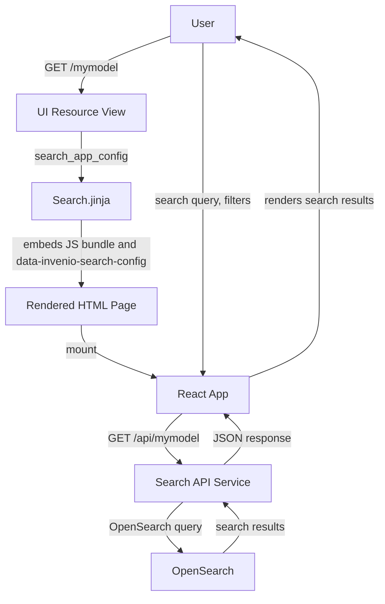
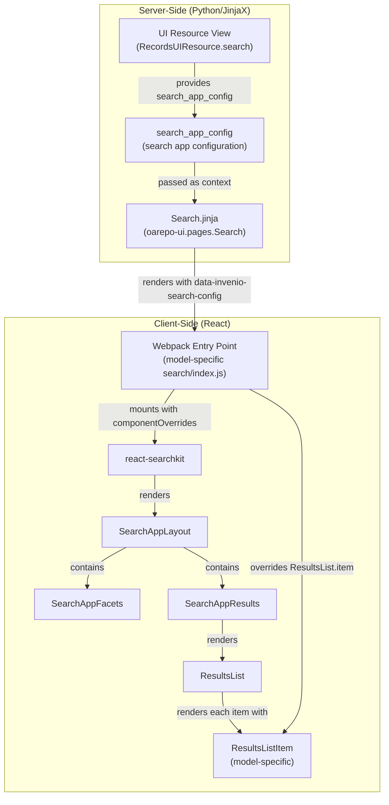

import { FileTree, Cards, Steps } from "nextra/components";
import { Card } from "@/components/card";

# Search page

The search page displays a list of records matching user queries. It uses **react-searchkit** to provide faceted search, sorting, and pagination with customizable result item components.

## Request and Application Flow

### Request Flow



### Application Flow

The search application is organized into server-side and client-side layers:



Server-side, the **UI Resource View** handles the search page request and provides `search_app_config` containing the search endpoint, facets, sort options, and other configuration. The **Search.jinja** template renders a `<div>` with `data-invenio-search-config` attribute containing this JSON configuration and includes the webpack bundle.

Client-side, the **Webpack Entry Point** reads the config, uses `parseSearchAppConfigs()` and `createSearchAppsInit()` to mount the **react-searchkit** app, and registers your component overrides (like `ResultsListItem`). The **react-searchkit** library renders **SearchAppLayout** which contains facets (**SearchAppFacets**) and results area (**SearchAppResults**). The results area renders **ResultsList** which loops through search results and renders each with your customized **ResultsListItem** component.

## Key Files

| File | Location | Purpose |
|------|----------|---------|
| **Search template** | `oarepo_ui.pages.Search` | [oarepo-ui](https://github.com/oarepo/oarepo-ui/blob/main/oarepo_ui/templates/oarepo_ui/pages/Search.jinja) | Renders `data-invenio-search-config` and includes webpack bundle |
| **Results list item** | `{{model_name}}/semantic-ui/js/{{model_name}}/search/ResultsListItem.jsx` | Model-specific ([nrp-model-copier](https://github.com/oarepo/nrp-model-copier/blob/master/template/ui/%7B%7Bmodel_name%7D%7D/semantic-ui/js/%7B%7Bmodel_name%7D%7D/search/ResultsListItem.jsx)) | Your custom component that defines how each result appears |
| **Search index** | `{{model_name}}/semantic-ui/js/{{model_name}}/search/index.js` | Model-specific | Entry point that registers your component overrides |
| **Search components** | `oarepo_ui/search` | [oarepo-ui](https://github.com/oarepo/oarepo-ui/tree/main/oarepo_ui/theme/assets/semantic-ui/js/oarepo_ui/search) | Available search UI components |

<FileTree>
  <FileTree.Folder name="ui/{{model_name}}/semantic-ui" defaultOpen>
    <FileTree.Folder name="js">
        <FileTree.Folder name="{{model_name}}/search" defaultOpen>
            <FileTree.File name="index.js" />
            <FileTree.File name="ResultsListItem.jsx" />
        </FileTree.Folder>
    </FileTree.Folder>
    <FileTree.File name="webpack.py" />
  </FileTree.Folder>
</FileTree>

## Configuration

### UI Resource

The search routes are defined in your model's UI resource config:

```python filename="ui/mymodel/__init__.py"
from oarepo_ui.resources.records.config import RecordsUIResourceConfig
from oarepo_ui.theme.config import UIComponent, UIComponentImportMode

class MymodelUIResourceConfig(RecordsUIResourceConfig):
    blueprint_name = "mymodel"
    url_prefix = "/mymodel"

    routes = {
        "search": "",
        # ... other routes
    }

    # Critical: Required for global search UI to work
    search_component = UIComponent(
        "DatasetsResultsListItem",
        "@js/mymodel/search/ResultsListItem",
        UIComponentImportMode.DEFAULT,
    )
```

The `search_component` **declares the React component used to render search result items** for your record model. This is critical for the global search UI to work - the global search displays results from multiple record models and needs to know which component to use for each.

The `search_component` automatically registers your result item component with the override system using the overridable component key. For more on server-side component overrides, see [Component Overrides](/customize/repository_ui/js_assets/react/overrides).

### Search App Configuration

The search app configuration is **dynamically generated** by `RecordsUIResourceConfig.search_app_config()` method using **oarepo-model's presets**.

For detailed information on how to customize search behavior through oarepo-model presets and customizations (facets, mappings, analyzers), see [Search configuration](/customize/model_backend/search).

### Template Context

The `Search.jinja` template receives these context variables from the UI resource view:

| Variable | Description |
|----------|-------------|
| `theme` | Theme configuration |
| `search_app_config` | Search app configuration (endpoint, facets, sort options) |
| `ui_config` | UI model configuration |
| `ui_resource` | Reference to the UI resource instance |
| `ui_links` | UI links |
| `extra_context` | Additional context from resource components |
| `webpack_entry` | Webpack entry point for the search app JavaScript |

## Building Your Search Result Item

The nrp-model-copier template provides a `ResultsListItem` component that displays each search result. You customize this component to match your record's metadata. For available search components, see [Search UI Components](/customize/model_ui/search_components).

```jsx filename="ui/{{model_name}}/semantic-ui/js/{{model_name}}/search/ResultsListItem.jsx"
import React from "react";
import PropTypes from "prop-types";
import _get from "lodash/get";
import _join from "lodash/join";
import { Grid, Item, Label } from "semantic-ui-react";
import { i18next } from "@translations/i18next";

export const ResultsListItem = ({ result, ...rest }) => {
  const accessRights = _get(result, "ui.access_status", null);
  const createdDate = _get(
    result,
    "ui.created_date_l10n_short",
    "No creation date found."
  );
  const languages = _get(result, "metadata.languages", []);
  const version = _get(result, "metadata.version", null);
  const title = _get(result, "metadata.title", i18next.t("No title"));

  return (
    <Item key={result.id} data-testid="result-item">
      <Item.Content>
        <Grid>
          <Grid.Row>
            <Grid.Column className="results-list item-main">
              <div className="justify-space-between flex">
                <Item.Header as="h2">
                  <a href={result.links.self_html}>{title}</a>
                </Item.Header>
                <div className="item-access-rights">
                  {result.state && (
                    <Label title={result.state_timestamp}>{result.state}</Label>
                  )}
                  {accessRights && accessRights.id !== "open" && (
                    <Label title={`${accessRights.description_l10n}`}>
                      {accessRights.title_l10n}
                    </Label>
                  )}
                </div>
              </div>
              <Item.Meta>
                <Grid columns={1}>
                  <Grid.Column>
                    <Grid.Row className="ui separated">
                      <span
                        aria-label={i18next.t("Languages")}
                        title={i18next.t("Languages")}
                      >
                        {_join(languages.map((l) => l.title), ", ")}
                      </span>
                    </Grid.Row>
                  </Grid.Column>
                </Grid>
              </Item.Meta>
              <Item.Extra>
                <div>
                  <small>
                    <p>
                      {createdDate && (
                        <>
                          {i18next.t("Uploaded on")} <span>{createdDate}</span>{" "}
                          {version && `(${i18next.t("version")}: ${version})`}
                        </>
                      )}
                    </p>
                  </small>
                </div>
              </Item.Extra>
            </Grid.Column>
          </Grid.Row>
        </Grid>
      </Item.Content>
    </Item>
  );
};

ResultsListItem.propTypes = {
  result: PropTypes.object.isRequired,
};

export default ResultsListItem;
```

## Component Overrides

Register your customized components in the search index file:

```jsx filename="ui/{{model_name}}/semantic-ui/js/{{model_name}}/search/index.js"
import {
  parseSearchAppConfigs,
  createSearchAppsInit,
} from "@js/oarepo_ui/search";
import ResultsListItem from "./ResultsListItem";

/** NOTE: This reads configs for any search app present on a page
 *   In HTML/Jinja, a search app instance is represented
 *   by a configuration object in the data-invenio-search-config attribute
 */
const [{ overridableIdPrefix }] = parseSearchAppConfigs();

export const componentOverrides = {
  /** NOTE: Then you can replace any existing search ui
   * component with your own implementation, e.g.:
   */
  [`${overridableIdPrefix}.ResultsList.item`]: ResultsListItem,
};

createSearchAppsInit({ componentOverrides });
```

**Common override keys:**

| Key | Description |
|-----|-------------|
| `{Model}.Search.ResultsList.item` | Individual result item |
| `{Model}.Search.SearchApp.results` | Main results container |
| `{Model}.Search.SearchApp.facets` | Facets panel |
| `{Model}.Search.SearchApp.searchbar` | Search bar component |

## Optional: Customize Search Page Template

The default search page is rendered by `oarepo_ui.pages.Search.jinja`. To customize the page layout or add banners:

### Step 1: Create a custom template

Create `/ui/{{model_name}}/templates/semantic-ui/{{model_name}}/templates/pages/SearchPage.jinja`:

```jinja filename="templates/semantic-ui/{{model_name}}/templates/pages/SearchPage.jinja"
{#def search_app_config, ui_config, ui_resource, ui_links, webpack_entry, extra_context #}





<div class="search-banner ui info message">
  {{ extra_context.get('search_banner_text', _('Search tips: Use quotes for exact phrases')) }}
</div>
{{ super() }}

```

### Step 2: Register the template

In your UI resource config, specify the custom template:

```python filename="ui/mymodel/__init__.py"
class MymodelUIResourceConfig(RecordsUIResourceConfig):
    # ... other config ...

    templates = {
        "search": "mymodel/templates/pages/SearchPage.jinja",
    }
```

## Further Reading

<Cards>
  <Card
    title="Search configuration"
    href="/customize/model_backend/search"
  >
    Model backend search customizations
  </Card>
  <Card
    title="Search UI Components"
    href="/customize/model_ui/search_components"
  >
    Search UI component reference
  </Card>
  <Card
    title="UI resource architecture"
    href="/customize/repository_ui/resources"
  >
    Understanding UI resources
  </Card>
  <Card
    title="oarepo-model"
    href="https://github.com/oarepo/oarepo-model"
  >
    Model framework repository
  </Card>
  <Card
    title="react-searchkit"
    href="https://github.com/inveniosoftware/react-searchkit"
  >
    Search library documentation
  </Card>
  <Card
    title="invenio-search-ui"
    href="https://github.com/inveniosoftware/invenio-search-ui"
  >
    Invenio search UI components
  </Card>
  <Card
    title="oarepo-ui search components"
    href="https://github.com/oarepo/oarepo-ui/tree/main/oarepo_ui/theme/assets/semantic-ui/js/oarepo_ui/search"
  >
    Search components source
  </Card>
</Cards>
