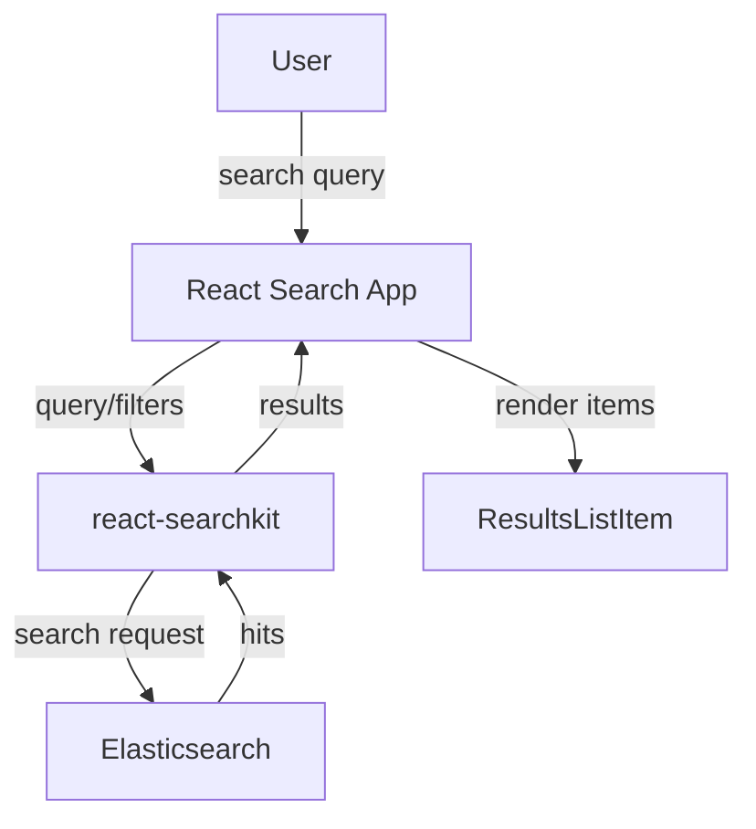

import { Callout, FileTree } from "nextra/components";

# Search result

The search page displays a list of records matching user queries. It uses react-searchkit to provide faceted search, sorting, and pagination with customizable result item components.

## Architecture

The search page follows this flow:

1. **User accesses** search URL and enters queries
2. **React search app** mounts and initializes with search configuration
3. **User searches** via query bar and filters apply
4. **react-searchkit** queries the Elasticsearch API
5. **Results display** using custom result item components



## UI Resource Configuration

The search route is defined in your model's UI resource config:

```python filename="ui/mymodel/__init__.py"
from oarepo_ui.resources.records.config import RecordsUIResourceConfig

class MymodelUIResourceConfig(RecordsUIResourceConfig):
    blueprint_name = "mymodel"
    url_prefix = "/mymodel"

    routes = {
        "search": "",
        # ... other routes
    }
```

## Template Structure

The search page uses a generic template provided by oarepo-ui (`oarepo_ui.pages.Search`). This template initializes the React search application with the search configuration.

<Callout type="info">
The generic `oarepo_ui.pages.Search` template provides the standard search interface. Customization is primarily done through the ResultsListItem component for result display and [component overrides](/customize/repository_ui/js_assets/react/overrides) for other UI elements.
</Callout>

### Available Context Variables

The search page template receives these variables from the resource:

| Variable | Description |
|----------|-------------|
| `search_app_config` | Search application configuration (facets, sort, API endpoint) |
| `ui_config` | UI resource configuration including model name and application ID |
| `ui_resource` | Reference to the UI resource instance |
| `ui_links` | UI navigation links (pagination, etc.) |
| `webpack_entry` | Webpack entry point for the search JavaScript |
| `extra_context` | Additional context from resource components |

## Search Configuration

Search behavior is configured through Flask app configuration:

```python filename="invenio.cfg"
# Search endpoint configuration for your model
RECORDS_REST_ENDPOINTS = {
    "mymodel": {
        "default_index": "mymodel-records-v1.0.0",
    }
}
```

## Custom Result Items

The most common customization is the result item component that displays each record in the search results.

### Creating a ResultsListItem

```jsx filename="ui/mymodel/semantic-ui/js/Search/ResultsListItem.jsx"
import React from "react";
import { RecordFacetsLabels } from "@js/oarepo_ui/search";
import { RecordAuthors } from "@js/invenio_app_rdm";
import _ from "lodash";

export const ResultsListItem = ({ result }) => {
  return (
    <div className="result-item">
      <a href={result.links.self_html}>
        <h3>{result.metadata.title}</h3>
      </a>

      <div className="record-authors">
        <RecordAuthors creators={result.metadata.creators} />
      </div>

      <div className="record-keywords">
        {_.get(result, "metadata.subjects", []).map((subject, idx) => (
          <span key={idx} className="badge">
            {subject.title || subject}
          </span>
        ))}
      </div>

      <div className="record-date">
        Published: {result.metadata.publicationDate}
      </div>
    </div>
  );
};
```

The `result` object contains:
- `result.id` - Record ID
- `result.links.self_html` - Link to render (detail) page
- `result.metadata` - Record metadata
- `result.created` - Creation date
- `result.updated` - Last update date

### Grid Layout Item

For grid view layouts, create a grid-optimized component:

```jsx filename="ui/mymodel/semantic-ui/js/Search/ResultsGridItem.jsx"
export const ResultsGridItem = ({ result }) => {
  return (
    <div className="result-grid-item">
      <h4>{result.metadata.title}</h4>
      <p>{_.get(result, "metadata.description", "").substring(0, 150)}...</p>
    </div>
  );
};
```

## Registering Custom Components

### Option 1: Via UI Resource Config (Recommended)

For model-specific search result components, register using the `search_component` attribute:

```python filename="ui/mymodel/__init__.py"
from oarepo_ui.resources.records.config import RecordsUIResourceConfig
from oarepo_ui.overrides import UIComponent, UIComponentImportMode

class MymodelUIResourceConfig(RecordsUIResourceConfig):
    search_component = UIComponent(
        import_name="ResultsListItem",
        import_path="@js/mymodel/search/ResultsListItem",
        import_mode=UIComponentImportMode.DEFAULT,
    )
```

Then register during app initialization:

```python filename="ui/mymodel/__init__.py"
from oarepo_ui.proxies import current_oarepo_ui

def finalize_app(app):
    """Register search result items during app initialization."""
    ui_resource_config = MymodelUIResourceConfig()

    if (
        current_oarepo_ui is not None
        and ui_resource_config.model
        and ui_resource_config.model.record_json_schema
        and ui_resource_config.search_component
    ):
        current_oarepo_ui.register_result_list_item(
            ui_resource_config.model.record_json_schema,
            ui_resource_config.search_component,
        )

# Register as entry point
```

```toml filename="pyproject.toml"
[project.entry-points."invenio_base.finalize_app"]
ui_mymodel = "ui.mymodel:finalize_app"
```

### Option 2: Via Search App Initialization

Create a search app entry point:

```jsx filename="ui/mymodel/semantic-ui/js/Search/index.js"
import {
  parseSearchAppConfigs,
  createSearchAppsInit,
} from "@js/oarepo_ui/search";
import { parametrize } from "react-overridable";
import ResultsListItem from "./ResultsListItem";

const [{ overridableIdPrefix }] = parseSearchAppConfigs();

export const componentOverrides = {
  [`${overridableIdPrefix}.ResultsList.item`]: ResultsListItem,
};

createSearchAppsInit({ componentOverrides });
```

Register in webpack.py:

```python filename="ui/mymodel/semantic-ui/webpack.py"
entry = {
    "mymodel_search": "./js/Search/index.js",
}
```

## Customizing Search Areas

Override specific parts of the search interface:

```python filename="invenio.cfg"
from oarepo_ui.overrides import UIComponent, UIComponentOverride

OAREPO_UI_OVERRIDES = OAREPO_UI_OVERRIDES | {
    # Customize facets
    UIComponentOverride(
        endpoint="mymodel.search",
        overridable_id="Mymodel.Search.SearchApp.facets",
        component=UIComponent(
            import_name="CustomFacets",
            import_path="@js/mymodel/search/CustomFacets",
            props={"allVersionsToggle": True}
        ),
    ),
    # Customize sort options
    UIComponentOverride(
        endpoint="mymodel.search",
        overridable_id="Mymodel.Search.SearchApp.sort",
        component=UIComponent(
            import_name="CustomSort",
            import_path="@js/mymodel/search/CustomSort",
        ),
    ),
}
```

### Override IDs for Search

| ID | Purpose |
|----|---------|
| `{Model}.Search.SearchApp.facets` | Facet (filter) panel |
| `{Model}.Search.SearchApp.results` | Main results container |
| `{Model}.Search.ResultsList.item` | Individual result item |
| `{Model}.Search.SearchApp.sort` | Sort dropdown |
| `{Model}.Search.SearchApp.searchbar` | Search input bar |
| `{Model}.Search.ActiveFilters.element` | Active filter badges |

See [Component Override](/customize/repository_ui/js_assets/react/overrides) for full details on overriding components.

## Entry Point Configuration

Ensure your search app entry point is registered in webpack.py:

```python filename="ui/mymodel/semantic-ui/webpack.py"
entry = {
    "mymodel_search": "./js/Search/index.js",
}
```

## Replacing the Default Search Template

By default, the search page uses the generic `oarepo_ui.pages.Search` template.

If you need to replace the entire search template with your own model-specific implementation:

### Create a Custom Page Component

```jinja filename="ui/mymodel/templates/semantic-ui/mymodel/pages/Search.jinja"
{#def search_app_config, ui_config, ui_resource, ui_links, webpack_entry, extra_context #}




    {{ super() }}
    {{ webpack[webpack_entry] }}



<div class="ui main container rel-mt-3">
  {# Add custom banner above search results #}
  
  <div class="ui message info">
    {{ extra_context.get('search_banner_text', _('Search tips: Use quotes for exact phrases')) }}
  </div>
  

  <div data-invenio-search-config='{{ search_app_config | tojson }}'></div>
</div>

```

Register it in your UI resource config:

```python filename="ui/mymodel/__init__.py"
class MymodelUIResourceConfig(RecordsUIResourceConfig):
    templates = {
        "search": "mymodel.pages.Search",
    }
```

See [JinjaX Components](/customize/repository_ui/jinjax) for more on creating page components.

## Related Resources

- [Search result components](/customize/model_ui/search_components) - Available search components
- [Component Override](/customize/repository_ui/js_assets/react/overrides) - Component customization
- [UI Resource Views](/customize/repository_ui/resources) - UI resource architecture
- [Webpack Configuration](/customize/repository_ui/webpack) - Entry point configuration
- [react-searchkit](https://inveniosoftware.github.io/react-searchkit/) - Search library documentation
