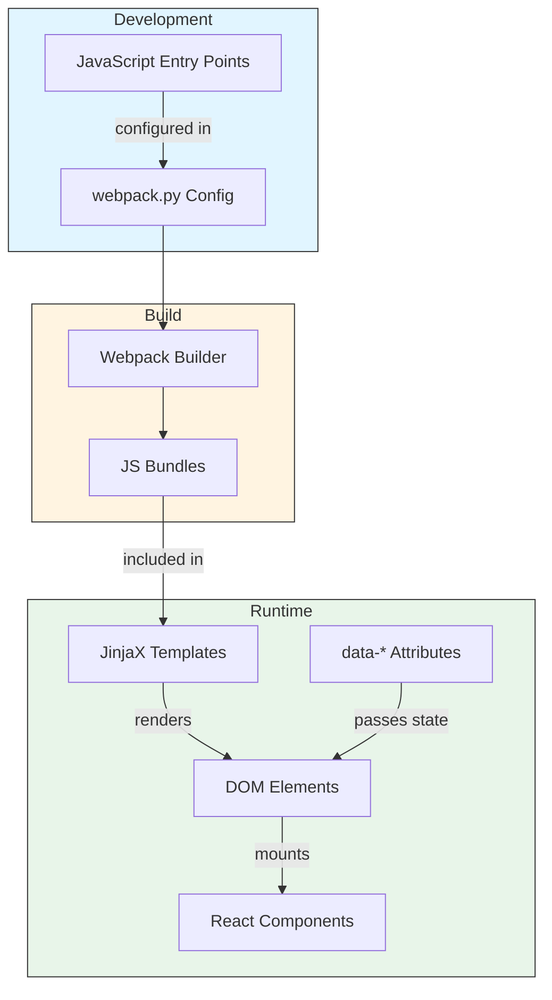

import { Callout, FileTree } from 'nextra/components';

# Integrating React

This page covers how to integrate React components into your repository, including configuring entry points, building bundles, and mounting components in Jinja/JinjaX templates.

## Architecture Overview

React integration in NRP repositories follows this flow:



## Repository-Level Component Structure

Place repository-wide React components in `ui/components/`:

<FileTree>
  <FileTree.Folder name="ui/components" defaultOpen>
    <FileTree.Folder name="semantic-ui" defaultOpen>
      <FileTree.Folder name="js" defaultOpen>
        <FileTree.Folder name="feature-a" defaultOpen>
          <FileTree.File name="index.js" />
          <FileTree.File name="Component.jsx" />
          <FileTree.File name="component-util.js" />
        </FileTree.Folder>
        <FileTree.Folder name="feature-b" defaultOpen>
          <FileTree.File name="index.js" />
        </FileTree.Folder>
        <FileTree.File name="home-page-search.js" />
        <FileTree.File name="custom-components.js" />
      </FileTree.Folder>
      <FileTree.Folder name="templates" />
    </FileTree.Folder>
    <FileTree.Folder name="templates" />
    <FileTree.File name="webpack.py" />
  </FileTree.Folder>
</FileTree>

## Creating a New Component

### Step 1: Create the Component

Create a simple React component that displays a welcome message:

```jsx filename="ui/components/semantic-ui/js/WelcomeBanner/WelcomeBanner.jsx"
import React from "react";

export function WelcomeBanner({ user }) {
  return (
    <div className="ui message info">
      <i className="info circle icon"></i>
      <div className="content">
        <div className="header">
          Welcome, {user.name || "Guest"}!
        </div>
        <p>This is your custom React component.</p>
      </div>
    </div>
  );
}
```

### Step 2: Create the Entry Point

Create an entry point that mounts your component to the DOM:

```jsx filename="ui/components/semantic-ui/js/WelcomeBanner/index.js"
import ReactDOM from "react-dom";
import React from "react";
import { WelcomeBanner } from "./WelcomeBanner";

function renderWelcomeBanner() {
  const element = document.getElementById("welcome-banner");
  if (element) {
    const user = JSON.parse(element.dataset.user || "{}");
    ReactDOM.render(
      <WelcomeBanner user={user} />,
      element
    );
  }
}

// Initialize when DOM is ready
if (document.readyState === "loading") {
  document.addEventListener("DOMContentLoaded", renderWelcomeBanner);
} else {
  renderWelcomeBanner();
}
```

### Step 3: Configure Entry Points in webpack.py

Add the entry point to your webpack configuration:

```python filename="ui/components/webpack.py"
from invenio_assets.webpack import WebpackThemeBundle

theme = WebpackThemeBundle(
    __name__,
    ".",
    default="semantic-ui",
    themes={
        "semantic-ui": dict(
            entry={
                "welcome_banner": "./js/WelcomeBanner/index.js",
            },
            aliases={},
            dependencies={},
            devDependencies={},
        )
    },
)
```

### Step 4: Include Entry Point in Template

Include the bundled JavaScript in your Jinja template and add a mount point:

```jinja filename="ui/components/templates/home.jinja"
<div id="welcome-banner" data-user='{{ user | tojson }}'></div>


{{ webpack['welcome_banner.js'] }}

```

### Step 5: Rebuild JavaScript Assets

After adding or modifying entry points, rebuild the JavaScript bundles:

```bash
invenio webpack clean create
invenio webpack install
```

## Available Entry Points from oarepo-ui

When using oarepo-ui, these entry points are available for inclusion:

| Entry Point | Purpose |
|-------------|---------|
| `oarepo_ui` | Core oarepo-ui utilities |
| `oarepo_ui_search` | Search app components and initialization |
| `oarepo_ui_forms` | Form components and contexts |
| `oarepo_ui_theme` | Theme-related JavaScript |
| `oarepo_ui_components` | Reusable UI components |

Include these in your templates as needed:

```jinja

{{ super() }}
{{ webpack['oarepo_ui_search.js'] }}

```

## Data Passing with data-* Attributes

Pass server-side data to React components using HTML data attributes. The server-side data comes from the template context prepared by UI resource view methods:

<Callout type="info">
UI resource views (see [UI Resource Views](/customize/repository_ui/resources)) prepare context data that gets passed to templates. You can pass any available context variable to your React component using data attributes.
</Callout>

The `tojson` filter serializes Python objects to JSON:

```jinja filename="ui/components/templates/home.jinja"
<div id="welcome-banner"
     data-user-name="{{ user.name }}"
     data-user-email="{{ user.email }}"
     data-settings='{{ settings | tojson }}'>
</div>


{{ webpack['welcome_banner.js'] }}

```

Use `data-*` attributes for simple values and `| tojson` for complex objects like nested data structures or arrays.

## Multiple Components on One Page

You can embed multiple React components in a single page. Each component has its own DOM mount point and entry point:

```jinja filename="ui/components/templates/home.jinja"
<div id="welcome-banner" data-user='{{ user | tojson }}'></div>
<div id="recent-items" data-items='{{ recent_items | tojson }}'></div>


{{ webpack['welcome_banner.js'] }}
{{ webpack['recent_items.js'] }}

```

Each entry point independently renders to its designated DOM element.

<Callout type="warning">
Avoid mounting multiple apps to the same DOM element, as this causes state conflicts.
</Callout>

## Related Resources

- [Components](/customize/repository_ui/js_assets/react/components) - Available form and search components
- [Component Override](/customize/repository_ui/js_assets/react/overrides) - Component customization patterns
- [State Management](/customize/repository_ui/js_assets/react/state_management) - Managing React state
- [Webpack Configuration](/customize/repository_ui/webpack) - Entry point and bundle configuration
- [JinjaX Components](/customize/repository_ui/jinjax) - Template component system
