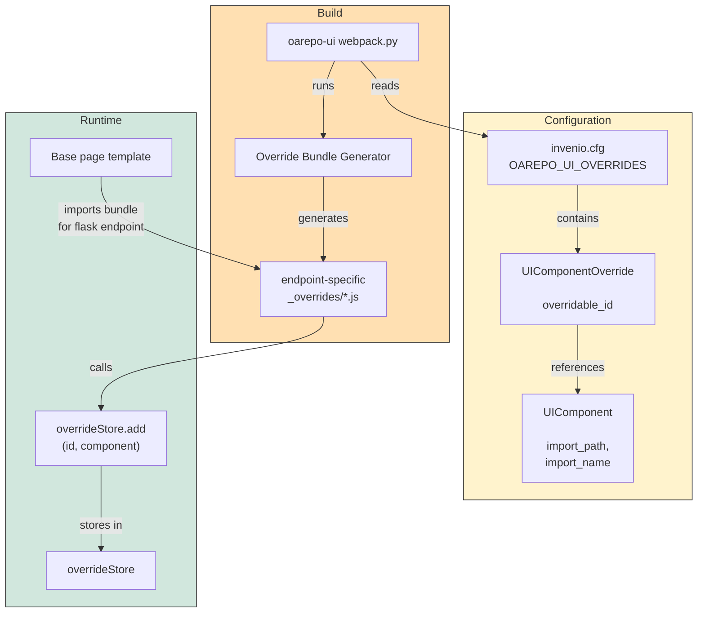

import { Callout, Tabs, FileTree, Cards, Steps } from 'nextra/components';
import { Card } from "@/components/card";

# Component Overrides

NRP repositories provide a powerful mechanism for customizing the user interface by replacing built-in React components with your own implementations. This allows you to adapt the repository's appearance and behavior to your specific needs without modifying the core codebase and libraries.

## Why Override Components?

Component overriding is useful when you need to:

- **Customize how search results are displayed** — Show different metadata fields, change the layout, or add custom actions
- **Modify form fields and controls** — Override how a specific field is rendered or behaves
- **Add or remove UI elements** — Hide buttons that aren't relevant to your users, add custom actions
- **Change component behavior** — Pass different configuration options to existing components

<Callout type="info">
Override at the right level: if you need to change the appearance of all records of a specific model, use model-scoped overrides. If you need to change a specific page component (like search facets globally), use a generic override.
</Callout>

## Two Override Approaches

NRP repositories support two distinct approaches for overriding React components:

| Approach | Description | When to Use | Configuration |
|----------|-------------|-------------|---------------|
| **react-overridable** (client-side) | Register overrides directly in JavaScript using the `OverrideStore` API | Simple customizations, quick prototyping, or when you don't want to involve Python configuration | JavaScript code in your entry point |
| **oarepo-ui overrides** (server-side) | Declare overrides in Flask/Python configuration, which generates JavaScript bundles automatically | Production deployments, type safety, endpoint-specific overrides, model-scoped customizations | `invenio.cfg` or UI resource config classes |

Both approaches share the same runtime mechanism—the `<Overridable>` component wrapper—but differ in how overrides are registered and managed.

<Callout type="info">
**Recommendation:** Use **oarepo-ui overrides** for production code. It provides better type safety, integrates with the build process, and supports advanced features like endpoint-specific and model-scoped overrides. Use react-overridable directly for quick experiments or when working outside the oarepo-ui framework.
</Callout>

<Callout type="warning">
**Only Overridable components:** Not every React component can be overridden. Only components wrapped in the `<Overridable>` component with an assigned `id` can be overridden using this mechanism. To customize a regular component without a wrapper, you must override the nearest parent component having overridable id assigned.
</Callout>

## How react-overridable Works

The [react-overridable](https://github.com/indico/react-overridable) library provides the runtime mechanism for component substitution. It works through [React's context system](https://react.dev/learn/passing-data-deeply-with-context) where `overrideStore` is provided through globally accessible context.

Both override approaches share this same runtime mechanism -- the difference is in how overrides are registered into the override store.

### The Mechanism

<Steps>

#### Wrapping Components

Base components are wrapped in an `<Overridable id="...">` element:

```jsx
import { Overridable } from 'react-overridable';

// In the base application code
<Overridable id="InvenioAppRdm.Search.ResultsList.item" record={record}>
  <DefaultResultsListItem record={record} />
</Overridable>
```

#### Override Store

The `overrideStore` is a global registry that maps overridable component IDs to their replacement components:

```js
import { overrideStore } from 'react-overridable';
import MyCustomComponent from './MyCustomComponent';

// Register the override - pairs ID with your component
overrideStore.add('InvenioAppRdm.Search.ResultsList.item', MyCustomComponent);
```

The `overrideStore` is an instance of `OverriddenComponentRepository` that stores the mapping. The `<Overridable>` component accesses it via `OverridableContext` which wraps the app and provides the store through React's context system.

#### Component Resolution

When an `<Overridable>` component renders, it:

- Accesses the `overrideStore` from `OverridableContext` via `useContext()`
- Looks up its ID in the store
- If found, renders the replacement component with the same props passed to `<Overridable>`
- Otherwise, renders its children (the original component)

The replacement component receives **the same props** that are defined on the `<Overridable>` element. This allows you to pass data through props consistently whether using the default or overridden component.

</Steps>

### Fallback Behavior

When an `<Overridable>` component's ID is not found in the override store, it simply renders its children (the original/default component):

```jsx
<Overridable id="InvenioAppRdm.Search.ResultsList.item">
  <DefaultResultsListItem record={record} />
</Overridable>
```

If `InvenioAppRdm.Search.ResultsList.item` is registered in the override store, the replacement component renders. Otherwise, `<DefaultResultsListItem>` renders.

## The Big Picture for oarepo-ui Overrides

The oarepo-ui override system builds on top of react-overridable. Here's how it configures and uses overrides:



**Configuration Phase** (yellow): You declare overrides in Python using `UIComponentOverride` and `UIComponent`

**Build Phase** (orange): The oarepo-ui webpack system reads your Python config and generates endpoint-specific JavaScript bundles that call `overrideStore.add()`

**Runtime Phase** (green): When a page loads, it tries to find & embed an override bundle specific to current Flask route/endpoint. If such bundle exists, it executes `overrideStore.add()` to register its overrides, then `<Overridable>` components look them up and render replacements.

This approach gives you:
- **Type safety** — Configuration is typed and validated at build time
- **Decoupling** — Your customizations are separate from core code
- **Upgradability** — Updates to the base repository won't overwrite your customizations
- **Endpoint-specific customization** — Replace a component on only specific Flask endpoints while leaving the default component rendered on other pages

### Declaring Overrides

In NRP repositories, overrides are declared through Flask app configuration in your `invenio.cfg` file rather than direct JavaScript registration. This provides type safety and integrates with the build process.

Component overrides are declared using the `UIComponentOverride` class from `oarepo_ui.overrides` and stored in the `OAREPO_UI_OVERRIDES` Flask config key.

### UIComponent

The `UIComponent` class describes a React component that will be used in an override:

| Attribute | Type | Description |
|-----------|------|-------------|
| `import_name` | `str` | Name of the component to import |
| `import_path` | `str` | JS module path (e.g., `"@js/datasets/search/ResultsListItem"`) |
| `import_mode` | `UIComponentImportMode` | Either `NAMED` (default) or `DEFAULT` import |
| `props` | `dict` \| `None` | Optional props for parametrizing the component |

### Manual Registration

To directly register a component override, set `OAREPO_UI_OVERRIDES` in your `invenio.cfg` file:

```python
# invenio.cfg
from oarepo_ui.overrides import UIComponent, UIComponentOverride, UIComponentImportMode

# Initialize from existing config if present
OAREPO_UI_OVERRIDES = OAREPO_UI_OVERRIDES | {
    UIComponentOverride(
        endpoint="invenio_search_ui.search",  # Flask blueprint endpoint
        overridable_id="Documents.Search.ResultsList.item",
        component=UIComponent(
            import_name="MyResultsListItem",
            import_path="@js/myapp/search/ResultsListItem",
            import_mode=UIComponentImportMode.NAMED,
        ),
    ),
}
```

<Callout type="info">
Use the `|` (union) operator to merge your overrides with any existing ones from upstream packages. This ensures your overrides are combined rather than replacing the entire set.
</Callout>

<Tabs items={['Parametrize', 'Replace Component']}>
  <Tabs.Tab>

    **Parametrize** allows you to pass additional props to existing components without changing their rendering logic:

    ```python
    # invenio.cfg
    from oarepo_ui.overrides import UIComponent, UIComponentOverride

    OAREPO_UI_OVERRIDES = OAREPO_UI_OVERRIDES | {
        UIComponentOverride(
            endpoint="invenio_search_ui.search",
            overridable_id="Documents.Search.SearchApp.facets",
            component=UIComponent(
                import_name="SearchAppFacets",
                import_path="@js/myapp/search/SearchAppFacets",
                props={"allVersionsToggle": True},
            ),
        ),
    }
    ```

    The generated `_overrides/invenio_search_ui.search.js` bundle code will look like:

    ```js
    import { parametrize } from 'react-overridable';
    import SearchAppFacets from '@js/myapp/search/SearchAppFacets';

    const SearchAppFacetsWithProps = parametrize(SearchAppFacets, {
      allVersionsToggle: true,
    });

    overrideStore.add('Documents.Search.SearchApp.facets', SearchAppFacetsWithProps);
    ```

  </Tabs.Tab>

  <Tabs.Tab>

    **Replace Component** completely substitutes an existing component with your own implementation:

    ```python
    # invenio.cfg
    from oarepo_ui.overrides import UIComponent, UIComponentOverride

    OAREPO_UI_OVERRIDES = OAREPO_UI_OVERRIDES | {
        UIComponentOverride(
            endpoint="invenio_search_ui.search",
            overridable_id="Documents.Search.ResultsList.item",
            component=UIComponent(
                import_name="ResultsListItem",
                import_path="@js/myapp/search/ResultsListItem",
            ),
        ),
    }
    ```

    The generated `_overrides/invenio_search_ui.search.js` bundle code will look like:

    ```js
    import ResultsListItem from '@js/myapp/search/ResultsListItem';

    overrideStore.add('Documents.Search.ResultsList.item', ResultsListItem);
    ```

  </Tabs.Tab>
</Tabs>

### Endpoint-Specific Bundles

To minimize bundle size, overrides are packaged by Flask Blueprint endpoint into a single `_overrides` folder. Inside this folder, each endpoint gets its own JavaScript bundle file named after the endpoint. These bundles are **auto-generated** by the oarepo-ui webpack system and contain the JavaScript code that calls `overrideStore.add()` to register your declared overrides.

For example:

<FileTree>
  <FileTree.Folder name="_overrides" defaultOpen>
    <FileTree.File name="invenio_search_ui.search.js" />
    <FileTree.File name="oarepo_ui.index.js" />
    <FileTree.File name="datasets_ui.search.js" />
  </FileTree.Folder>
</FileTree>

These bundles are only loaded on pages matching their respective endpoint.

Common endpoints include:
- `"invenio_search_ui.search"` - Main search page
- `"oarepo_ui.index"` - Home page
- Custom blueprint names from your UI resources (e.g., `"datasets_ui.search"`)


## Finding Component IDs

Use React Dev Tools to discover the overridable IDs in your application:

1. Install the [React Dev Tools browser extension](https://react.dev/learn/react-developer-tools)
2. Enable discovery mode by calling `reactOverridableEnableDevMode()` in the browser console
3. Hover over components in your application to see their overridable IDs displayed

<Callout type="info">
Discovery mode is helpful during development but should not be enabled in production.
</Callout>

## Override Registration Order

Since `OAREPO_UI_OVERRIDES` is a set, duplicate overrides (by `endpoint` and `overridable_id`) are not allowed. When adding overrides dynamically, check for existence before adding to avoid duplicates:

```python
from oarepo_ui.proxies import current_ui_overrides

if override not in current_ui_overrides:
    current_ui_overrides.add(override)
```

## Related Resources

<Cards>
  <Card
    title="react-overridable"
    href="https://github.com/indico/react-overridable"
  >
    Library documentation
  </Card>
  <Card
    title="oarepo-ui overrides API"
    href="https://github.com/oarepo/oarepo-ui/blob/main/oarepo_ui/overrides/components.py"
  >
    Python component types
  </Card>
  <Card
    title="oarepo-ui webpack overrides"
    href="https://github.com/oarepo/oarepo-ui/blob/main/oarepo_ui/webpack.py"
  >
    JavaScript bundle generation
  </Card>
  <Card
    title="Integrating React"
    href="/customize/repository_ui/js_assets/react/integration"
  >
    Setting up entry points with component overrides
  </Card>
</Cards>
