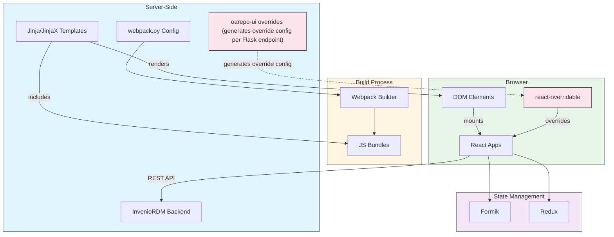

import { Callout, Cards } from 'nextra/components';
import { Card } from "@/components/card";

# React in NRP Repositories

React is used in NRP repositories for building **interactive user interface components** within a server-side rendered application architecture based on InvenioRDM. Unlike traditional Single Page Applications, React here is used for embedding dynamic components within Jinja-rendered pages, combining SEO benefits with rich client-side interactivity.

<Callout type="info">
This section covers React-specific topics. For server-side templating with JinjaX components, see the [JinjaX components guide](/customize/repository_ui/jinjax).
</Callout>

## Overview

React in NRP repositories powers the most dynamic and interactive parts of the user interface:

- **Search interfaces** - Faceted filtering, result lists, sorting
- **Deposit forms** - Multi-step workflows, validation, dynamic fields
- **Dashboard components** - Real-time data visualization, interactive controls

## Architecture

React applications are integrated through a defined structure:

The integration process involves:
1. **Webpack entry points** defined in `webpack.py` files - Python configuration files specifying JavaScript entry points
2. **Component mounting** to specific DOM elements within Jinja templates - creating a bridge between server-side HTML and client-side JavaScript
3. **Component overriding** mechanism for customization without modifying core code

## Explore React Topics

<Cards>
  <Card
    title="Installation & Integration"
    href="/customize/repository_ui/react/integration"
  >
    Learn how to add JavaScript entry points, configure webpack, and mount React components within Jinja templates.
  </Card>
  <Card
    title="State Management"
    href="/customize/repository_ui/react/state_management"
  >
    Understanding useState, Formik, Context API, and Redux for managing component state.
  </Card>
  <Card
    title="Component Override"
    href="/customize/repository_ui/react/overrides"
  >
    How to customize existing components using react-overridable and oarepo-ui overrides.
  </Card>
  <Card
    title="Component Development"
    href="/customize/repository_ui/react/components"
  >
    Deep dive into building search apps, deposit forms, and custom components.
  </Card>
</Cards>

## Key Concepts

### Customization

NRP repositories support two customization approaches:

- **Client-Side** - `react-overridable` for customizing React UI components at runtime
- **Server-Side** - `oarepo-ui overrides` generates override configuration for react-overridable based on Flask endpoint routing

See [Component Override](/customize/repository_ui/react/overrides) for details.

### State Management

Multiple approaches are used depending on complexity:

| Approach | For |
|----------|------|
| `useState` | Simple component state |
| Formik | Form handling and validation |
| Context API | Cross-component data sharing |
| Redux | Complex app state (search, forms) |

See [State Management](/customize/repository_ui/react/state_management) for details.

## Related Resources

- [InvenioRDM Documentation](https://inveniordm.docs.cern.ch/) - Official documentation for InvenioRDM
- [react-searchkit Documentation](https://inveniosoftware.github.io/react-searchkit/) - Search interface library
- [react-overridable GitHub](https://github.com/indico/react-overridable) - Component customization library
- [Formik Documentation](https://formik.org/) - Form state management
