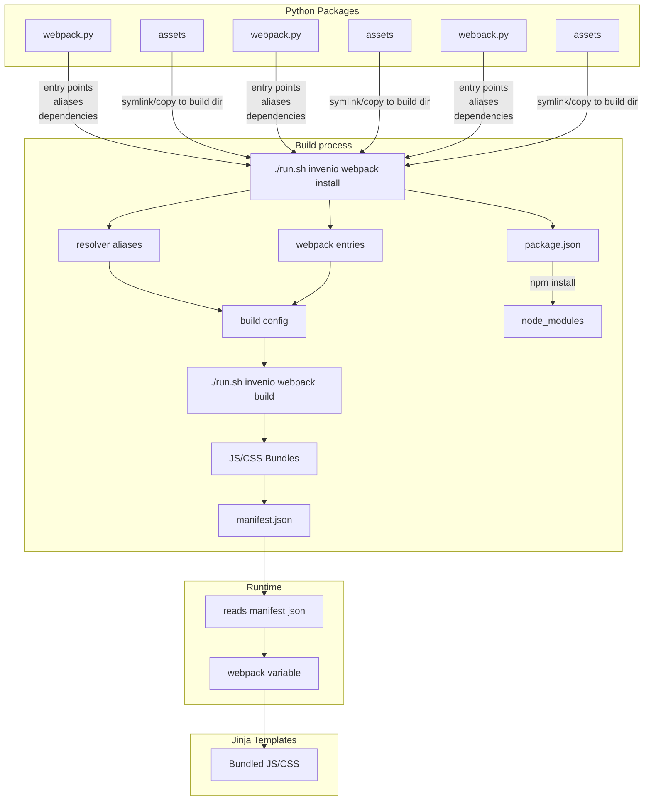

import { Callout, FileTree, Tabs, Cards } from "nextra/components";
import { Card } from "@/components/card";

# Webpack Configuration

Webpack is a JavaScript module bundler that transforms and packages your front-end code into optimized files that browsers can execute efficiently.

## Why Webpack?

Modern front-end development involves:

- **Multiple JavaScript files** that depend on each other
- **npm packages** from the JavaScript ecosystem
- **React components** requiring JSX transformation
- **Code splitting** for optimal page loading

Webpack handles all of this:

| What Webpack Does | Why It Matters |
|-------------------|----------------|
| **Bundling** — Combines many files into one or a few bundles | Reduces HTTP requests, improves load times |
| **Transpilation** — Converts JSX, modern JS to browser-compatible code | Lets you use modern syntax and React |
| **npm integration** — Installs and bundles npm packages | Access to thousands of open-source libraries |
| **Code splitting** — Creates separate bundles per entry point | Users only download code needed for the pages they visit |
| **Minification** — Removes whitespace, compresses code | Smaller file sizes, faster delivery |

Webpack performs code splitting by analyzing each entry point separately. Only the dependencies explicitly required by an entry point (directly or transitively) are included in its resulting bundle. This keeps bundles small and ensures users load only what's needed for the specific page they're visiting.

## How It Works in NRP Repositories

NRP repositories relies on two main Python libraries that brings Webpack support for Python/Flask:

| Library | Purpose |
|------|---------|
| **invenio-assets** | Provides CLI commands and manages the build process |
| **flask-webpackext** | Reads Webpack's output files (`manifest.json`) and makes them available in Jinja templates via the `webpack` variable |

Each Python package or module in your repository could contribute to the resulting UI through a `webpack.py` file. Configurations from these files are merged into a single unified Webpack project:



## How the UI Build Process Works

NRP repositories use **Flask-WebpackExt** combined with a build process managed through `./run.sh commands` to build the UI assets.

### Build Process Flow

1. **Discovery**: During `./run.sh invenio webpack install`, Flask-WebpackExt discovers all installed Python packages that have registered `webpack.py` files

2. **Configuration Collection**: Each package's `webpack.py` module declares:
   - Webpack entry points (JS bundles to be built)
   - Path aliases for importing modules
   - NPM dependencies required by the package
   - Additional webpack configuration extensions

3. **Dependency Aggregation**: All NPM dependencies from discovered packages are aggregated into a single `package.json` at the build directory

4. **Installation**: `npm install` runs to install all dependencies needed by all UI packages into `node_modules/`

5. **Bundling**: `./run.sh invenio webpack build` runs webpack to process all entry points and generate optimized bundles (JS/CSS) along with a `manifest.json` file

6. **Runtime**: Jinja templates read `manifest.json` and use the `webpack` variable to include the bundled assets

### Available Commands

| Command | Purpose |
|---------|---------|
| `./run.sh invenio webpack install` | Install npm dependencies and set up build environment |
| `./run.sh invenio webpack build` | Build JS/CSS bundles and generate manifest |
| `./run.sh invenio webpack clean` | Clean built assets |

<Callout type="info">
When developing with `./run.sh run`, the webpack build and install process happens automatically. You only need to run these commands explicitly when:
- Adding new webpack entry points
- Adding a new `webpack.py` module
- Manually forcing a rebuild
</Callout>

### Key Benefits

This architecture means you don't need to:

- Manually manage NPM dependencies for each UI module
- Configure bundling separately for each package
- Worry about dependency conflicts between modules

All webpack configurations from all packages are combined and built together as a single project.

## Registering webpack.py

Each `webpack.py` file must be explicitly registered as a **Python entry point** in your package's `pyproject.toml` file. The `invenio-assets` build system discovers webpack configurations through the `invenio_assets.webpack` entry point group.

```toml filename="pyproject.toml"
# pyproject.toml - registering webpack configurations

[project.entry-points."invenio_assets.webpack"]
my_theme = "ui.mytheme.webpack:theme"
```

The format is `"<entry-point-id>" = "<module.path>:<variable>"`:

| Part | Example | Description |
|------|---------|-------------|
| Entry point ID | `my_theme` | A unique identifier for this webpack configuration |
| Module path | `ui.mytheme.webpack` | Python module path (folders separated by dots) |
| Variable | `theme` | The name of the `WebpackThemeBundle` variable to import |

<Callout type="warning">
After adding or modifying entry points in `pyproject.toml`, reinstall the package for the changes to take effect: `uv pip install -e .`
</Callout>

## webpack.py Structure

A `webpack.py` file defines a `WebpackThemeBundle` instance that configures:

- **Entry points** — JavaScript entry files for bundling
- **Aliases** — Short names for importing modules
- **Dependencies** — npm packages (`dependencies` and `devDependencies`) required by your code
- **Theme** — Which UI theme base to use (typically `semantic-ui`)

## WebpackThemeBundle

`WebpackThemeBundle` is the class that defines a webpack theme configuration. It can be placed in any `webpack.py` file.

### Parameters

| Parameter | Type | Description |
|-----------|------|-------------|
| `import_name` | string | Typically `__name__` - the Python module name |
| `static_folder` | string | Base directory for static files (usually `"."`) |
| `default` | string | Default theme name (e.g., `"semantic-ui"`) |
| `themes` | dict | Theme configuration with entry points, aliases, dependencies |

### Example

```python filename="ui/components/webpack.py"
from invenio_assets.webpack import WebpackThemeBundle

theme = WebpackThemeBundle(
    __name__,                    # Python module name
    ".",                         # Static folder path (relative to this file)
    default="semantic-ui",       # Default theme to use
    themes={
        "semantic-ui": dict(
            entry={
                # JavaScript entry points to bundle
                "welcome_banner": "./js/WelcomeBanner/index.js",
                "recent_items": "./js/RecentItems/index.js",
            },
            aliases={
                # webpack resolver aliases for clean imports
                "@js/features": "./js/features",
                "@js/components": "./js/components",
            },
            # npm packages required by this bundle
            dependencies={
                "lodash": "^4.17.21",
                "axios": "^1.6.0",
            },
            devDependencies={
                "jest": "^29.0.0",
            },
        )
    }
)
```

## Entry Points

An entry point is the main JavaScript file that webpack processes to create a bundle:

```js
// ui/components/semantic-ui/js/WelcomeBanner/index.js
import ReactDOM from "react-dom";
import { WelcomeBanner } from "./WelcomeBanner";

function renderWelcomeBanner() {
  const element = document.getElementById("welcome-banner");
  if (element) {
    ReactDOM.render(<WelcomeBanner />, element);
  }
}

renderWelcomeBanner();
```

The entry point key becomes the bundle name for inclusion in templates: `webpack['welcome_banner.js']`.

### Entry Points from oarepo-ui

The `oarepo-ui` package provides pre-configured entry points:

| Entry Point | Purpose |
|-------------|---------|
| `oarepo_ui` | Core utilities |
| `oarepo_ui_search` | Search app components |
| `oarepo_ui_forms` | Form components and contexts |
| `oarepo_ui_theme` | Theme-related JavaScript |
| `oarepo_ui_components` | Reusable UI components |

```jinja

{{ webpack['oarepo_ui_search.js'] }}

```

## Including Bundles in Templates

Once configured, include the bundle in your Jinja or JinjaX templates. See [Templating](/customize/repository_ui/templating) for more details on template inheritance and including scripts:

```jinja filename="ui/components/templates/home.jinja"

{{ super() }}  <!-- Include parent JavaScript -->
{{ webpack['welcome_banner.js'] }}  <!-- Your custom bundle -->

```

## Aliases

Aliases provide convenient shortcuts for importing modules:

```python filename="ui/components/webpack.py"
"aliases": {
    "@js/features": "./js/features",
    "@js/components": "./js/components",
}
```

Then use in your code:

```js
// Instead of:
import MyComponent from '../features/my-component';

// You can use:
import MyComponent from '@js/features/my-component';
```

## npm Dependencies

Add npm packages through the `dependencies` or `devDependencies` keys within the theme dict:

```python filename="ui/components/webpack.py"
theme = WebpackThemeBundle(
    __name__,
    ".",
    themes={
        "semantic-ui": dict(
            entry={},
            aliases={},
            # Production dependencies
            dependencies={
                "axios": "^1.6.0",
                "moment": "^2.29.0",
            },
            # Development dependencies
            devDependencies={
                "jest": "^29.0.0",
                "typescript": "^5.0.0",
            },
        )
    },
)
```

After modifying dependencies, run:

```bash
invenio webpack install
```

## Rebuilding Assets

After modifying entry points, aliases, or packages:

### Full Rebuild

```bash
invenio webpack clean create
invenio webpack install
```

### Development Mode (Watch Changes)

For development with automatic reloading, see [Run frontend assets builder](/installation/run_instance#run-frontend-assets-builder-optional).

## Troubleshooting

### Bundle Not Loading

1. Check the entry point path is relative to `webpack.py`
2. Verify the file exists at the path
3. Rebuild with `./run.sh invenio webpack clean create install`
4. Ensure your package is installed (`pip install -e .`) after modifying entry points

### Import Errors

```python
# Correct: path relative to webpack.py location
"entry": {
    "my_feature": "./js/MyFeature/index.js",  # ✓
}
```

```python
# Incorrect: absolute path
"entry": {
    "my_feature": "/js/MyFeature/index.js",  # ✗
}
```

## Related Resources

<Cards>
  <Card
    title="Invenio Webpack Documentation"
    href="https://flask-webpackext.readthedocs.io/en/latest/"
  >
    Flask webpack extension
  </Card>
  <Card
    title="oarepo-ui webpack.py"
    href="https://github.com/oarepo/oarepo-ui/blob/main/oarepo_ui/theme/webpack.py"
  >
    oarepo-ui webpack configuration
  </Card>
  <Card
    title="Run frontend assets builder"
    href="/installation/run_instance#run-frontend-assets-builder-optional"
  >
    Running the assets builder with hot-reload for development
  </Card>
  <Card
    title="Integrating React"
    href="/customize/repository_ui/js_assets/react/integration"
  >
    Setting up React entry points
  </Card>
  <Card
    title="Simple JavaScript"
    href="/customize/repository_ui/js_assets/vanilla_js"
  >
    Vanilla JavaScript patterns
  </Card>
</Cards>
