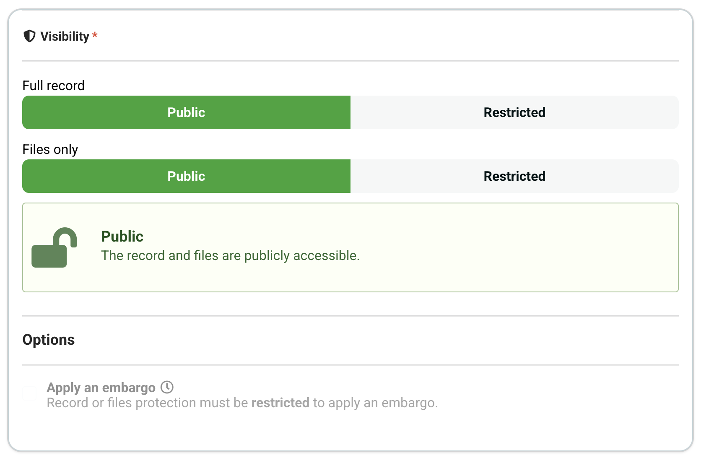
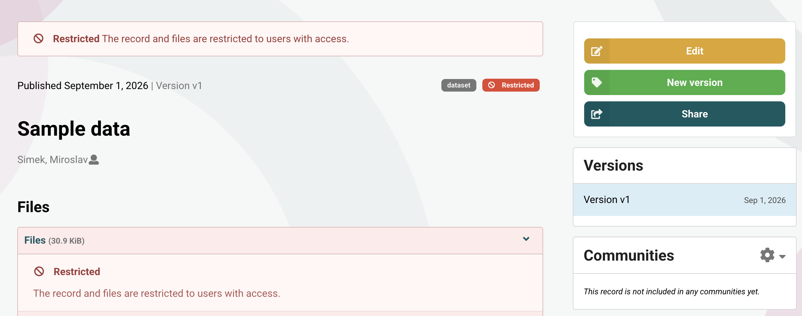
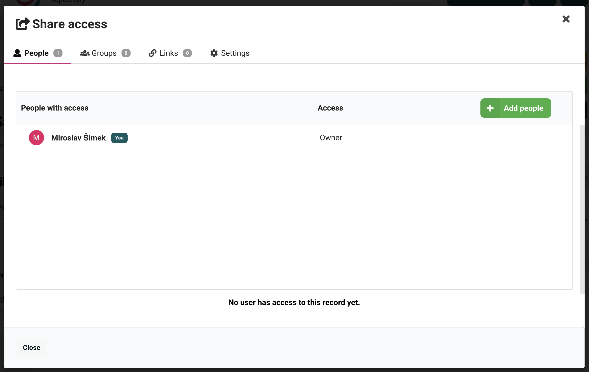
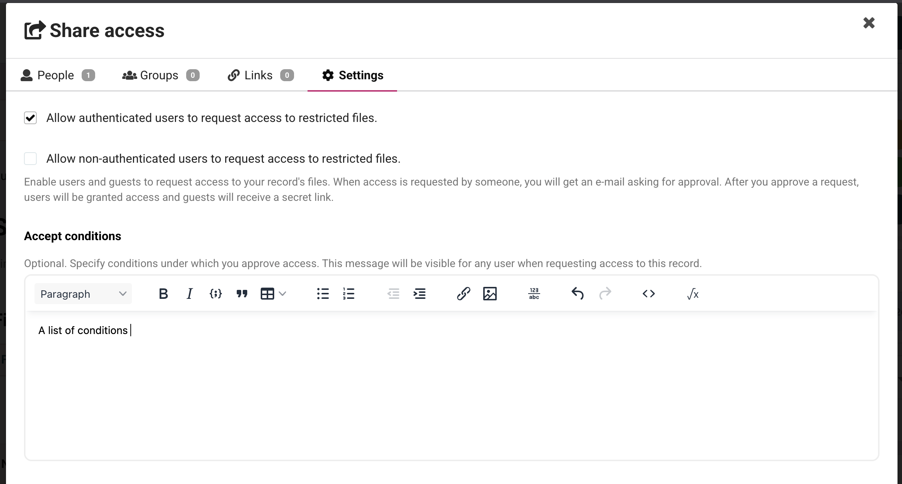
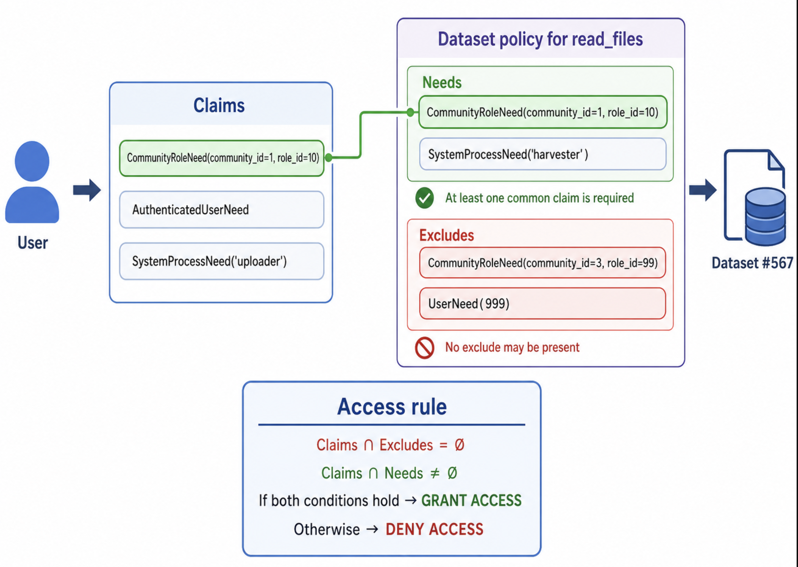
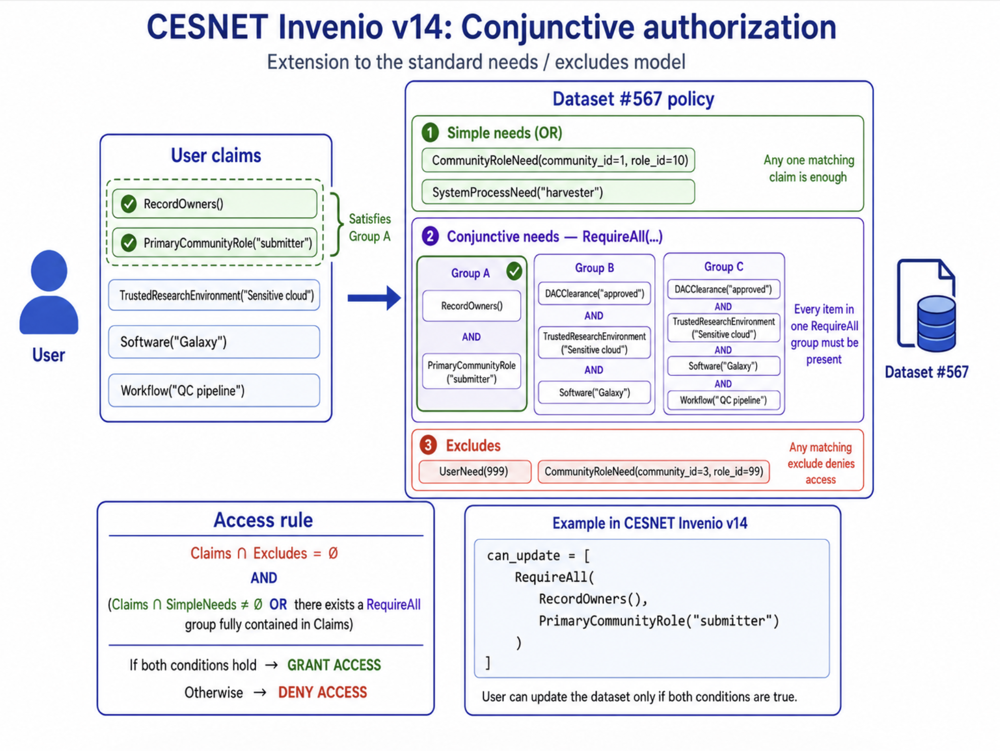
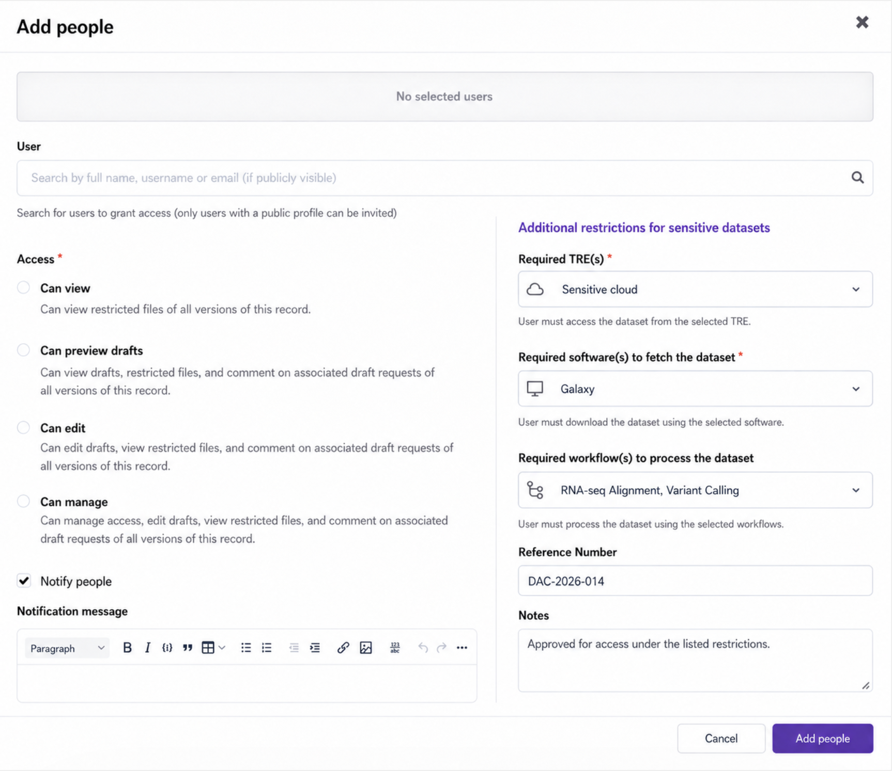
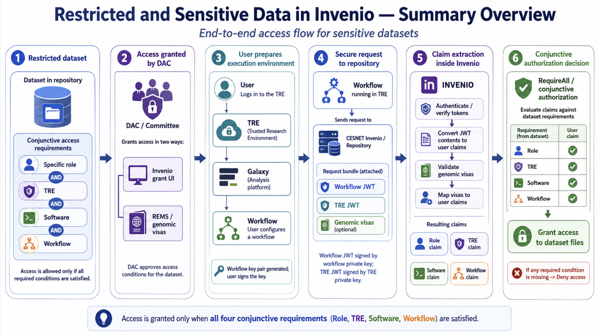

# Restricted and Sensitive Data in Invenio

This document describes how sensitive data will be handled in CESNET Invenio repositories.

## Dataset protection in standard Invenio repositories

In an Invenio repository, access to the dataset can be restricted in two ways:

- **Restricted community**: If a community is marked as restricted, only members of that community can access the dataset. The dataset is not visible to other users.
- **Restricted access**: 
  - Restricted dataset: both the dataset metadata and the contained files are restricted. Users can't search the dataset or access it directly.
  - Restricted files: only users with the appropriate permissions can access the files, but everyone can still search for the dataset.


When a dataset is restricted, the dataset can be shared by the dataset owner (or community owner/curator when the dataset is a member of a community).



Clicking on the share button brings the following dialog:



where the owner of the dataset can grant access to other users.

The dataset can also be configured to allow people to request access to restricted files.



When configured, a user can click on a "Request access" button to request access to a restricted file.
They need to provide a reason for the request. Upon submission, the request is sent to the dataset owner
via email and the dataset owner can approve or deny the request.

## Permission system

### Permission system in classical Invenio repositories

#### User claims

When a user tries to access a protected dataset or wants to execute an action inside the repository, the following steps are taken:

1. If the user is not authenticated, a redirect to the login page is performed.
2. For an authenticated user, the user is represented via an "Identity" object. The identity object contains:
   - User ID
   - A set of provided "claims" which are an instance of Flask-Principal's `Need` class. 
     An example of such a token is a `CommunityRoleNeed(community_id, role_id)` which claims
     that the user has a specific role in a community.

So, a physical user is represented inside Invenio as this set of claims.

Note: user claims in invenio permissions and AAI (oauth) claims are two different things.

#### Dataset needs

A user that wants to perform an action on a dataset - for example, read_files. Invenio will:

1. Locate a permission policy for the dataset
2. Take can_read_files field from that permission policy. The result is a list of permission generators.
3. Execute the permission generators, passing the dataset as a parameter, to get a set of needs and excludes.

#### Authorization

The user claims are compared against the excludes at first. If there is a match (that is, at least one claim matches an exclude), the user is denied access. Otherwise, the user claims are compared against the needs. If there is a match (that is, at least one claim satisfies a need), the user is granted access.



#### Limitations

The limitation of the plain Invenio permission system is that it does not support conjunctive needs. For example, the plain Invenio permissions cannot express:

- Give access to the dataset only 
   - if the user has a specific role **AND** accesses the dataset from a specific trusted research environment.
- User can edit metadata 
   - if they are the owner of the dataset **AND** are a member of an organization the dataset belongs to (that is, the user has not left the organization).

This brings problems with AAI integration, where the user retains the same identity throughout their life, regardless of the organizations they are a member of (they have deduplicated identities under one e-infra identity, so from the point of view of the permission system, the user is still the same person).

#### Declarative nature

Permission policies are declared within the code of the repository. Their rules are not dynamic - that is, after the repository is deployed, the permission system will not change.

### CESNET Invenio extension

CESNET Invenio in version 14 brings conjunctive needs support to the permission system. This means that the following 
permissions can be expressed:

- Give a user access to the dataset only if they have a specific role **AND** access the dataset from a specific trusted research environment.
- Give a user access to the dataset only if they have been cleared by the data access committee **AND** access the dataset from a specific trusted research environment **AND** the file is downloaded by specific software.
- Give a user access to the dataset only if they have been cleared by the data access committee **AND** access the dataset from a specific trusted research environment **AND** the file is downloaded by specific software **AND** will be processed by a specific workflow within the software.

In the following example, user can update the dataset only if they are the owner and have a specific role in the primary community:



## User claims extraction

When a user logs in or accesses invenio with their credentials via the API, the flask-login with optionally flask-oauthclient is activated. The process goes like this:

- verify that the user is who they claim to be. 
  This can be done by verifying the password agains the local database, checking the JWT token, or using an external authentication service (oauth provider).
- optionally, extract the user's claims from the authentication token (e.g. convert PERUN capabilities to Invenio RoleNeed)
- after-login callbacks are called. Their aim is to read the database/request and enhance the user's claims with additional information from the database.
  For example, the process will read community membership table from the database to determine the user's role in each community.

### Genomic Visas

This process is extensible. We can add a custom callback that would, for example, extract visas from the AAI response and map them to Invenio user claims.
This will scale well provided the resulting set of claims is not too large (that is, the user does not have too many visas).

Then the permission policy could look like:

```python
can_read_files = [
    HasGenomicVisa(tre_required=True, workflow_required=True)
]
```

This will allow the user to read files only if they have a valid visa that specifies the dataset, tre and workflow. 

## TRE and Workflows extraction

The set of user claims will be augmented with the TRE(s) and workflow(s) required to access the dataset and passed
inside the request.

See [Dominik Pantůček; Job Authentication in Computation Environment](/files/jaice.pdf) on how these are
generated and transferred over the wire to the repository in a cryptographically secure manner.

## Grants

In the examples at the beginning of this document, we've seen that a restricted dataset 
can be shared with other users. Internally, this is represented by a grant.

A grant is a piece of information that is connected to a dataset and specifies:
- the subject (user or group)
- permissions on the dataset (read, update, manage, ...)

For repositories containing sensitive data, this information will be amended with:
- the TRE(s) required to access the dataset
- the software(s) required to fetch the dataset
- the workflows(s) required to process the dataset

The UI dialogue will be extended to allow entering these extra fields. 



This extension will allow data access committees that do not use external approval systems
(such as REMS or others that would propagate the approvals through genomic visas to the AAI) 
to still be able to grant access to sensitive data directly through the Invenio UI.

## Summary

There is a dataset in the repository, restricted so that access requires a specific role, a trusted
research environment (TRE), specific software, and a specific workflow.

The data access committee (DAC) grants access to it:
 - via the dedicated Invenio UI, or
 - inside REMS or other tools that produce genomic visas.

The user logs in to the TRE and to the software (such as Galaxy) and parametrizes a workflow there.
A public/private key pair is generated for the workflow, and the user signs the key.

The workflow is executed inside the TRE. During execution, a request is sent to the repository
to authenticate the user and fetch the dataset. Two JWT tokens are sent along with the request: one
signed by the workflow's private key and one signed by the TRE's private key. Visas are also sent
along with the request, if available.

Inside Invenio, the tokens are converted into user claims. If genomic visas are found, they are
validated and converted to user claims as well.

Finally, these claims are evaluated against the dataset's (conjunctive) needs - role, TRE, software,
and workflow - and access to the dataset is granted only if all of them are satisfied.


