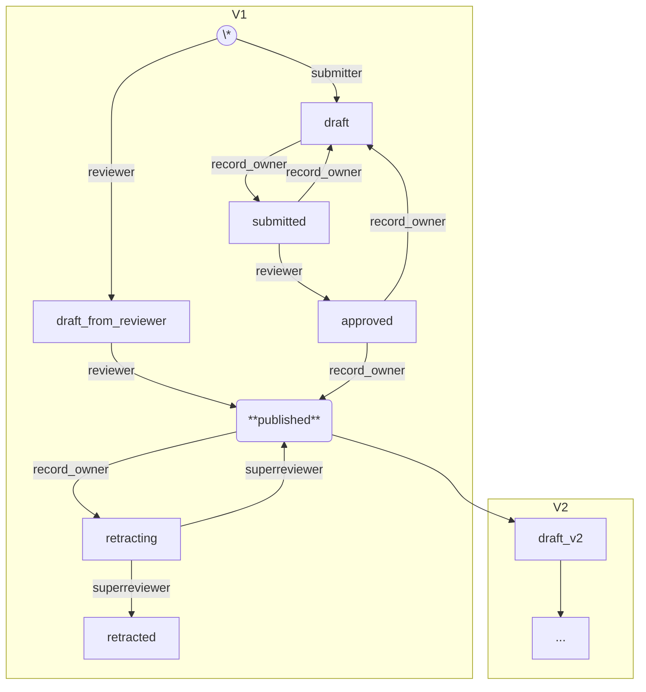
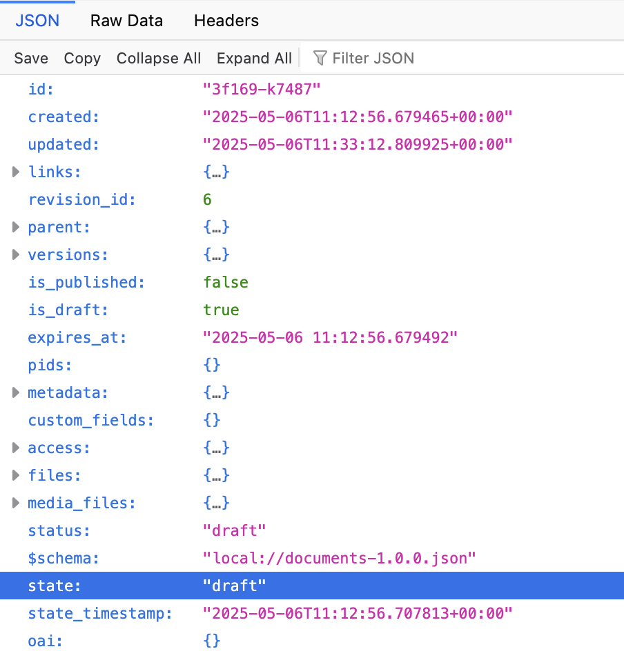
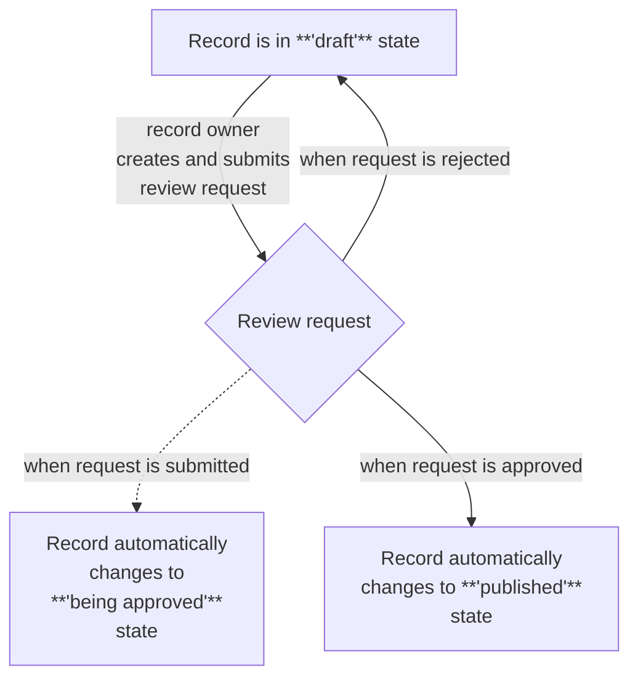

import { Cards } from 'nextra/components'
import { Card } from "@/components/card";
import { ToDo } from "@/components/todo";

# Workflows

<ToDo />

## Overview

In the Invenio NRP repository, each record is always created within
its primary community. In this model, the record does not belong
to its depositor but to the community.
For example, if the community represents a project team,
the record is an outcome of the project and thus belongs
to the project as a whole—not just to the depositor.

Each community defines the lifecycle of its records, including
how they are created, published, accessed, retracted, processed,
and so on.

These rules are captured in a deposition workflow, which is declared
on the community. A community must have at least one deposition
workflow. If it has multiple workflows, one is designated as
the default and is used when a deposited record has no workflow explicitly assigned.

Once a record is created within the community, the workflow is linked to it
—from that point onward, the record is governed by that workflow.

To track the progress of the record through the workflow,
a special "status" read-only field is included at the top level
of the record.

The following diagram illustrates a sample workflow for a record.

1. The record is initially created in the "draft" state and can be submitted for review.

2. Upon submission, the state changes to "submitted", and the record can no longer be edited—ensuring the reviewer evaluates the same version submitted by the author. Permissions at this stage can be configured to:
   * Prevent the submitter from editing the record
   * Allow the reviewer to modify metadata (but not files).

3. The reviewer can then approve or reject the record.

   * If approved, the record can be published, with the record owner having the final decision ("the last word").

4. The submitter can also request retraction, moving the record to the "retracting" state.

5. A superreviewer then decides whether to retract or publish the record.

**Note:** If a user with elevated permissions (e.g., a reviewer) creates the draft, certain workflow steps may be skipped.



On record, the state is represented as a read-only field `state`.



## Permissions

Permissions can be set for each state in the workflow,
allowing for different users to have different permissions
at different stages of the workflow.

For example, if the record in in the `retracting` state, it might
be visible just to the record owner and the superreviewer - but not
to the general public, even though the record is published. This is
usable for example when the record has been published prematurely
and needs to be made invisible as soon as possible.

The permissions determine:

* Who has the authority to access, edit, or delete the record
* Who can access, upload, or delete the record's files

**Example:**

```python
    can_read_draft = _can_read_anytime + [
        IfInState(
            ["draft", "submitted"],
            then_=[
                PrimaryCommunityMembers(),
                AccessGrant("preview"),
                AccessGrant("edit"),
                SecretLinks("preview"),
                SecretLinks("edit"),
            ],
        ),
    ]
```

## Requests

Records move through the workflow by means of "requests". A request
represents user's intention to perform an action on the record. Request
can be approved/rejected by users with the appropriate permissions or can
be automatically approved/rejected by the system.

Requests can be used for example for determining:

* Who can request a review of the record
* Who has the authority to approve or reject the record
* Who can request the publishing of the record
* Who has the authority to publish the record

Requests are also used to "move" the record from one state to another.
For example, the review request:

1. Can be created by the owner of the record, when it is in the state "draft"
2. Can be approved by anyone with a community role "approver".
3. When the request is created/submitted, the record moves to the state "being approved"
4. If it is approved, the record moves to state "published"
5. If it is rejected, the record moves back to state "draft"



## Real-world example

The following example illustrates real-world workflows.

* A [default workflow from the National Library of Technology, Czech Republic](https://github.com/Narodni-repozitar/nr-docs/blob/main/common/workflows/default.py) is intended for communities that trust their members. The deposition process is strict in the sense that the record is not published until the community curator approves it. However, draft records are visible to all community members (regardless of their publication status or their access status).
* A [individual-but-curated workflow from BIOCEV's database of Molecular Biophysics Database](https://github.com/Molecular-Biophysics-Database/mbdb-app/blob/development/common/workflows/individual_workflow.py)

## Creating and managing workflows

<Cards>
    <Card title='Create workflow' arrow href="/customize/workflows/create">Define workflows inside an invenio.cfg file.</Card>
    <Card title='Apply workflow' arrow href="/customize/workflows/apply">Select which workflow is default for a community.</Card>
    <Card title='Develop new requests' arrow href="/develop/workflows">Develop new requests.</Card>
</Cards>
