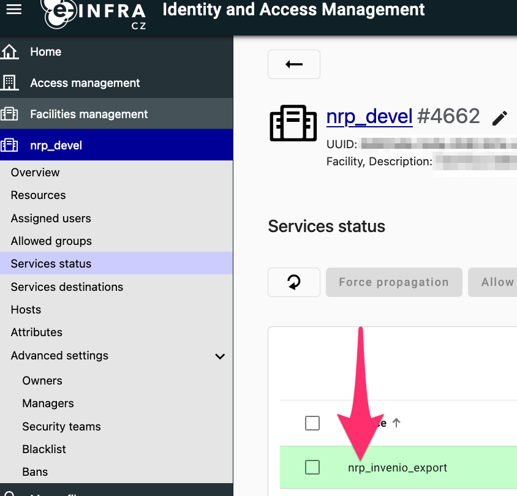

# AAI

## AAI Management console settings

To set up and connect AAI, you'll need to perform the following 
steps inside [AAI management console](https://perun.e-infra.cz/): 

* Contact AAI support to create a VO that will host the repository accounts 
* Add a group that will hold repository root 
* Add a group to the repository root that will contain managed communities. Let's call it 'communities group'
  * Create an application form for the VO/group 
  * Create a notification for the pre-approved invitation 
* Inside the VO, create a repository service account 
* Contact AAI support to create a facility that will represent the repository and to 
  create a synchronization service. Do not enable it yet. Also ask them to add permissions
  on the facility to your repository service account 

## OIDC settings

In addition, set up a OIDC client in [spadmin console](https://spadmin.e-infra.cz/).
Configuration:

| Configuration | Value |
|-----|------|
| URL of login page | `https://<server>/oauth/login/e-infra/` |
| Redirect URIs |  `https://127.0.0.1:5000/oauth/authorized/e-infra/` <br/> `https://<server>/oauth/authorized/e-infra/` |
| Flow the service will use | authorization code |
| Token endpoint authentication method | client_secret_basic |
| Proof Key for Code Exchange (PKCE) Code Challenge Method | none |
| Service will call introspection endpoint | yes |
| Scopes the service will use | openid, profile, email, organization, eduperson_entitlement, voperson_external_id, voperson_external_affiliation, isCesnetEligibleLastSeen |

## Deployment parameters

Make sure you set up the following environment variables (or pass those in secrets' json config):

| Variable | Value description |
|-----|------|
| INVENIO_REMOTE_AUTH_ENABLED | "true" |
| INVENIO_SERVER_NAME | The server name, such as `myrepo.org` |
| INVENIO_EINFRA_SERVICE_USERNAME | Username of the repository service account |
| INVENIO_EINFRA_SERVICE_PASSWORD | Password of the repository service account |
| INVENIO_EINFRA_REPOSITORY_VO_ID | ID of the VO. It is a number that is displayed in the console next to the name of the VO after `#`  |
| INVENIO_EINFRA_COMMUNITIES_GROUP_ID | ID of the communities group. It is a number that is displayed in the console next to the name of the group after `#`  |
| INVENIO_EINFRA_REPOSITORY_FACILITY_ID | ID of the repository facility. In the console, head to facilities, display the facility and copy the ID displayed next to the facility name  |
| INVENIO_EINFRA_SYNC_SERVICE_NAME | Name of the synchronization service, displayed on "services status" under the facility page  |

For exports from AAI:

| Variable | Description |
|---|---|
| INVENIO_EINFRA_USER_DUMP_S3_ACCESS_KEY | Access key to the S3 bucket where AAI puts dumps |
| INVENIO_EINFRA_USER_DUMP_S3_SECRET_KEY | Secret key to the S3 bucket where AAI puts dumps |
| INVENIO_EINFRA_USER_DUMP_S3_ENDPOINT | S3 endpoint, for example https://s3.cl4.du.cesnet.cz |
| INVENIO_EINFRA_USER_DUMP_S3_BUCKET | Name of the S3 bucket |

For OIDC:

| Variable | Description |
|---|---|
| INVENIO_EINFRA_CONSUMER_KEY | OIDC key |
| INVENIO_EINFRA_CONSUMER_SECRET | OIDC secret |


Note: these parameters need to be set up both for the "web" service and the background celery workers

## `invenio.cfg`

Add the following section to `invenio.cfg`:

```python
from oarepo_oidc_einfra import EINFRA_LOGIN_APP

OAUTHCLIENT_REMOTE_APPS = {
    "e-infra": EINFRA_LOGIN_APP
}
```

Note: An empty `OAUTHCLIENT_REMOTE_APPS` might already be present there.


